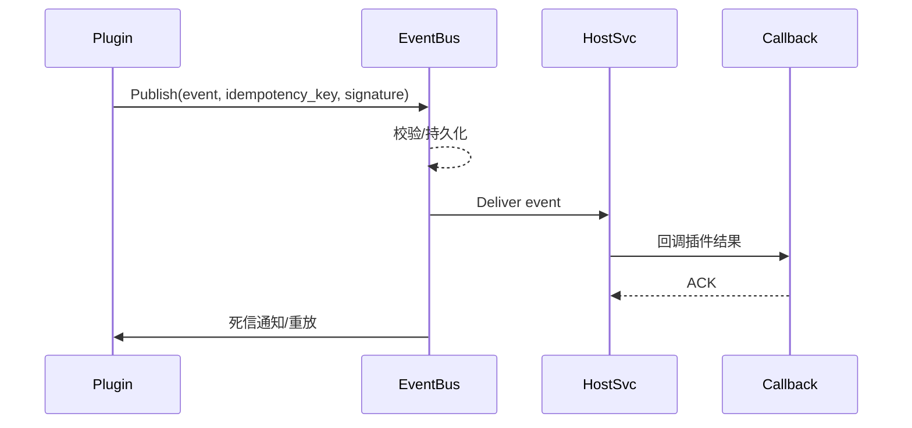

# Executive Summary

> 本子场景确保插件与宿主之间的事件发布、回调、幂等与死信治理，满足至少一次送达、回调确认 <3s、死信率 <0.5%，并支持签名校验与自动补偿。

# Scope & Guardrails

- **In Scope**：事件发布、签名、幂等键、持久化、回调处理、确认、重试、死信/重放、Webhooks/Queue/TOPIC 管理。
- **Out of Scope**：同步 API 调用、调用韧性策略。
- **Environment & Flags**：`PX_PLUGIN_EVENT_PIPELINE`, `PX_PLUGIN_WEBHOOK_GUARD`, `PX_PLUGIN_EVENT_REPLAY`; 依赖 EventBus、Webhook 管理中心、DLQ、Notification Center。

# Participants & Responsibilities

| Scope | Repository | Layer | 责任与交付物 |
|-------|------------|-------|--------------|
| Plugin SDK | powerx-plugin | service | 事件发布、签名、幂等 ID、回调端点、确认/重放 |
| EventBus/Webhook | powerx | service | 幂等校验、持久化、重试、死信、告警、回放工具 |
| Ops/SRE | powerx | ops | 死信监控、扩容、补偿脚本、审计 |

# End-to-End Flow

1. **Publish**：插件通过 SDK 调用 `POST /events/publish`，附带租户上下文、幂等 ID、签名。
2. **Process & Deliver**：EventBus 校验签名/幂等，持久化并投递到宿主服务或回调队列。
3. **Callback & Ack**：宿主完成处理后向插件回调，插件验证签名并返回确认。
4. **Deadletter & Replay**：失败事件自动重试，超过阈值进入死信；SRE 可查询并重放。

# Key Interactions & Contracts

- `POST /events/publish`、`POST /events/bulk`, `POST /callbacks/ack`, `GET /events/deadletters`.
- Headers：`x-idempotency-key`, `x-event-type`, `x-signature`.
- 事件：`plugin.host-event.published`, `plugin.host-event.deadletter`, `plugin.host-callback.failed`.
- 配置：`event_pipeline.yaml`, `webhook_endpoints.yaml`, `deadletter_policies.yaml`.

# Usecase Links

- `UC-INT-PLUGIN-CALL-ASYNC-001` — 事件发布、回调、幂等、死信重放。

# Acceptance Criteria

1. 事件投递至少一次成功，幂等 ID 确保重复请求不会重复处理。
2. 回调签名校验覆盖率 100%，平均确认时间 <3s。
3. 死信率 <0.5%，死信堆积阈值可配置，支持一键重放。

# Telemetry & Ops

- 指标：`plugin.event.publish_rate`, `plugin.event.deadletter_rate`, `plugin.callback.success_rate`, `plugin.event.replay_count`.
- 告警：死信堆积 >100、回调成功率 <99%、签名失败 >5 次/分钟。
- Dashboards：`Plugin Event Mesh`, DLQ 面板、`reports/_state/plugin-event.json`。

# Open Issues & Follow-ups

| 风险/事项 | 影响范围 | 负责人 | ETA |
|-----------|----------|--------|-----|
| 回调端点缺少多 Region 备份 | 高可用性 | Plugin Ecosystem Squad | 2025-03-02 |
| 死信重放脚本尚未接入 IAM 审批 | 审计合规 | Platform SRE Squad | 2025-02-28 |
