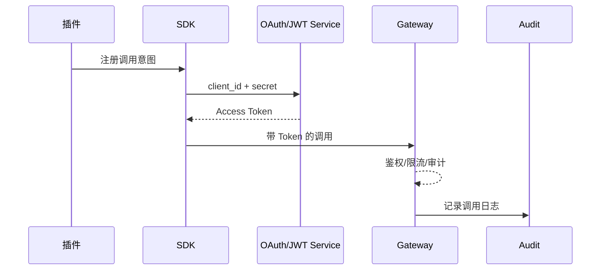

# Executive Summary

> 该子场景定义插件在宿主开放平台上注册调用通道、获取凭证、执行鉴权/限流/审计的端到端流程，目标是令牌延迟稳定 <80ms、鉴权成功率 ≥99%、密钥泄露可在 5 分钟内吊销并补发。

# Scope & Guardrails

- **In Scope**：调用意图登记、`client_id/secret` 或证书签发、OAuth2 Client Credentials / JWT 流程、短期令牌刷新、Gateway 限流/审计、密钥轮换、自助吊销。
- **Out of Scope**：插件能力注册、租户上下文治理、调用韧性策略、异步事件。
- **Environment & Flags**：`PX_PLUGIN_HOST_CALL_GATEWAY`, `PX_PLUGIN_SECRET_ROTATION`, `PX_PLUGIN_LIMIT_GUARD`；依赖 IAM、Secret Manager、API Gateway、Audit Ledger。

# Participants & Responsibilities

| Scope | Repository | Layer | 责任与交付物 |
|-------|------------|-------|--------------|
| Plugin SDK | powerx-plugin | service | 登记调用意图、封装 OAuth/JWT 流程、Token 缓存与刷新 |
| Gateway | powerx | service/security | 鉴权、租户授权、限流、审计日志、密钥吊销与轮换 |
| IAM / Secret Manager | powerx | security | 管理租户授权矩阵、密钥存储、轮换策略、异常告警 |

# End-to-End Flow

1. **Register Intent**：插件在开放平台登记调用场景，审批通过后获得 `client_id`、密钥或证书。
2. **Obtain Token**：运行时通过 SDK 调用 OAuth2/JWT 端点，获取短期访问令牌并缓存。
3. **Invoke & Enforce**：请求经 Gateway 执行身份校验、租户授权、限流，成功后转发至宿主服务，并写入审计。
4. **Rotate & Revoke**：密钥泄露或到期时触发轮换/吊销；SDK 自动刷新 Token 并上报状态。

# Key Interactions & Contracts

- `POST /openapi/v1/clients` — 调用意图登记，字段含插件 ID、租户范围、能力标签。
- `POST /openapi/v1/token` — OAuth2 Client Credentials，返回 `access_token`, `expires_in`.
- `POST /openapi/v1/jwt/issue` — 证书签发，返回 JWK/公钥。
- `POST /openapi/v1/secrets/rotate`，`DELETE /openapi/v1/secrets/{id}` — 轮换/吊销。
- 事件 `plugin.host-call.auth_failure`, `plugin.host-call.secret_revoked`.

安全要点：所有密钥存储在 Secret Manager；租户授权矩阵需多租隔离；限流策略 per plugin/tenant；审计日志储存 ≥365 天。

# Usecase Links

- `UC-INT-PLUGIN-CALL-AUTH-001` — 调用登记、鉴权、限流与审计。

# Acceptance Criteria

1. 插件可在 2 分钟内完成调用通道注册并获取凭证。
2. 鉴权通过率 ≥99%，失败均写入审计并带租户/插件 ID。
3. 密钥轮换/吊销可在 5 分钟内传播到 Gateway；泄露告警后 1 分钟内阻断旧凭证。

# Telemetry & Ops

- 指标：`plugin.auth.latency_ms`, `plugin.auth.success_rate`, `plugin.auth.rate_limit_hits`, `plugin.secret.rotate_time`.
- 告警：成功率 <99%（P1）、限流连续触发 >10 次/分钟（P2）、轮换失败（P1）。
- Dashboard：`Plugin Host Call - Auth`，`Audit Ledger` 报表。

# Open Issues & Follow-ups

| 风险/事项 | 影响范围 | 负责人 | ETA |
|-----------|----------|--------|-----|
| Gateway 尚未支持 mTLS 证书校验 | 高敏插件接入 | Core Platform Squad | 2025-03-01 |
| Secret Rotation CLI 缺少租户批量功能 | 多租部署 | Plugin Ecosystem Squad | 2025-02-25 |
