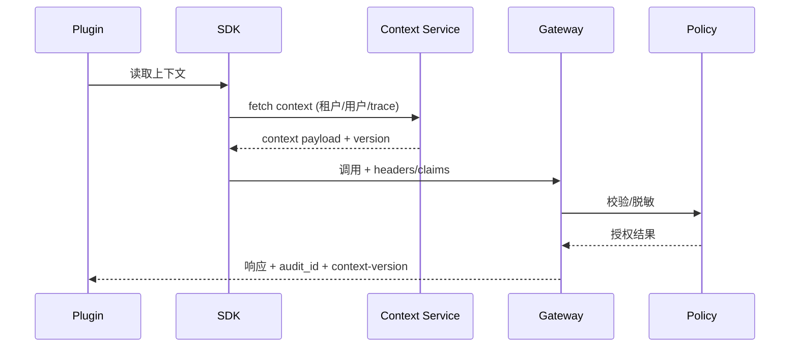

# Executive Summary

> 本子场景确保插件在调用宿主时携带完整的租户、用户、会话与 Trace 上下文，宿主依据策略执行字段级访问控制与脱敏，并在调用结束后写回审计。成功标准为上下文字段 100% 命中、跨租户访问拦截率 100%、脱敏策略命中率 ≥ 98%。

# Scope & Guardrails

- **In Scope**：上下文缓存同步、标准 Header/Claim、字段级权限、数据脱敏、审计字段、上下文失效/刷新、跨租阻断。
- **Out of Scope**：鉴权凭证注册、调用韧性、异步事件通道。
- **Environment & Flags**：`PX_PLUGIN_CONTEXT_GUARD`, `PX_PLUGIN_FIELD_MASKING`, `PX_PLUGIN_TRACE_BRIDGE`；依赖 IAM、Policy Engine、Audit Ledger、Tracing。

# Participants & Responsibilities

| Scope | Repository | Layer | 责任与交付物 |
|-------|------------|-------|--------------|
| Plugin SDK | powerx-plugin | service | 从宿主同步上下文、注入 Header/Claims、处理缓存失效与重拉 |
| Gateway & Policy Engine | powerx | security | 校验上下文、执行字段权限/脱敏、记录审计/告警 |
| Observability | powerx | ops | Trace ID 贯通、跨租户监控、上下文缺失告警 |

# End-to-End Flow

1. **Context Sync**：插件部署后通过 `/context/bootstrap` 接口拉取租户/用户/Trace 配置，并在 SDK 缓存。
2. **Invoke**：SDK 在请求 Header 中写入 `x-tenant-uuid`, `x-user-id`, `x-trace-id`, `x-permissions` 等字段，或在 JWT Claim 中携带。
3. **Policy Enforcement**：Gateway 校验上下文与租户映射，调用 Policy Engine 进行字段级授权/脱敏；若缺失或不匹配则阻断。
4. **Audit & Refresh**：宿主返回结果并提供审计 ID；SDK 根据返回的 `context-version` 决定是否刷新缓存。

# Key Interactions & Contracts

- `GET /openapi/v1/context/bootstrap`、`GET /openapi/v1/context/refresh`。
- Header 规范：`x-tenant-uuid`, `x-user-id`, `x-plugin-id`, `x-trace-id`, `x-session-id`, `x-permissions`.
- Policy Config：`context_schema.yaml`, `field_masking.yaml`.
- Audit 事件：`plugin.host.context_missing`, `plugin.host.cross_tenant_blocked`.

# Usecase Links

- `UC-INT-PLUGIN-CALL-CONTEXT-001` — 上下文同步、字段级策略、审计回写。

# Acceptance Criteria

1. 上下文字段在调用中全部存在，缺失率 <0.1%，发现后 1 分钟内自动刷新。
2. 跨租户访问阻断率 100%，并写入审计与告警。
3. 脱敏策略命中率 ≥98%，敏感字段访问都需最小权限 token。

# Telemetry & Ops

- 指标：`plugin.context.miss_count`, `plugin.context.refresh_latency`, `plugin.cross_tenant.blocked`, `plugin.field_mask.hits`.
- 告警：上下文缺失连续 5 次、脱敏策略失效、跨租访问被放行。
- Dashboards：`Plugin Context Guard`, Trace Explorer。

# Open Issues & Follow-ups

| 风险/事项 | 影响范围 | 负责人 | ETA |
|-----------|----------|--------|-----|
| Context 服务缺少版本化回滚 | 缓存失效导致大量 400 | Core Platform Squad | 2025-02-27 |
| 字段脱敏策略尚未接入多语言日志 | 合规与可观测性 | Security Squad | 2025-03-03 |
