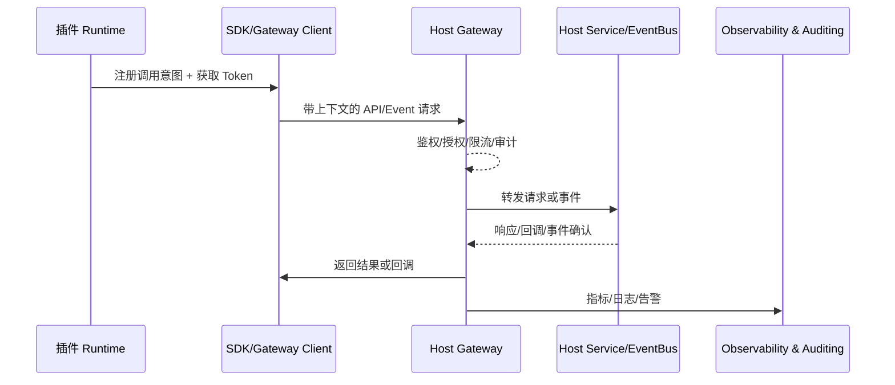

# Positioning & Goals

插件生态需要一个标准化、可治理的“插件 → 宿主”调用通道。该场景覆盖 SDK 注册、租户隔离、上下文治理、调用韧性与异步事件回调，目标是在开放平台上提供统一网关与可观测能力，确保插件可以安全地复用宿主服务：

- SDK/Gateway 延迟 p95 < 80ms，鉴权通过率 ≥ 99%，密钥轮换自动化；
- 全链路携带租户/用户上下文、字段脱敏与最小权限控制；
- 遇到失败可自动重试、熔断、降级并追踪 MTTR；
- 同时支持同步 API 与异步 Event/Webhook，具备幂等与死信治理。

# Scope & Guardrails

- **In Scope**：调用通道注册、OAuth/JWT 鉴权、租户策略、上下文标准、同步/异步调用治理、可观测与韧性策略、审计与告警。
- **Out of Scope**：插件能力注册、宿主主动调用插件、插件与第三方直连集成、Marketplace 上架计费。
- **Environment & Flags**：`PX_PLUGIN_HOST_CALL_GATEWAY`, `PX_PLUGIN_CONTEXT_GUARD`, `PX_PLUGIN_CALL_RESILIENCE`, `PX_PLUGIN_EVENT_PIPELINE`；依赖 IAM、API Gateway、EventBus、Notification Center、Observability Stack。

# Core Capabilities

1. **Unified Invocation Channel**：SDK + Gateway 提供注册、鉴权、限流、审计、密钥轮换。
2. **Context & Data Governance**：标准 Header / Payload 传递租户、用户、Trace ID，支持字段脱敏与策略下发。
3. **Resilience & Recovery**：重试、熔断、降级、告警、回退 SOP，防止插件链路拖垮宿主。
4. **Async Event & Callback Mesh**：事件发布、回调、幂等、死信管理，保证异步任务可重放与可追踪。

# Participants & Responsibilities

| Scope | Repository | Layer | 责任与交付物 | Owners |
|-------|------------|-------|--------------|--------|
| Plugin Runtime SDK | powerx-plugin | service | 提供调用通道注册、Token 刷新、上下文注入、重试/降级策略 | Plugin Ecosystem Squad |
| Host Gateway & IAM | powerx | service/security | 鉴权、租户隔离、字段级策略、审计日志与限流 | Core Platform Squad |
| Observability & Event Mesh | powerx | ops | 指标/追踪、告警、EventBus/Webhook 幂等、死信治理 | Platform SRE Squad |

# End-to-End Flow

1. **Register & Authorize**：插件在开放平台登记调用意图，获取 `client_id/secret`、证书或 JWT 配置；运行时通过 SDK 换取短期令牌。
2. **Invoke with Context**：SDK 将租户/用户/Trace 上下文嵌入 Header，Gateway 做鉴权、授权、限流并把请求路由到宿主服务；数据按策略脱敏。
3. **Observe & Harden**：若调用失败，SDK 基于策略重试/熔断/降级，同时上报指标、告警；宿主追踪日志帮助排障。
4. **Event & Callback**：插件可投递/订阅事件，宿主执行幂等与回调确认；失败进入死信队列并支持补偿。

# Key Interactions & Contracts

- **APIs**：`POST /openapi/v1/token`, `POST /openapi/v1/host/<service>`、`POST /openapi/v1/events/publish`, `POST /openapi/v1/callbacks/ack`.
- **Headers/Context**：`x-tenant-uuid`, `x-user-id`, `x-plugin-id`, `x-trace-id`, `x-permissions`.
- **Events**：`plugin.host-call.audit`, `plugin.host-call.retry`, `plugin.host-event.deadletter`.
- **Configs**：`plugin_call_gateway.yaml`, `context_schema.yaml`, `resilience_policies.yaml`, `event_pipeline.yaml`.

# Validation Workflow

1. **鉴权/注册链路**：覆盖正逆向令牌、密钥吊销、限流；确保审计记录完整。
2. **上下文与数据治理**：模拟跨租户访问、字段脱敏、上下文缺失，并验证审计与告警。
3. **韧性策略**：注入故障/超时，观察重试、熔断、降级与恢复 SLA。
4. **异步事件**：测试事件发布、回调、幂等、死信处理与补偿脚本。

# Related Links

- `SCN-INT-PLUGIN-CAPABILITY-001`（能力注册）；
- `SCN-DEV-PLUGIN-DEBUG-001`（开发调试）；
- 子场景：`SCN-INT-PLUGIN-CALL-AUTH-001`, `SCN-INT-PLUGIN-CALL-CONTEXT-001`, `SCN-INT-PLUGIN-CALL-RESILIENCE-001`, `SCN-INT-PLUGIN-CALL-ASYNC-001`。

# Acceptance Criteria

1. 插件通过 SDK/Gateway 完成鉴权，延迟 p95 < 80ms，鉴权成功率 ≥ 99%，密钥轮换 ≤ 5 分钟。
2. 调用上下文字段 100% 带齐，敏感数据脱敏命中率 ≥ 98%，未授权访问拦截率 100%。
3. 自动重试成功率 ≥ 85%，熔断触发后 2 分钟内可恢复；降级链路有审计可追溯。
4. 异步事件至少一次送达、回调确认 ≤ 3 秒、死信率 < 0.5%，所有事件支持幂等重放。

# Telemetry & Ops

- **指标**：`plugin.host.auth.success_rate`, `plugin.host.latency_p95`, `plugin.host.context.validation_failures`, `plugin.host.retry.count`, `plugin.host.circuit.open`, `plugin.host.event.deadletter`.
- **告警**：鉴权失败率 >1%（P1）、跨租户访问检测（P0）、熔断连续触发 >3 次（P1）、死信堆积 > 100（P2）。
- **可视化**：Grafana《Plugin Host Call Hub》、Trace Explorer、EventBus 死信面板、`reports/_state/plugin-host-call.json`。

# Architecture Diagram

# Open Issues & Follow-ups

| 风险/事项 | 影响范围 | 负责人 | ETA |
|-----------|----------|--------|-----|
| `plugin_call_gateway.yaml` 缺少 WebSocket/长连接策略 | 实时业务 | Core Platform Squad | 2025-02-28 |
| 死信处理仅支持手动补偿，缺少自动回放脚本 | 异步事件可靠性 | Platform SRE Squad | 2025-03-05 |
| Plugin SDK 未提供租户上下文缓存失效回调 | 数据治理 | Plugin Ecosystem Squad | 2025-02-25 |
