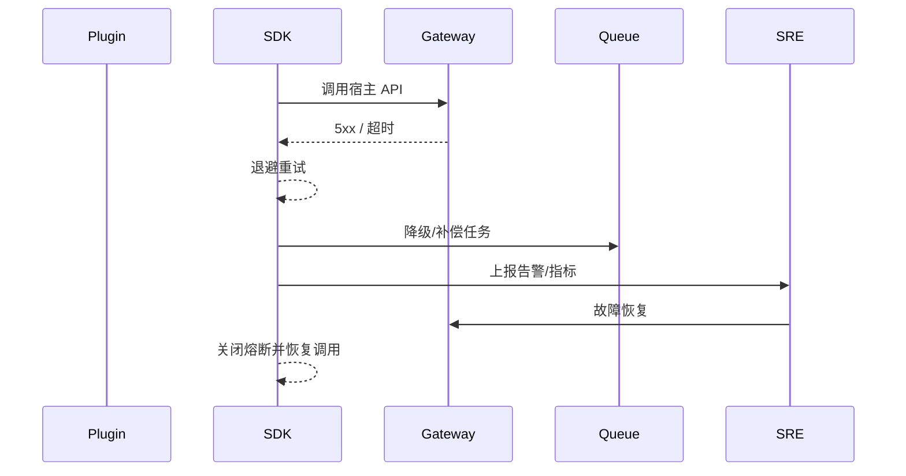

# Executive Summary

> 当宿主 API/事件出现超时、限流或内部错误时，插件需具备自动重试、熔断、降级与告警能力；失败事件要可追踪并能补偿。成功标准：自动重试成功率 ≥85%，熔断触发后 2 分钟内恢复，降级响应带审计 ID，MTTR < 15 分钟。

# Scope & Guardrails

- **In Scope**：SLA 配置、超时/退避/重试、熔断、降级（缓存/延迟队列/人工任务）、失败事件上报、回滚/补偿。
- **Out of Scope**：鉴权、上下文治理、异步事件回调实现。
- **Environment & Flags**：`PX_PLUGIN_CALL_RESILIENCE`, `PX_PLUGIN_FAILOVER_QUEUE`, `PX_PLUGIN_CIRCUIT_BREAKER`; 依赖 Observability、Alertmanager、Task Queue、Workflow Engine。

# Participants & Responsibilities

| Scope | Repository | Layer | 责任与交付物 |
|-------|------------|-------|--------------|
| Plugin SDK | powerx-plugin | ops | SLA/重试/熔断配置、降级策略、失败事件上报 |
| Observability & Alerting | powerx | ops | 指标、告警、事件聚合、自动化 runbook |
| Workflow / Task Queue | powerx | service | 延迟队列、人工补偿、恢复编排 |

# End-to-End Flow

1. **Policy Setup**：为各宿主接口配置 SLA、重试、熔断、降级策略。
2. **Detect Failure**：调用失败或超时后 SDK 记录指标并进入退避重试。
3. **Apply Breaker/Degrade**：连续失败达到阈值触发熔断，返回降级结果（缓存、延迟队列、人工任务）。
4. **Report & Recover**：失败事件写入监控与任务系统，SRE/自动化脚本处理后关闭熔断并恢复流量。

# Key Interactions & Contracts

- 配置：`resilience_policies.yaml`（超时、重试次数、熔断阈值、降级方案）。
- API：`POST /plugin/call/metrics`, `POST /plugin/call/failures`, `POST /plugin/call/recover`.
- 队列：`failover://plugin-call`（延迟队列/死信）、`workflow://plugin/manual-task`.

# Usecase Links

- `UC-INT-PLUGIN-CALL-RESILIENCE-001` — SLA 配置、重试/熔断/降级、失败补偿。

# Acceptance Criteria

1. 自动重试成功率 ≥85%，重试次数/退避策略可配置且写入指标。
2. 熔断开关状态可观测，触发后 2 分钟内自动恢复或通知 SRE。
3. 降级/补偿任务可追溯（含租户、插件、Trace），MTTR < 15 分钟。

# Telemetry & Ops

- 指标：`plugin.host.retry.count`, `plugin.host.retry.success_rate`, `plugin.host.circuit.state`, `plugin.host.degrade.count`, `plugin.host.mttr`.
- 告警：连续失败率 >5%、熔断持续 >5 分钟、降级无补偿。
- Dashboard：`Plugin Call Resilience`, Runbook in `docs/ops/plugin-host-call-resilience.md`.

# Open Issues & Follow-ups

| 风险/事项 | 影响范围 | 负责人 | ETA |
|-----------|----------|--------|-----|
| 退避策略尚未支持租户维度 | 高流量租户易触发雪崩 | Plugin Ecosystem Squad | 2025-02-26 |
| 降级结果缺少审计 ID | 难以追踪用户影响 | Observability Squad | 2025-02-25 |
