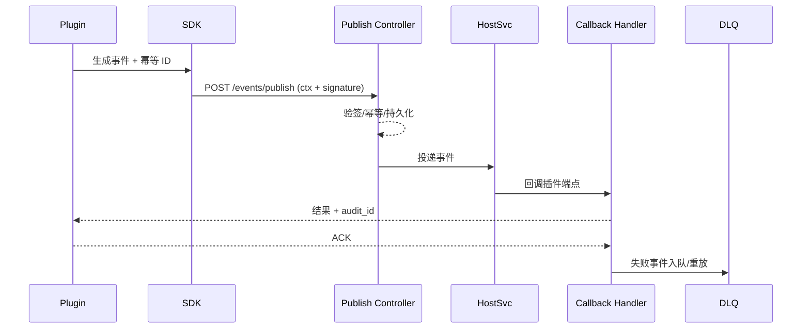

doc_id: UC-INT-PLUGIN-CALL-ASYNC-001
scn_id: SCN-INT-PLUGIN-CALL-HOST-001
title: 插件异步事件与回调治理（service/integration）
status: Draft
version: v0.1.0
repo_key: powerx
scope: powerx
layer: service
domain: integration
scenario_title: "插件调用宿主"
owners:
  - name: Michael Hu
    role: Plugin Tech Lead
    contact: tech@artisan-cloud.com
  - name: Grace Lin
    role: Security & Compliance Lead
    contact: compliance@artisan-cloud.com
contributors:
  - name: Leo Zhang
    role: Platform Event Lead
    contact: event@artisan-cloud.com
  - name: Ada Wu
    role: SDK Runtime PM
    contact: sdk@artisan-cloud.com
linked_requirements:
  - id: SCN-INT-PLUGIN-CALL-ASYNC-001
    description: 子场景《异步事件与回调处理》
code_refs:
  - repo: powerx
    path: services/plugin/eventmesh/publish_controller.ts
    description: `POST /events/publish`/`bulk` 接口、签名校验、幂等键生成
  - repo: powerx
    path: services/plugin/eventmesh/callback_handler.ts
    description: 宿主回调签名校验、ACK、重试/死信写入
  - repo: powerx
    path: services/plugin/eventmesh/deadletter_service.ts
    description: 死信持久化、查询、重放、告警
  - repo: powerx-plugin
    path: packages/sdk/src/eventChannel.ts
    description: 插件侧事件 SDK、幂等 ID、回调端点、确认与重放
feature_flags:
  - PX_PLUGIN_EVENT_PIPELINE
  - PX_PLUGIN_WEBHOOK_GUARD
  - PX_PLUGIN_EVENT_REPLAY
optional: false
last_reviewed_at: 2025-02-20

---

# Usecase Overview

- **业务目标**：让插件能以标准化方式向宿主 EventBus/Webhook 发布事件、接收回调并确认，保证至少一次送达、3 秒内回调确认、死信率 <0.5%，同时具备签名校验、幂等与自动补偿能力。
- **成功度量**：
  - `plugin.event.publish_success_rate ≥ 99.5%`
  - 回调平均确认时间 < 3s，签名失败率 < 0.5%
  - 死信堆积 < 100 条、24h 内全部处理
  - 重放作业可在 5 分钟内恢复事件
- **场景关联**：落实 `SCN-INT-PLUGIN-CALL-HOST-001` Stage 4（Event & Callback Mesh），与 AUTH/CONTEXT/RESILIENCE 子场景共同构成插件调用宿主的闭环。

> 通过统一的事件管道，插件能够异步传输大批量数据或执行长耗时任务，而宿主可可靠地回调结果并提供审计。

# Context & Assumptions

- **前置条件**
  - Feature Flags `PX_PLUGIN_EVENT_PIPELINE`, `PX_PLUGIN_WEBHOOK_GUARD`, `PX_PLUGIN_EVENT_REPLAY` 已开启。
  - 插件已通过 AUTH 子场景获取凭据，并同步上下文信息（租户、Trace、用户）。
  - EventBus 与 Webhook 管理中心可用，支持持久化、重试、死信、重放。
  - 插件在宿主开放平台登记了回调端点、签名算法、公钥。
  - Observability Stack（Tracing、Metrics、DLQ Dashboard）已对接。
- **输入/输出**
  - 输入：插件发起的 `events://` 消息、Bulk 发布、宿主回调通知、死信告警。
  - 输出：事件投递结果、回调确认 ACK、死信记录、重放结果、审计日志。
- **边界**
  - 不处理宿主主动拉取插件接口（另有“宿主调用插件”场景）。
  - 同步 API/调用韧性策略在其他子场景覆盖。
  - 插件与第三方系统的事件通道不在本 usecase 处理。

# Context & Assumptions

- **前置条件**：见上。
- **输入/输出**：见上。
- **边界**：见上。

# Solution Blueprint

## 体系分解

| 层 | 主要组件/模块 | 责任 | 代码入口 |
|----|---------------|------|---------|
| 插件事件 SDK | `packages/sdk/src/eventChannel.ts` | 生成幂等 ID、打包上下文、签名请求、管理回调端点与 ACK | powerx-plugin |
| 事件发布控制器 | `services/plugin/eventmesh/publish_controller.ts` | 验签、幂等、持久化、批量发布、投递至 EventBus | powerx |
| 回调处理器 | `services/plugin/eventmesh/callback_handler.ts` | 回调签名校验、ACK、重试/死信写入 | powerx |
| 死信/重放服务 | `services/plugin/eventmesh/deadletter_service.ts` | 死信查询、告警、手动或自动重放，记录审计 | powerx |
| Observability | `services/plugin/eventmesh/telemetry.ts` | 指标上报、Trace/日志、告警、报表输出 | powerx |

## 流程与时序

1. **Step 1 – Publish Event**：插件通过 SDK 调用 `POST /events/publish`，携带租户上下文、幂等 ID、签名、事件 Payload。
2. **Step 2 – Validate & Persist**：服务端校验签名、租户授权与幂等键，持久化事件并写入审计，然后投递给宿主业务服务。
3. **Step 3 – Callback & Ack**：宿主处理完成后调用插件回调端点，插件验证签名后返回 ACK（附 Trace/审计 ID）。
4. **Step 4 – Retry & Deadletter**：回调失败或超时则自动重试；超过阈值进入死信并触发告警，SRE 可重放或人工补偿。

# Contracts & Interfaces

- **Inbound**
  - `POST /openapi/v1/events/publish` / `bulk` — Body: `event_type`, `payload`, `tenant_id`, `idempotency_key`, `signature`.
  - `POST /openapi/v1/events/publish/replay` — 重放失败事件。
  - `POST /openapi/v1/callbacks/ack` — 插件确认回调（可由 SDK 自动完成）。
- **Outbound**
  - `POST <plugin_callback_url>` — 宿主回调，Header 包含 `x-signature`, `x-event-id`, `x-trace-id`.
  - `POST /notifications/send` — 死信/失败告警。
- **Configs / Schemas**
  - `event_pipeline.yaml` — 事件类型、Topic、重试策略、幂等 TTL。
  - `webhook_endpoints.yaml` — 回调端点、公钥、超时。
  - `deadletter_policies.yaml` — 阈值、告警、重放策略。

# Implementation Checklist

| 项目 | 描述 | 完成状态 | 负责人 |
|------|------|----------|--------|
| 事件发布 API | 实现签名、幂等、批量发布、上下文校验 | [ ] | Platform Event Squad |
| 插件 SDK | 支持事件通道、幂等 ID、回调 ACK、自动重放 | [ ] | Plugin Ecosystem Squad |
| 回调/死信服务 | 回调签名校验、重试+DLQ、重放 CLI | [ ] | Platform Event Squad |
| Observability | 指标、追踪、死信面板、告警路由 | [ ] | SRE Squad |
| Runbooks | 死信处理、补偿脚本、回调故障排查文档 | [ ] | SRE Squad |

# Testing Strategy

- **单元测试**：签名/幂等校验、事件序列化、回调 ACK、重放逻辑。
- **集成测试**：
  - 使用 `scripts/dev/mock_plugin_event.mjs` 发布事件、模拟回调成功/失败。
  - 注入重复事件，验证幂等仅处理一次。
  - 模拟签名错误或跨租户上下文，确认被拒绝。
- **端到端验证**：
  - 正向：事件发布→宿主处理→回调成功，Trace 连贯。
  - 逆向：回调失败 3 次进入 DLQ，运行 `event_replay` 恢复。
  - 死信堆积告警触发→SRE 重放→告警关闭。
- **非功能测试**：高吞吐（>5k events/min）下延迟、死信率与重放性能。

# Observability & Ops

- **指标**：`plugin.event.publish_rate`, `plugin.event.publish_latency`, `plugin.event.deadletter_rate`, `plugin.callback.success_rate`, `plugin.event.replay_count`.
- **日志**：publish/回调/重放日志需包含 `tenant_id`, `plugin_id`, `event_id`, `idempotency_key`, `trace_id`.
- **告警**：死信 >100（P1）、回调成功率 <99%（P1）、签名失败 >5/min（P2）、重放失败（P1）。
- **Dashboards**：Grafana《Plugin Event Mesh》、DLQ Dashboard、`reports/_state/plugin-event.json`。

# Rollback & Failure Handling

- 回调失败自动重试（指数退避），超过阈值写入死信并通知值班。
- 提供 `px plugin event replay --event-id <id>` 与批量重放脚本；重放前需通过 IAM 审批。
- 若签名或公钥配置错误，支持滚动更新 `webhook_endpoints.yaml` 并即时生效。
- 提供人工补偿任务模板，确保业务方可追踪补偿状态。

# Follow-ups & Risks

| 风险/事项 | 影响 | 缓解方案 | 负责人 | ETA |
|-----------|------|----------|--------|-----|
| 回调端点缺少多 Region 容灾 | 事件回调高可用 | Plugin Ecosystem Squad | 2025-03-02 |
| 死信重放脚本未接入 IAM 审批 | 审计合规风险 | Platform SRE Squad | 2025-02-28 |
| 批量事件 publish 暂无分片限流 | 高吞吐租户可能拖垮网关 | Core Platform Squad | 2025-03-05 |

# References & Links

- 场景：`docs/scenarios/integration/SCN-INT-PLUGIN-CALL-HOST-001.md`
- 子场景：`docs/scenarios/integration/SCN-INT-PLUGIN-CALL-ASYNC-001.md`
- 配置：`event_pipeline.yaml`, `webhook_endpoints.yaml`, `deadletter_policies.yaml`
- 脚本：`scripts/ops/plugin-event-replay.mjs`（建议） / `scripts/qa/workflow-metrics.mjs --target plugin-event`
- 发布指引：`npm run publish:usecases -- --scn-id SCN-INT-PLUGIN-CALL-HOST-001 --validate-only`
