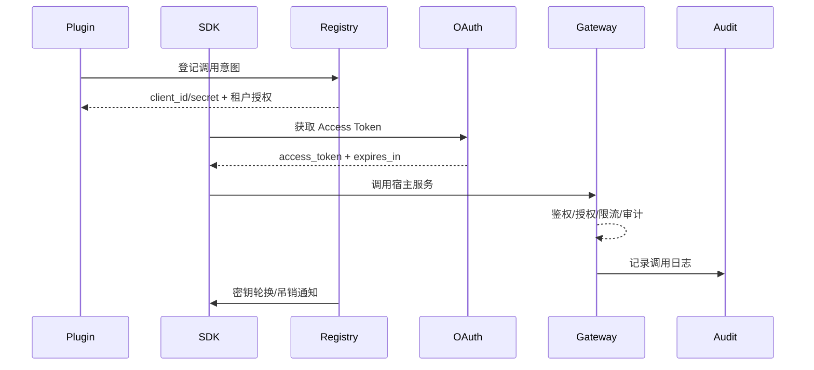

doc_id: UC-INT-PLUGIN-CALL-AUTH-001
scn_id: SCN-INT-PLUGIN-CALL-HOST-001
title: 插件调用通道注册与鉴权（service/integration）
status: Draft
version: v0.1.0
repo_key: powerx
scope: powerx
layer: service
domain: integration
scenario_title: "插件调用宿主"
owners:
  - name: Michael Hu
    role: Plugin Tech Lead
    contact: tech@artisan-cloud.com
contributors:
  - name: Grace Lin
    role: Security & Compliance Lead
    contact: compliance@artisan-cloud.com
  - name: Leo Zhang
    role: Platform Gateway PM
    contact: gateway@artisan-cloud.com
linked_requirements:
  - id: SCN-INT-PLUGIN-CALL-AUTH-001
    description: 子场景《调用通道注册与鉴权》
code_refs:
  - repo: powerx
    path: services/plugin/gateway/client_registry.ts
    description: 调用意图登记、client_id/secret 生成、租户授权绑定
  - repo: powerx
    path: services/plugin/gateway/oauth_service.ts
    description: OAuth2/JWT 签发、短期 Token 下发、刷新与吊销
  - repo: powerx
    path: services/plugin/gateway/policy_enforcer.ts
    description: 租户授权矩阵、限流、审计日志、密钥轮换
  - repo: powerx-plugin
    path: packages/sdk/src/authChannel.ts
    description: 插件 SDK 注册调用意图、封装 Token 获取/刷新、密钥轮换
feature_flags:
  - PX_PLUGIN_HOST_CALL_GATEWAY
  - PX_PLUGIN_SECRET_ROTATION
  - PX_PLUGIN_LIMIT_GUARD
optional: false
last_reviewed_at: 2025-02-20

---

# Usecase Overview

- **业务目标**：为插件提供统一、安全、可审计的调用通道注册与鉴权能力，支持 OAuth2 Client Credentials / JWT，保证鉴权成功率 ≥99%、密钥轮换 ≤5 分钟、Gateway 延迟 p95 <80ms，并对未授权访问或限流即时告警。
- **成功度量**：
  - `plugin.host.auth.success_rate ≥ 99%`
  - 密钥轮换传播 ≤ 5 分钟、轮换失败率 <0.1%
  - 认证延迟 p95 <80ms
  - 审计覆盖率 100%（包含租户、插件、client_id、trace）
- **场景关联**：支撑 `SCN-INT-PLUGIN-CALL-HOST-001` Stage 1（Register & Authorize），为 CONTEXT/RESILIENCE/ASYNC 子场景提供前置凭据。

> 所有插件在调用宿主前必须完成调用意图登记、凭证获取与租户授权绑定，保障租户隔离与最小权限。

# Context & Assumptions

- **前置条件**
  - Feature Flags `PX_PLUGIN_HOST_CALL_GATEWAY`, `PX_PLUGIN_SECRET_ROTATION`, `PX_PLUGIN_LIMIT_GUARD` 已开启。
  - 插件能力已在注册场景落地并获授权调用宿主能力。
  - Secret Manager、IAM、Audit Ledger 可用，Gateway 支持 per-plugin/tenant 限流。
  - 插件具备安全存储密钥的能力，SDK 可访问 secret 管控接口。
  - For sandbox，提供测试租户与凭证。
- **输入/输出**
  - 输入：调用意图（宿主服务、租户范围、能力标签）、plugin_id、租户矩阵、凭证申请、轮换/吊销请求。
  - 输出：`client_id/secret` 或证书、短期 Token、租户授权表、限流/审计日志、告警事件。
- **边界**
  - 不包含上下文字段或数据脱敏（由 CONTEXT 子场景负责）。
  - 不处理异步事件签名/幂等等逻辑。
  - 插件内部的密钥保管策略由插件团队自管，但需遵守平台要求。

# Solution Blueprint

## 体系分解

| 层 | 主要组件/模块 | 责任 | 代码入口 |
|----|---------------|------|---------|
| 调用意图登记 | `services/plugin/gateway/client_registry.ts` | 记录插件→宿主服务映射、租户授权、审批流、Secret 同步 | powerx |
| OAuth/JWT 服务 | `services/plugin/gateway/oauth_service.ts` | 签发 Access Token / JWT、刷新、吊销、审计 | powerx |
| Gateway Policy | `services/plugin/gateway/policy_enforcer.ts` | 校验 Token、租户授权、限流、审计、告警、轮换监听 | powerx |
| 插件 SDK | `packages/sdk/src/authChannel.ts` | 调用注册、封装 Token 获取/刷新、密钥轮换通知、异常回退 | powerx-plugin |

## 流程与时序

1. **Register Intent**：插件在开放平台登记调用场景（API 列表、租户范围、能力标签），审批通过后生成 `client_id/secret` 或证书，写入 Secret Manager 与 Audit。
2. **Obtain Token**：插件运行时通过 SDK 调用 `POST /openapi/v1/token`（Client Credentials）或 `POST /openapi/v1/jwt/issue`，获得短期令牌；SDK 缓存并自动刷新。
3. **Invoke & Enforce**：请求通过 Gateway，执行 Token 校验、租户授权、限流，成功后转发至宿主服务，写入审计日志。
4. **Rotate/Revoke**：当密钥泄露或到期，触发 `POST /openapi/v1/secrets/rotate` / `DELETE ...`，SDK 接收轮换通知并替换；旧凭证 5 分钟内失效。

# Contracts & Interfaces

- `POST /openapi/v1/clients` — 登记调用意图，Body：`plugin_id`, `services`, `tenants`, `scopes`, `callback`.
- `POST /openapi/v1/token` — OAuth2 Client Credentials。
- `POST /openapi/v1/jwt/issue` — 证书/JWT 签发。
- `POST /openapi/v1/secrets/rotate`、`DELETE /openapi/v1/secrets/{id}` — 密钥轮换/吊销。
- `GET /openapi/v1/clients/{id}` — 查询授权、限流策略。
- Event：`plugin.host-call.secret_rotated`, `plugin.host-call.auth_failure`.

安全/合规：密钥存储于 Secret Manager，访问须多因子；所有 Token 关联租户上下文；限流策略 per plugin + tenant；审计保留 365 天。

# Implementation Checklist

| 项目 | 描述 | 完成状态 | 负责人 |
|------|------|----------|--------|
| Client Registry API | 支持多租户授权、审批流、SecretManager 写入 | [ ] | Core Platform Squad |
| OAuth/JWT Service | 支持证书、短期 Token、刷新/吊销、审计 | [ ] | Platform Security Squad |
| SDK Auth Channel | 调用注册、Token 获取/刷新、密钥轮换通知 | [ ] | Plugin Ecosystem Squad |
| Gateway Policy | per-plugin/tenant 限流、审计 ID、异常告警 | [ ] | Core Platform Squad |
| Automation & Runbooks | 密钥轮换脚本、告警处理、Sandbox 凭证 | [ ] | SRE Squad |

# Testing Strategy

- **单元测试**：client registry 校验、OAuth/JWT 签发、Token 解析、限流策略。
- **集成测试**：
  - Sandbox 插件注册→获取凭证→调用 API；
  - 模拟密钥泄露，验证吊销与轮换；
  - 限流/未授权租户访问，确认 403/429 与告警。
- **端到端**：
  - 正向：插件注册→凭证→调用→审计；
  - 逆向：过期 Token、吊销后调用、租户不匹配；
  - 限流恢复：短时间内触发 429，确认限流日志与恢复。
- **非功能**：高并发 Token 请求、轮换批量处理性能。

# Observability & Ops

- **指标**：`plugin.auth.success_rate`, `plugin.auth.latency_ms`, `plugin.auth.rate_limit_hits`, `plugin.secret.rotation_time`.
- **日志**：Registry/OAuth/Gateway 鉴权日志需包含 `tenant_id`, `plugin_id`, `client_id`, `trace_id`, `decision`.
- **告警**：
  - 成功率 <99%（P1）
  - 限流连续触发 >10 次/分钟（P2）
  - 密钥轮换失败 or 5 分钟未传播（P1）
  - 无审计日志写入（P0）
- **Dashboards**：`Plugin Host Auth`, Audit Explorer。

# Rollback & Failure Handling

- 注册失败：重试或回滚审批，提供 `px plugin client delete` CLI。
  - 密钥泄露：立即调用 `secrets/rotate` 并吊销旧凭证，触发告警；SDK 自动刷新。
  - Gateway 鉴权异常：切换到备用 Auth 服务或沙箱凭证； runbook 引导 SRE 处理。
  - 限流策略配置错误：回滚到上一个版本，通知租户。

# Follow-ups & Risks

| 风险/事项 | 影响 | 缓解方案 | 负责人 | ETA |
|-----------|------|----------|--------|-----|
| Gateway 尚未支持 mTLS 通道 | 高敏插件安全性 | Core Platform Squad | 2025-03-01 |
| Secret Rotation CLI 缺少批量租户 | 多租插件效率 | Plugin Ecosystem Squad | 2025-02-25 |
| Audit 日志缺少 trace id | 可观测性受限 | Observability Squad | 2025-02-24 |

# References & Links

- 场景：`docs/scenarios/integration/SCN-INT-PLUGIN-CALL-HOST-001.md`
- 子场景：`docs/scenarios/integration/SCN-INT-PLUGIN-CALL-AUTH-001.md`
- 配置：`plugin_call_gateway.yaml`, `secret_rotation_policies.yaml`
- 脚本：`scripts/ops/plugin-client-rotate.mjs`
- 发布指引：`npm run publish:usecases -- --scn-id SCN-INT-PLUGIN-CALL-HOST-001 --validate-only`
