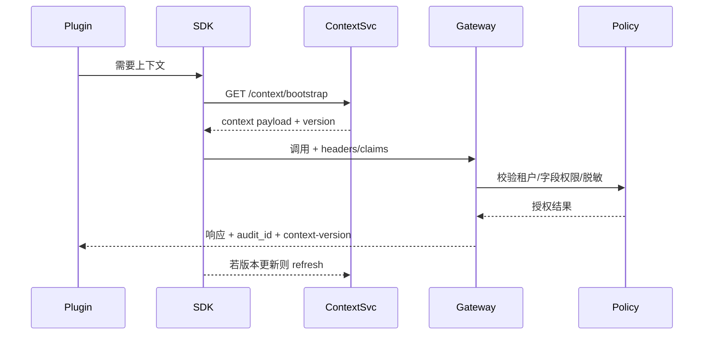

doc_id: UC-INT-PLUGIN-CALL-CONTEXT-001
scn_id: SCN-INT-PLUGIN-CALL-HOST-001
title: 插件调用上下文传递与数据治理（security/integration）
status: Draft
version: v0.1.0
repo_key: powerx
scope: powerx
layer: security
domain: integration
scenario_title: "插件调用宿主"
owners:
  - name: Grace Lin
    role: Security & Compliance Lead
    contact: compliance@artisan-cloud.com
contributors:
  - name: Michael Hu
    role: Plugin Tech Lead
    contact: tech@artisan-cloud.com
  - name: Irene Zhao
    role: Data Governance PM
    contact: data-ops@artisan-cloud.com
linked_requirements:
  - id: SCN-INT-PLUGIN-CALL-CONTEXT-001
    description: 子场景《上下文传递与数据治理》
code_refs:
  - repo: powerx-plugin
    path: packages/sdk/src/contextBridge.ts
    description: 插件运行时上下文缓存、Header 注入、Trace 传播、刷新逻辑
  - repo: powerx
    path: services/plugin/gateway/context_validator.ts
    description: 上下文校验、跨租户阻断、字段级权限检查
  - repo: powerx
    path: services/plugin/gateway/masking_engine.ts
    description: 字段脱敏策略、最小权限 enforcement、审计字段生成
feature_flags:
  - PX_PLUGIN_CONTEXT_GUARD
  - PX_PLUGIN_FIELD_MASKING
  - PX_PLUGIN_TRACE_BRIDGE
optional: false
last_reviewed_at: 2025-02-20

---

# Usecase Overview

- **业务目标**：确保插件在调用宿主 API/Event 时携带完整的租户、用户、Trace、权限上下文，宿主侧可执行字段级权限和脱敏策略，拦截跨租访问，并将上下文结果写入审计，达成上下文缺失率 <0.1%、跨租阻断率 100%、脱敏命中率 ≥98%。
- **成功度量**：
  - `plugin.context.miss_count / total_calls < 0.1%`
  - `plugin.cross_tenant.blocked == 100%`（无漏检）
  - `plugin.field_mask.hits ≥ 98%`
  - 审计日志上下文字段完整度 100%
- **场景关联**：承接 `SCN-INT-PLUGIN-CALL-HOST-001` Stage 2（Invoke with Context），与 AUTH 子场景共享凭证，与 RESILIENCE/ASYNC 共享 Trace ID。

# Context & Assumptions

- **前置条件**
  - Feature Flags `PX_PLUGIN_CONTEXT_GUARD`, `PX_PLUGIN_FIELD_MASKING`, `PX_PLUGIN_TRACE_BRIDGE` 已启用。
  - 插件已完成调用通道注册并获得凭证（AUTH 子场景）。
  - 宿主提供 `/context/bootstrap`、`/context/refresh` 接口及 Policy Engine 配置。
  - IAM 提供租户-用户-权限矩阵、字段级策略，Audit Ledger 可写入上下文信息。
  - Trace/Logging 平台可接收 `x-trace-id`、`x-session-id`。
- **输入/输出**
  - 输入：租户 ID、插件 ID、用户/角色、Trace ID、权限/Scopes、上下文版本、字段脱敏策略。
  - 输出：带上下文的调用请求、字段脱敏后的响应、审计记录、上下文刷新指令。
- **边界**
  - 不负责鉴权 Token 的签发（AUTH 子场景）。
  - 不覆盖插件本地数据脱敏（由插件自行实现，但必须遵守租户策略）。
  - 异步事件上下文嵌入在 ASYNC 子场景；本文关注同步调用以及 Gateway 层治理。

# Solution Blueprint

## 体系分解

| 层 | 主要组件/模块 | 责任 | 代码入口 |
|----|---------------|------|---------|
| Context Bridge SDK | `packages/sdk/src/contextBridge.ts` | 拉取/缓存上下文、注入 Header/Claims、处理失效刷新 | powerx-plugin |
| Context Service | `services/plugin/gateway/context_service.ts` | `/context/bootstrap/refresh` API、上下文版本管理、租户策略下发 | powerx |
| Gateway Validator | `services/plugin/gateway/context_validator.ts` | 校验 Header/Claims、跨租阻断、字段权限判定、审计字段生成 | powerx |
| Masking Engine | `services/plugin/gateway/masking_engine.ts` | 脱敏策略生成、数据返回时脱敏、敏感字段命中日志 | powerx |

## 流程与时序

1. **Bootstrap**：插件启动时调用 `GET /context/bootstrap` 获取租户/用户/Trace/权限上下文，SDK 缓存并携带版本号。
2. **Invoke**：每次调用时 SDK 在 Header / JWT Claim 中写入 `tenant_uuid`, `x-user-id`, `x-plugin-id`, `x-trace-id`, `x-permissions`, `x-context-version`。
3. **Enforce**：Gateway 校验上下文与租户映射，调用 Policy Engine 做字段级权限与脱敏；若缺失/跨租/过期则返回 400/403 并写入审计。
4. **Refresh & Audit**：宿主响应中返回 `context-version`、`audit_id`；若版本提高，SDK 触发刷新；所有上下文决策写入审计与监控。

# Contracts & Interfaces

- `GET /openapi/v1/context/bootstrap` — 返回 `tenant_uuid`, `user_id`, `roles`, `permissions`, `trace_id`, `mask_policy`, `version`.
- `GET /openapi/v1/context/refresh?version=<v>` — 增量更新。
- Header/Claims：`tenant_uuid`, `x-user-id`, `x-plugin-id`, `x-trace-id`, `x-session-id`, `x-permissions`, `x-context-version`.
- Policy Config：`context_schema.yaml`, `field_masking.yaml`, `cross_tenant_rules.yaml`.
- Audit Event：`plugin.host.context_missing`, `plugin.host.cross_tenant_blocked`, `plugin.host.masking_applied`.

# Implementation Checklist

| 项目 | 描述 | 完成状态 | 负责人 |
|------|------|----------|--------|
| Context Service API | Bootstrap/Refresh、版本管理、缓存策略 | [ ] | Core Platform Squad |
| SDK Context Bridge | 缓存/刷新、Header 注入、Trace 传播 | [ ] | Plugin Ecosystem Squad |
| Gateway Validator | 上下文校验、跨租拦截、审计字段 | [ ] | Security Squad |
| Masking Engine | 字段级权限、脱敏策略、命中统计 | [ ] | Security/Data Team |
| Monitoring & Audit | 指标、日志、Trace、告警配置 | [ ] | Observability Squad |

# Testing Strategy

- **单元测试**：上下文解析、缓存更新、Header/Claim 注入、策略判定、脱敏规则。
- **集成测试**：
  - 正向：完整上下文调用，验证审计与脱敏。
  - 逆向：缺少 `tenant_uuid`、过期 `context-version`、跨租户访问。
  - 字段策略：不同角色访问敏感字段，确认被脱敏或拒绝。
- **端到端**：
  - Sandbox 插件：Bootstrap→调用→刷新→审计。
  - 故障：Context 服务不可用时的降级流程（提示刷新/回退）。
  - Trace：跨场景 Trace ID 贯通。
- **非功能**：上下文缓存命中率、刷新延迟、Policy Engine 性能。

# Observability & Ops

- **指标**：`plugin.context.miss_count`, `plugin.context.refresh_latency`, `plugin.cross_tenant.blocked`, `plugin.field_mask.hits`, `plugin.context.audit_missing`.
- **日志**：ContextSvc/Gateway/Mask Engine 日志需包含 `tenant_uuid`, `plugin_id`, `context_version`, `decision`, `trace_id`。
- **告警**：
  - 上下文缺失连续 >3（P1）
  - 跨租访问未阻断（P0）
  - 脱敏策略命中率 <95%（P1）
  - Context Refresh 失败率 >5%（P2）
- **Dashboards**：`Plugin Context Guard`, Trace Explorer, Audit Panel。

# Rollback & Failure Handling

- 若 Context 配置误发导致大量 400：回滚 `context_schema.yaml`，SDK 允许临时使用旧版本（Grace Period）。
- Context 服务不可用：SDK 进入“缓存只读”模式 5 分钟，期间仅允许已授权租户调用；超时后需人工恢复。
- 脱敏策略错误：回滚配置并重新处理审计；通知受影响租户。

# Follow-ups & Risks

| 风险/事项 | 影响 | 缓解方案 | 负责人 | ETA |
|-----------|------|----------|--------|-----|
| Context 服务缺少版本回滚 | 大规模上下文失效 | Core Platform Squad | 2025-02-27 |
| 脱敏策略尚未支持多语言日志 | 合规审计 | Security Squad | 2025-03-03 |
| 插件 SDK 没有缓存失效回调 | 上下文过期后无法感知 | Plugin Ecosystem Squad | 2025-02-25 |

# References & Links

- 场景：`docs/scenarios/integration/SCN-INT-PLUGIN-CALL-HOST-001.md`
- 子场景：`docs/scenarios/integration/SCN-INT-PLUGIN-CALL-CONTEXT-001.md`
- 配置：`context_schema.yaml`, `field_masking.yaml`
- 脚本：`scripts/ops/plugin-context-refresh.mjs`
- 发布指引：`npm run publish:usecases -- --scn-id SCN-INT-PLUGIN-CALL-HOST-001 --validate-only`
