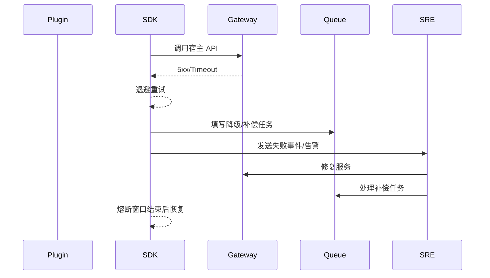

doc_id: UC-INT-PLUGIN-CALL-RESILIENCE-001
scn_id: SCN-INT-PLUGIN-CALL-HOST-001
title: 插件调用韧性与回退策略（ops/integration）
status: Draft
version: v0.1.0
repo_key: powerx
scope: powerx
layer: ops
domain: integration
scenario_title: "插件调用宿主"
owners:
  - name: Michael Hu
    role: Plugin Tech Lead
    contact: tech@artisan-cloud.com
contributors:
  - name: Grace Lin
    role: Security & Compliance Lead
    contact: compliance@artisan-cloud.com
  - name: Leo Zhang
    role: Platform Gateway PM
    contact: gateway@artisan-cloud.com
linked_requirements:
  - id: SCN-INT-PLUGIN-CALL-RESILIENCE-001
    description: 子场景《调用韧性与回退策略》
code_refs:
  - repo: powerx-plugin
    path: packages/sdk/src/resilience/policyManager.ts
    description: SLA/超时/重试/熔断/降级策略配置与执行
  - repo: powerx
    path: services/plugin/resilience/telemetry_service.ts
    description: 失败事件上报、指标聚合、告警触发、MTTR 计算
  - repo: powerx
    path: services/plugin/resilience/failover_queue.ts
    description: 降级任务/延迟队列/人工补偿编排
  - repo: powerx
    path: scripts/ops/plugin-call-failover.mjs
    description: 故障注入与回放工具、熔断恢复脚本
feature_flags:
  - PX_PLUGIN_CALL_RESILIENCE
  - PX_PLUGIN_FAILOVER_QUEUE
  - PX_PLUGIN_CIRCUIT_BREAKER
optional: false
last_reviewed_at: 2025-02-20

---

# Usecase Overview

- **业务目标**：当宿主 API/事件出现超时、限流或内部错误时，插件需通过标准策略实现自动重试、熔断、降级与补偿，保证自动重试成功率 ≥85%、熔断触发后 2 分钟内可恢复、降级请求具备审计追踪，并把失败事件上报监控。
- **成功度量**：
  - `plugin.host.retry.success_rate ≥ 85%`
  - `plugin.host.circuit.recover_time ≤ 2m`
  - 降级/补偿任务 100% 记录审计 ID 与租户/插件信息
  - `plugin.host.mttr < 15m`
- **场景关联**：对应 `SCN-INT-PLUGIN-CALL-HOST-001` Stage 3（Observe & Harden），在 AUTH/CONTEXT 完成前置控制后提供高可用保障，并与 ASYNC 子场景共享失败事件管道。

# Context & Assumptions

- **前置条件**
  - Feature Flags `PX_PLUGIN_CALL_RESILIENCE`, `PX_PLUGIN_FAILOVER_QUEUE`, `PX_PLUGIN_CIRCUIT_BREAKER` 已启用。
  - 插件调用已具备凭证/上下文治理，Observability Stack 可收集 Metrics/Logs/Trace。
  - Task Queue 或 Workflow Engine 可处理延迟重试与人工补偿。
  - Alertmanager 配置了值班渠道，SRE Runbook 可执行回滚。
- **输入/输出**
  - 输入：SLA 配置、重试/熔断策略、降级方案、失败事件。
  - 输出：重试/熔断/降级执行结果、延迟队列任务、告警、审计记录、回滚脚本。
- **边界**
  - 不覆盖鉴权、上下文、异步事件实现，但失败事件可与 ASYNC 共享。
  - 插件自身业务逻辑的降级内容需插件团队提供，平台负责框架与审计。

# Solution Blueprint

## 体系分解

| 层 | 主要组件/模块 | 责任 | 代码入口 |
|----|---------------|------|---------|
| Resilience Policy Manager | `packages/sdk/src/resilience/policyManager.ts` | 解析 `resilience_policies.yaml`，执行超时、退避重试、熔断策略 | powerx-plugin |
| Failover Queue & Tasks | `services/plugin/resilience/failover_queue.ts` | 存储降级任务、延迟队列、人工补偿、状态回调 | powerx |
| Telemetry & Alerts | `services/plugin/resilience/telemetry_service.ts` | 失败事件聚合、指标、告警、MTTR 与 Runbook 触发 | powerx |

## 流程与时序

1. **Policy Setup**：为每个宿主接口配置 SLA、超时、重试次数、熔断阈值、降级方案，并同步到 SDK。
2. **Detect Failure**：调用失败或超时后，SDK 立即记录指标并按指数退避策略重试。
3. **Circuit & Degrade**：连续失败达到阈值触发熔断，返回降级响应（缓存/延迟队列/人工任务），并在 `failover_queue` 中登记。
4. **Report & Recover**：失败事件上报监控触发告警；SRE 或自动脚本处理后，执行熔断恢复、重放任务并更新审计。

# Contracts & Interfaces

- `resilience_policies.yaml` — 定义 `timeout_ms`, `retry.max_attempts`, `retry.backoff`, `circuit.threshold`, `degrade.strategy`, `failover.queue`.
- `POST /plugin/call/failures` — 上报失败事件：`tenant_uuid`, `plugin_id`, `api`, `error_code`, `retry_count`, `trace_id`.
- `POST /plugin/call/failover` — 创建降级/补偿任务。
- `POST /plugin/call/recover` — 熔断恢复或回滚完成通知。
- Logs/Audit：`plugin.host.retry`, `plugin.host.circuit`, `plugin.host.degrade`.

# Implementation Checklist

| 项目 | 描述 | 完成状态 | 负责人 |
|------|------|----------|--------|
| Policy Engine | 支持 per-API 策略、租户 override、动态下发 | [ ] | Plugin Ecosystem Squad |
| SDK Resilience | 实现超时、退避、熔断、降级挂钩、指标上报 | [ ] | Plugin Ecosystem Squad |
| Failover Queue | 延迟/死信队列、人工补偿任务、状态回调 | [ ] | Platform Ops Squad |
| Telemetry & Alerts | 指标埋点、Grafana、告警规则、Runbook | [ ] | SRE Squad |
| Tooling | `plugin-call-failover.mjs` 故障注入和恢复脚本 | [ ] | SRE Squad |

# Testing Strategy

- **单元测试**：退避计算、熔断状态机、降级策略选择、队列入库、指标上报。
- **集成测试**：
  - 调用故障注入（5xx/限流/超时）→重试/熔断；
  - 降级缓存/延迟队列场景；
  - Failover 任务自动/人工补偿。
- **端到端**：
  - 正向：模拟一次失败后重试成功；
  - 逆向：连续失败触发熔断，2 分钟后恢复；
  - 補償：Failover 任务生成→SRE 处理→审计。
- **非功能**：高并发重试对 Gateway 的影响、队列吞吐、熔断恢复性能。

# Observability & Ops

- **指标**：`plugin.host.retry.count`, `plugin.host.retry.success_rate`, `plugin.host.circuit.state`, `plugin.host.degrade.count`, `plugin.host.failover.queue_depth`, `plugin.host.mttr`.
- **日志**：Resilience/Queue/Telemetry 需记录 `tenant_uuid`, `plugin_id`, `api`, `trace_id`, `policy_id`, `decision`。
- **告警**：
  - 自动重试成功率 <80%（P1）
  - 熔断持续 >5 分钟（P1）
  - Failover 队列深度 >100（P1）
  - MTTR >15m 或未写入审计（P0）
- **Dashboards**：`Plugin Call Resilience`, Runbook 链接。

# Rollback & Failure Handling

- 提供 `px plugin call breaker --close <api>` 手动关闭熔断、`--open` 强制熔断。
- Failover 任务可手动重放或取消，所有操作需记录审计。
- 若策略配置错误，回滚 `resilience_policies.yaml` 并重新下发，SDK 支持热更新。
- 重大故障时可切换到“只读缓存”降级模式，并广播通知租户。

# Follow-ups & Risks

| 风险/事项 | 影响 | 缓解方案 | 负责人 | ETA |
|-----------|------|----------|--------|-----|
| 退避策略缺少租户维度 | 高流量租户易雪崩 | Plugin Ecosystem Squad | 2025-02-26 |
| 降级响应缺少审计 ID | 难以追踪影响范围 | Observability Squad | 2025-02-25 |
| Failover CLI 尚未与 IAM 审批集成 | 操作风险 | Platform Ops Squad | 2025-03-01 |

# References & Links

- 场景：`docs/scenarios/integration/SCN-INT-PLUGIN-CALL-HOST-001.md`
- 子场景：`docs/scenarios/integration/SCN-INT-PLUGIN-CALL-RESILIENCE-001.md`
- 配置：`resilience_policies.yaml`, `failover_queue.yaml`
- 脚本：`scripts/ops/plugin-call-failover.mjs`
- 发布指引：`npm run publish:usecases -- --scn-id SCN-INT-PLUGIN-CALL-HOST-001 --validate-only`
