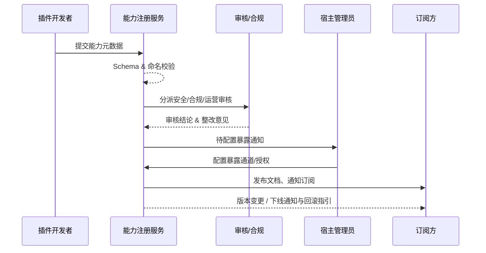

# Positioning & Goals

插件生态需要一套可治理的能力注册与暴露流程，让宿主、第三方和其他插件能够安全地发现、调用能力。此场景覆盖能力建模、审批、暴露配置与后续变更订阅，目标是在 5 分钟内完成提交校验、2 个工作日内完成多角色审核、3 分钟内同步暴露配置，并在版本变更或下线时保证订阅方按计划收到通知和回滚方案。

# Scope & Guardrails

- **In Scope**：能力元数据模板、Schema 校验、敏感标签；多角色审批与整改；暴露通道（REST/GraphQL/Webhook/任务节点/SDK）配置；租户授权、额度与订阅通知；能力版本变更、下线、回滚与审计。
- **Out of Scope**：插件内部实现与调试、宿主调用链路细节、Marketplace 上架与计费、插件主动回调宿主。
- **Environment & Flags**：`PX_PLUGIN_CAPABILITY_REGISTRY_V2`、`PX_CAPABILITY_MULTI_TENANT_GUARD`、`PX_CAPABILITY_CHANGE_NOTICE`；依赖 IAM/RBAC、API Gateway、EventBus、Notification Center、Workflow Engine。

# Core Capabilities

1. **Capability Modeling Engine**：结构化模板、Schema/命名冲突校验、能力 ID 生成与示例文档生成。
2. **Review & Compliance Workflow**：按能力敏感度自动编排安全/合规/运营审核，支持整改回退、SLA、升级策略与完整审计。
3. **Exposure & Lifecycle Guardrails**：暴露通道配置、租户授权与额度同步、多渠道订阅通知、版本变更/下线灰度计划。

# Participants & Responsibilities

| Scope | Repository | Layer | 责任与交付物 | Owners |
|-------|------------|-------|--------------|--------|
| plugin-ecosystem | powerx-plugin | service | 能力目录 UI、注册表单、Schema 校验、文档/示例生成 | Michael Hu |
| core-platform | powerx | service | 能力注册 API、审批编排、暴露配置同步、租户授权与订阅通知 | Michael Hu |
| security | powerx | security | 数据分级策略、合规审批、审计日志、风险告警 | Grace Lin |
| ops | powerx | ops | 版本灰度/下线流程、通知自动化、回滚与指标治理 | Grace Lin |

# Validation Workflow

1. **建模提交**：开发者录入能力模型、Schema、示例与风险标签，系统校验命名/字段冲突并生成能力 ID。
2. **多角色审核**：注册服务分派安全、合规、运营审核，支持评论与整改，形成审计链路。
3. **暴露配置**：宿主管理员选择暴露通道、配置租户授权/额度，生成文档、Postman/SDK 并同步至门户。
4. **生命周期治理**：变更或下线触发影响评估、灰度计划与订阅通知，必要时执行回滚并记录审计。

# Architecture Diagram

# Key Interactions & Contracts

- **APIs / Events**：`POST /internal/plugins/capabilities`、`POST /internal/plugins/capabilities/{id}/submit`、`POST /internal/plugins/capabilities/{id}/workflow/approve`、`PATCH /internal/plugins/capabilities/{id}/exposure`、`POST /internal/plugins/capabilities/{id}/tenants/{tenantId}/quota`、事件 `capability.registry.updated`、`capability.lifecycle.changed`。
- **Configs / Schemas**：`docs/standards/powerx-plugin/integration/02_capabilities_and_schema/Capability_Design_Guide.md`、`docs/standards/powerx-plugin/integration/02_capabilities_and_schema/IO_Schema_and_Validation.md`、`docs/standards/powerx-plugin/integration/01_plugin_lifecycle/deprecation.md`。
- **Security / Compliance**：敏感字段绑定数据分级标签，高敏双人复核并附脱敏方案；所有暴露配置写入 `audit.capability.*` 日志留存 ≥365 天；例外审批需记录审批号与回滚策略。

# Related Links

- `UC-INT-PLUGIN-CAPABILITY-MODELING-001` — 能力建模与 Schema 校验。
- `UC-INT-PLUGIN-CAPABILITY-REVIEW-001` — 安全/合规/运营审核流程。
- `UC-INT-PLUGIN-CAPABILITY-EXPOSURE-001` — 暴露通道配置与租户授权。
- `UC-INT-PLUGIN-CAPABILITY-LIFECYCLE-001` — 版本变更、下线与通知治理。
- 设计稿：`docs/meta/scenarios/powerx/plugin-ecosystem/integration-and-connectivity/plugin-capability-registration-and-exposure/primary.md`
- Workflow Telemetry：`scripts/qa/workflow-metrics.mjs`

# Acceptance Criteria

1. 能力提交后 5 分钟内完成自动校验并生成能力 ID，命名/Schema 冲突率 <2%。
2. 审核 SLA 满足 ≤2 个工作日，未通过的能力禁止进入暴露阶段，拒绝原因结构化存档 100%。
3. 暴露配置 3 分钟内同步至网关与门户，租户授权即时生效；版本变更通知覆盖 100% 订阅方并附回滚方案。

# Telemetry & Ops

- 指标：`capability.registration.duration_ms`、`capability.review.sla_breach_total`、`capability.exposure.activate_rate`、`capability.lifecycle.notice_coverage`。
- 告警阈值：自动校验失败率 >10%（P2）、审核超 SLA 连续 3 单（P1）、暴露配置 3 分钟未生效（P1）、通知覆盖率 <95%（P2）。
- 观测来源：Workflow Metrics、API Gateway 指标、Notification Center 报表、审计日志。

# Open Issues & Follow-ups

| 风险/事项 | 影响范围 | 负责人 | ETA |
|-----------|----------|--------|-----|
| 能力目录缺少多语言字段映射，影响全球站点检索 | 文档与检索 | Michael Hu | 2025-02-10 |
| 高敏能力整改依赖人工附件传输，需引入加密通道 | 合规流程 | Grace Lin | 2025-02-28 |

# Appendix

- `docs/meta/scenarios/powerx/plugin-ecosystem/integration-and-connectivity/plugin-capability-registration-and-exposure/primary.md`
- `docs/standards/powerx-plugin/integration/02_capabilities_and_schema/Capability_Design_Guide.md`
- `docs/standards/powerx-plugin/integration/02_capabilities_and_schema/IO_Schema_and_Validation.md`
- `docs/standards/powerx-plugin/integration/01_plugin_lifecycle/deprecation.md`
