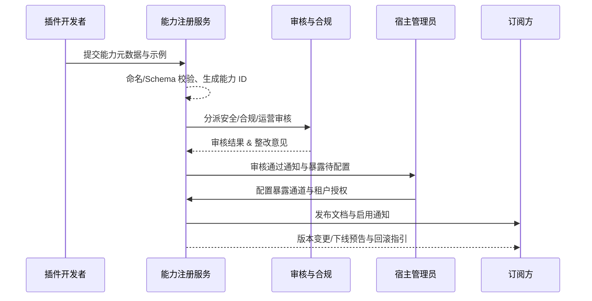

scn_id: SCN-INT-PLUGIN-CAPABILITY-001
title: 插件能力注册与暴露治理闭环
status: Draft
version: v0.1.0
owners:
  - name: Michael Hu
    role: Plugin Tech Lead
    contact: tech@artisan-cloud.com
  - name: Grace Lin
    role: Security & Compliance Lead
    contact: compliance@artisan-cloud.com
domains: [integration]
layers: [service, security, ops]
repos:
  - key: powerx-plugin
    scope: plugin-ecosystem
    responsibility: 插件控制台、能力目录、元数据校验与开发者文档生成
  - key: powerx
    scope: core-platform
    responsibility: 能力注册 API、审批流程编排、暴露配置与通知调度
  - key: powerx
    scope: security
    responsibility: 数据分级、权限审计、合规策略与风控升级
related_usecases:
  - doc_id: UC-INT-PLUGIN-CAPABILITY-MODELING-001
    layer: service
    domain: integration
  - doc_id: UC-INT-PLUGIN-CAPABILITY-REVIEW-001
    layer: security
    domain: integration
  - doc_id: UC-INT-PLUGIN-CAPABILITY-EXPOSURE-001
    layer: service
    domain: integration
  - doc_id: UC-INT-PLUGIN-CAPABILITY-LIFECYCLE-001
    layer: ops
    domain: integration
last_reviewed_at: 2025-01-20

---

# Executive Summary

插件生态需要一套标准化的能力注册与暴露流程，才能保证宿主、第三方和其他插件能够安全、可控地发现并消费能力。本场景梳理从能力建模、审核、暴露配置到后续变更通知的治理闭环：开发者 5 分钟内提交结构化元数据，审批 SLA 默认 2 个工作日，多通道暴露配置 3 分钟生效，并在能力变更或下线时向订阅方提供灰度与回滚策略。

# Scope & Guardrails

- **In Scope**：能力注册元数据模板、Schema 校验、敏感标签、审批编排（安全/合规/运营）、暴露方式配置（REST/GraphQL/Webhook/工作流节点/SDK）、租户授权与额度、订阅通知、版本/下线治理。
- **Out of Scope**：插件内部功能实现与调试流程、宿主调用链路细节（参考 `docs/meta/scenarios/powerx/plugin-ecosystem/integration-and-connectivity/host-call-plugin/primary.md`）、插件主动回调宿主、Marketplace 上架及计费策略。
- **Environment & Flags**：`PX_PLUGIN_CAPABILITY_REGISTRY_V2`、`PX_CAPABILITY_MULTI_TENANT_GUARD`、`PX_CAPABILITY_CHANGE_NOTICE`；依赖 IAM/RBAC、API Gateway、EventBus、Notification Center、Workflow Engine。

# Participants & Responsibilities

| Scope | Repository | Layer | 责任与交付物 | Owners |
|-------|------------|-------|--------------|--------|
| plugin-ecosystem | powerx-plugin | service | 能力目录 UI、注册表单、Schema 校验、文档/示例生成 | Michael Hu（Plugin Tech Lead / tech@artisan-cloud.com） |
| core-platform | powerx | service | 能力注册 API、审批编排、暴露配置同步、租户授权与额度管理 | Michael Hu（Plugin Tech Lead / tech@artisan-cloud.com） |
| security | powerx | security | 数据分级策略、合规审批、审计日志、风险告警与风控自动化 | Grace Lin（Security & Compliance Lead / compliance@artisan-cloud.com） |
| ops | powerx | ops | 订阅通知、版本灰度、下线回滚、监控与熔断策略 | Grace Lin（Security & Compliance Lead / compliance@artisan-cloud.com） |

# End-to-End Flow

1. **Stage 1 – 能力建模与注册提交**：开发者在控制台录入能力模型、Schema、示例请求/响应与风险标签，系统校验命名冲突并生成能力 ID。
2. **Stage 2 – 多角色审核与风险把关**：注册服务自动分派安全、合规、运营审核，支持评论协作与整改回退，形成审计链路。
3. **Stage 3 – 暴露配置与多通道交付**：宿主管理员选择暴露方式，配置租户授权与额度，生成文档/Postman/SDK 并下发至开发者门户。
4. **Stage 4 – 生命周期治理与订阅通知**：变更或下线触发影响评估、灰度与回滚计划，并向订阅方发送跨渠道通知。

# Key Interactions & Contracts

- **APIs / Events**：`POST /internal/plugins/capabilities`、`POST /internal/plugins/capabilities/{id}/submit`、`POST /internal/plugins/capabilities/{id}/workflow/approve`、`PATCH /internal/plugins/capabilities/{id}/exposure`、`POST /internal/plugins/capabilities/{id}/tenants/{tenantId}/quota`；事件 `capability.registry.updated`、`capability.lifecycle.changed`。
- **Configs / Schemas**：`docs/standards/powerx-plugin/integration/02_capabilities_and_schema/Capability_Design_Guide.md`、`docs/standards/powerx-plugin/integration/02_capabilities_and_schema/IO_Schema_and_Validation.md`、`docs/standards/powerx-plugin/integration/01_plugin_lifecycle/deprecation.md`。
- **Security / Compliance**：敏感字段绑定数据分级标签，高敏能力双人复核并附脱敏方案；所有暴露配置写入 `audit.capability.*` 审计日志，留存 ≥365 天。

# Usecase Links

- `UC-INT-PLUGIN-CAPABILITY-MODELING-001` — 能力建模、Schema 校验与能力 ID 生成（service 层）。
- `UC-INT-PLUGIN-CAPABILITY-REVIEW-001` — 安全/合规/运营审核编排与 SLA 治理（security 层）。
- `UC-INT-PLUGIN-CAPABILITY-EXPOSURE-001` — 暴露通道配置、租户授权与交付物同步（service 层）。
- `UC-INT-PLUGIN-CAPABILITY-LIFECYCLE-001` — 版本变更、下线与订阅通知闭环（ops 层）。

# Acceptance Criteria

1. 能力提交后 5 分钟内完成自动校验与工单创建，命名或字段冲突率 <2%，能力 ID 唯一。
2. 审核流程支持 SLA 配置、双人复核与升级策略，未通过的能力禁止进入暴露阶段且记录结构化拒绝原因。
3. 暴露配置 3 分钟内同步至网关与文档中心，租户授权/额度即时生效，变更通知覆盖 100% 订阅方并具备回滚机制。

# Telemetry & Ops

- 指标：`capability.registration.duration_ms`、`capability.review.sla_breach_count`、`capability.exposure.activate_rate`、`capability.lifecycle.notice_coverage`。
- 告警阈值：自动校验失败率 >10% 触发 P2；审核 SLA 超时连续 3 单升级 P1；暴露配置 3 分钟未生效触发 P1；通知覆盖率 <95% 触发 P2。
- 观测来源：Workflow Metrics（`scripts/qa/workflow-metrics.mjs`）、API Gateway 指标看板、Notification Center 投递报表、审计日志查询。

# Open Issues & Follow-ups

| 风险/事项 | 影响范围 | 负责人 | ETA |
|-----------|----------|--------|-----|
| 能力目录缺少多语言字段映射，影响全球站点检索体验 | 多区域文档与检索 | Michael Hu | 2025-02-10 |
| 高敏能力整改依赖人工附件传输，需上线加密通道 | 合规与数据安全 | Grace Lin | 2025-02-28 |

# Appendix

- `docs/meta/scenarios/powerx/plugin-ecosystem/integration-and-connectivity/plugin-capability-registration-and-exposure/primary.md`
- `docs/meta/scenarios/powerx/list.md#L99`
- `docs/standards/powerx-plugin/integration/02_capabilities_and_schema/Capability_Design_Guide.md`
- `docs/standards/powerx-plugin/integration/02_capabilities_and_schema/IO_Schema_and_Validation.md`
- `docs/standards/powerx-plugin/integration/01_plugin_lifecycle/deprecation.md`
- `scripts/qa/workflow-metrics.mjs`
