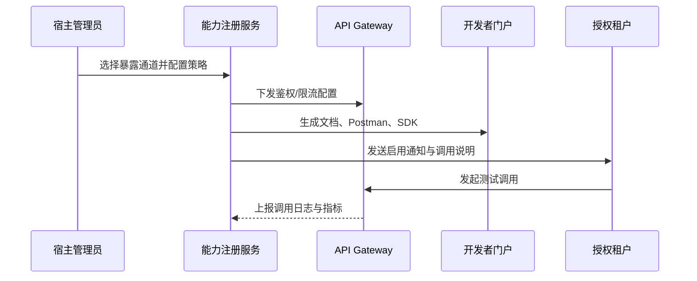

scn_id: SCN-INT-PLUGIN-CAPABILITY-EXPOSURE-001
title: 插件能力暴露与消费配置
status: Draft
version: v0.1.0
owners:
  - name: Michael Hu
    role: Plugin Tech Lead
    contact: tech@artisan-cloud.com
domains: [integration]
layers: [service]
repos:
  - key: powerx
    scope: core-platform
    responsibility: 暴露配置 API、多通道交付、租户授权与额度管控
  - key: powerx-plugin
    scope: plugin-ecosystem
    responsibility: 能力目录 UI、调用示例、开发者门户同步
related_usecases:
  - doc_id: UC-INT-PLUGIN-CAPABILITY-EXPOSURE-001
    layer: service
    domain: integration
last_reviewed_at: 2025-01-20

---

# Executive Summary

审核通过的能力需要在宿主平台安全、可控地对外暴露。本场景涵盖暴露通道选择（REST、GraphQL、Webhook、工作流节点、SDK）、租户授权、额度限制、文档与示例同步，确保 3 分钟内生效并具备熔断与审计能力，让订阅方快速启用能力。

# Scope & Guardrails

- **In Scope**：暴露通道配置、API Gateway/GraphQL/Webhook/Workflow/SDK 下发、租户授权与额度、调用示例生成、文档同步、熔断与限流策略。
- **Out of Scope**：能力审核决策、宿主调用链路观测（参考“宿主调用插件”场景）、订阅计费策略、终端 UI 集成。
- **Environment & Flags**：`PX_CAPABILITY_MULTI_TENANT_GUARD`、`PX_CAPABILITY_EXPOSURE_CHANNELS`；依赖 API Gateway、GraphQL 层、Webhook Service、Workflow Engine、Notification Center。

# Participants & Responsibilities

| Scope | Repository | Layer | 责任与交付物 | Owners |
|-------|------------|-------|--------------|--------|
| core-platform | powerx | service | 暴露配置 API、租户授权与额度、网关策略同步、熔断与告警 | Michael Hu（Plugin Tech Lead / tech@artisan-cloud.com） |
| plugin-ecosystem | powerx-plugin | service | 能力目录 UI、调用示例、Postman/SDK 包生成、门户同步 | Michael Hu（Plugin Tech Lead / tech@artisan-cloud.com） |
| security | powerx | security | 调用鉴权、租户隔离 header、审计日志 | Grace Lin（Security & Compliance Lead / compliance@artisan-cloud.com） |

# End-to-End Flow

1. **Stage 1 – 通道选择与策略设置**：宿主管理员在能力目录勾选暴露通道，配置鉴权方式、限流与熔断策略。
2. **Stage 2 – 租户授权与额度分配**：为租户、项目或分组分配调用权限、QPS、调用次数与数据范围。
3. **Stage 3 – 文档与示例生成**：系统生成文档、Postman 集合、SDK 示例，并同步到开发者门户与订阅通知。
4. **Stage 4 – 生效验证与监控**：网关策略 3 分钟内生效，调用日志写入审计，监控看板显示启用情况。

# Key Interactions & Contracts

- **APIs / Events**：`PATCH /internal/plugins/capabilities/{id}/exposure`、`POST /internal/plugins/capabilities/{id}/tenants/{tenantId}/quota`、`POST /internal/plugins/capabilities/{id}/exposure/publish`、事件 `capability.exposure.activated`、`capability.exposure.quota_exceeded`。
- **Configs / Schemas**：`docs/standards/powerx-plugin/integration/03_runtime_and_ops/Quotas_RateLimits_and_Costs.md`、`docs/standards/powerx-plugin/integration/02_capabilities_and_schema/Capability_Design_Guide.md`。
- **Security / Compliance**：租户专属凭证、IAM 策略映射；未授权调用返回 403 并记录 `audit.capability.exposure.denied`；熔断策略需支持租户维度隔离。

# Usecase Links

- `UC-INT-PLUGIN-CAPABILITY-EXPOSURE-001` — 宿主管理员 3 分钟内完成暴露配置并向租户分配额度。

# Acceptance Criteria

1. 暴露配置提交后 3 分钟内网关策略、文档与通知全部生效。
2. 租户授权与额度实时更新，未授权调用立即阻断并写入审计。
3. 文档、Postman、SDK 由系统自动生成且与最新配置保持一致。

# Telemetry & Ops

- 指标：`capability.exposure.activate_rate`、`capability.quota.consumption`、`capability.exposure.denied_count`。
- 告警阈值：暴露配置生效延迟 >3 分钟 P1；额度超限未触发熔断 P0；未授权调用连续上升 P2。
- 观测来源：API Gateway 指标、接口调用日志、Notification Center 投递报告。

# Open Issues & Follow-ups

| 风险/事项 | 影响范围 | 负责人 | ETA |
|-----------|----------|--------|-----|
| Webhook 通道失败后告警不够及时，需接入重试回退机制 | 订阅体验 | Michael Hu | 2025-02-18 |

# Appendix

- `docs/meta/scenarios/powerx/plugin-ecosystem/integration-and-connectivity/plugin-capability-registration-and-exposure/primary.md#子场景-c`
- `docs/standards/powerx-plugin/integration/03_runtime_and_ops/Quotas_RateLimits_and_Costs.md`
- `docs/standards/powerx-plugin/integration/02_capabilities_and_schema/Capability_Design_Guide.md`
