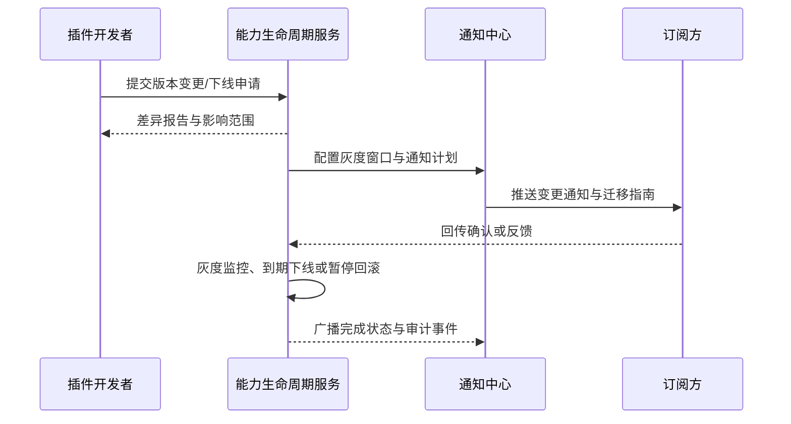

scn_id: SCN-INT-PLUGIN-CAPABILITY-LIFECYCLE-001
title: 插件能力版本变更与下线通知
status: Draft
version: v0.1.0
owners:
  - name: Grace Lin
    role: Security & Compliance Lead
    contact: compliance@artisan-cloud.com
domains: [integration]
layers: [ops]
repos:
  - key: powerx
    scope: core-platform
    responsibility: 能力版本管理、灰度策略、回滚控制、通知编排
  - key: powerx-plugin
    scope: plugin-ecosystem
    responsibility: 变更申请入口、影响范围评估、文档与示例更新
related_usecases:
  - doc_id: UC-INT-PLUGIN-CAPABILITY-LIFECYCLE-001
    layer: ops
    domain: integration
last_reviewed_at: 2025-01-20

---

# Executive Summary

该场景描述能力上线后的版本演进与下线治理：开发者提交版本升级或退场计划，系统生成差异报告、评估影响范围、定义灰度窗口并触发订阅方通知。目标是保障变更可追踪、可回滚、通知覆盖率 100%，在灰度期内允许双版本并行，防止强制下线造成业务中断。

# Scope & Guardrails

- **In Scope**：版本差异对比、影响评估、灰度策略配置、通知编排（邮件/站内/Webhook）、双版本并行、到期下线、失败回滚、审计留存。
- **Out of Scope**：能力首次注册与审核、暴露配置细节、插件整体版本管理、Marketplace 生命周期。
- **Environment & Flags**：`PX_CAPABILITY_CHANGE_NOTICE`、`PX_CAPABILITY_LIFECYCLE_ROLLOUT`；依赖 Notification Center、EventBus、审计日志、指标平台。

# Participants & Responsibilities

| Scope | Repository | Layer | 责任与交付物 | Owners |
|-------|------------|-------|--------------|--------|
| core-platform | powerx | ops | 版本差异分析、灰度编排、到期自动下线、回滚控制 | Grace Lin（Security & Compliance Lead / compliance@artisan-cloud.com） |
| plugin-ecosystem | powerx-plugin | service | 变更申请入口、影响评估提示、文档更新、订阅管理 | Michael Hu（Plugin Tech Lead / tech@artisan-cloud.com） |
| notification | powerx | ops | 多渠道通知投递、失败重试、覆盖率统计 | Grace Lin（Security & Compliance Lead / compliance@artisan-cloud.com） |

# End-to-End Flow

1. **Stage 1 – 变更申请与差异分析**：开发者提交版本升级或下线申请，系统生成差异对比、影响范围与迁移提示。
2. **Stage 2 – 灰度计划与通知编排**：配置灰度窗口、兼容期限、订阅方列表与通知渠道，自动生成迁移指南。
3. **Stage 3 – 灰度执行与监控**：灰度期内允许 V1/V2 并行，监控调用指标与异常情况，必要时暂停。
4. **Stage 4 – 下线/回滚与审计**：灰度结束后自动下线旧版本，如监测到调用未清零则暂停并触发告警，可人工确认后重启下线或执行回滚。

# Key Interactions & Contracts

- **APIs / Events**：`POST /internal/plugins/capabilities/{id}/versions`、`POST /internal/plugins/capabilities/{id}/versions/{version}/plan`、`POST /internal/plugins/capabilities/{id}/versions/{version}/rollback`、事件 `capability.lifecycle.notice_sent`、`capability.lifecycle.rollback_triggered`。
- **Configs / Schemas**：`docs/standards/powerx-plugin/integration/01_plugin_lifecycle/deprecation.md`、`docs/standards/powerx-plugin/integration/03_runtime_and_ops/Logs_Metrics_and_Tracing.md`。
- **Security / Compliance**：灰度配置需审计；通知 payload 遵守隐私策略；回滚操作需要双人确认并写入 `audit.capability.lifecycle.*`。

# Usecase Links

- `UC-INT-PLUGIN-CAPABILITY-LIFECYCLE-001` — 能力版本变更灰度 14 天，通知覆盖率 100%，失败可暂停并回滚。

# Acceptance Criteria

1. 变更申请生成差异报告（字段、Schema、权限）并给出迁移建议。
2. 灰度计划可配置多渠道通知，覆盖率 ≥100%，失败自动重试并记录。
3. 下线任务检测到调用残留时自动暂停并告警，可手动确认后继续或执行回滚。

# Telemetry & Ops

- 指标：`capability.lifecycle.notice_coverage`、`capability.lifecycle.dual_version_duration`、`capability.lifecycle.rollback_count`。
- 告警阈值：通知覆盖率 <95% P1；灰度期监控异常率 >5% P1；回滚触发连续 2 次 P0。
- 观测来源：Notification Center 报告、Lifecycle 审计日志、Metrics & Tracing 仪表盘。

# Open Issues & Follow-ups

| 风险/事项 | 影响范围 | 负责人 | ETA |
|-----------|----------|--------|-----|
| 订阅方确认流程未与外部协作工具集成，需补充钉钉/Slack 接口 | 协同效率 | Grace Lin | 2025-02-20 |

# Appendix

- `docs/meta/scenarios/powerx/plugin-ecosystem/integration-and-connectivity/plugin-capability-registration-and-exposure/primary.md#子场景-d`
- `docs/standards/powerx-plugin/integration/01_plugin_lifecycle/deprecation.md`
- `docs/standards/powerx-plugin/integration/03_runtime_and_ops/Logs_Metrics_and_Tracing.md`
