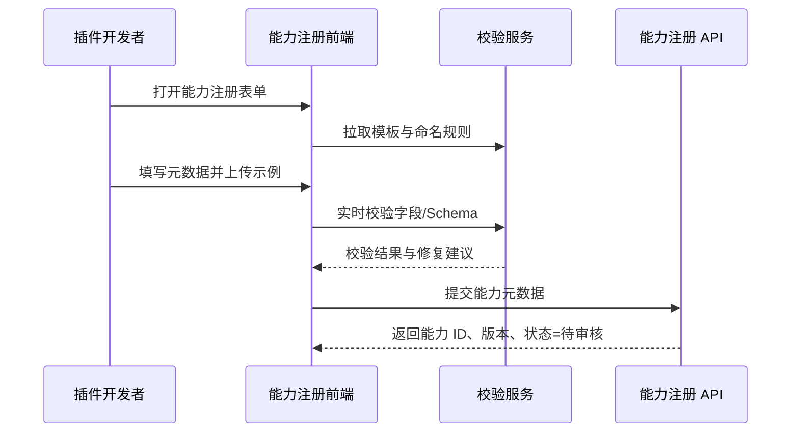

scn_id: SCN-INT-PLUGIN-CAPABILITY-MODELING-001
title: 能力建模与注册提交治理
status: Draft
version: v0.1.0
owners:
  - name: Michael Hu
    role: Plugin Tech Lead
    contact: tech@artisan-cloud.com
domains: [integration]
layers: [service]
repos:
  - key: powerx-plugin
    scope: plugin-ecosystem
    responsibility: 能力注册表单、Schema 校验、示例与错误码模板生成
  - key: powerx
    scope: core-platform
    responsibility: 能力 ID 生成、命名冲突检测、版本记录与审计落库
related_usecases:
  - doc_id: UC-INT-PLUGIN-CAPABILITY-MODELING-001
    layer: service
    domain: integration
last_reviewed_at: 2025-01-20

---

# Executive Summary

该场景聚焦插件开发者提交能力元数据的起始流程。目标是在 5 分钟内完成元数据录入、自动校验与能力 ID 生成，避免命名冲突、Schema 不一致或缺失的示例数据，并为后续审批提供完整审计与版本追踪能力。

# Scope & Guardrails

- **In Scope**：能力元数据模板、输入输出 Schema、示例请求/响应、错误码、敏感度标签、自动命名校验、能力 ID 与版本记录、审计日志。
- **Out of Scope**：插件内部实现与单元测试、审批流程编排、暴露配置与租户授权、文档门户展示。
- **Environment & Flags**：`PX_PLUGIN_CAPABILITY_REGISTRY_V2`；依赖 Schema 校验服务、命名规则服务、审计日志总线、对象存储（示例或附件）。

# Participants & Responsibilities

| Scope | Repository | Layer | 责任与交付物 | Owners |
|-------|------------|-------|--------------|--------|
| plugin-ecosystem | powerx-plugin | service | 注册 UI、输入校验、示例生成、表单草稿保存 | Michael Hu（Plugin Tech Lead / tech@artisan-cloud.com） |
| core-platform | powerx | service | 能力 ID 策略、命名冲突检测、版本留痕、审计事件 | Michael Hu（Plugin Tech Lead / tech@artisan-cloud.com） |

# End-to-End Flow

1. **Stage 1 – 表单引导与模板加载**：开发者选择能力类型，系统加载元数据模板、示例与校验规则。
2. **Stage 2 – 元数据填写与实时校验**：输入能力名称、描述、场景、Schema、错误码，实时校验命名与字段冲突。
3. **Stage 3 – 示例与附件补充**：上传示例请求/响应、体验 Demo、敏感标签与脱敏方案。
4. **Stage 4 – 提交生成能力 ID**：通过自动校验后正式提交，生成能力 ID、版本、审计事件，状态转为“待审核”。

# Key Interactions & Contracts

- **APIs / Events**：`GET /internal/plugins/capabilities/templates`、`POST /internal/plugins/capabilities/validate`、`POST /internal/plugins/capabilities`、事件 `capability.registry.created`。
- **Configs / Schemas**：`docs/standards/powerx-plugin/integration/02_capabilities_and_schema/IO_Schema_and_Validation.md`、`docs/standards/powerx-plugin/integration/02_capabilities_and_schema/Capability_Design_Guide.md`。
- **Security / Compliance**：高敏字段需填写脱敏策略；所有提交写入 `audit.capability.registry.create`，保留操作人、时间、payload 摘要。

# Usecase Links

- `UC-INT-PLUGIN-CAPABILITY-MODELING-001` — 开发者 5 分钟内完成能力元数据建模并生成能力 ID。

# Acceptance Criteria

1. 注册表单加载 ≤3 秒，支持草稿保存与恢复。
2. 自动校验覆盖命名规范、字段冲突、Schema 合法性，阻断率 <2%。
3. 提交后 1 分钟内生成能力 ID 与版本记录，并写入审计日志。

# Telemetry & Ops

- 指标：`capability.form.load_duration_ms`、`capability.validation.failure_rate`、`capability.id.generate_duration_ms`。
- 告警阈值：表单加载 >5 秒 P2；自动校验失败率 >10% P2；能力 ID 生成 >60 秒 P1。
- 观测来源：前端性能上报、校验服务日志、审计事件看板。

# Open Issues & Follow-ups

| 风险/事项 | 影响范围 | 负责人 | ETA |
|-----------|----------|--------|-----|
| 英文与多语言描述字段未强制填写，影响全球站点展示 | 国际化 | Michael Hu | 2025-02-10 |

# Appendix

- `docs/meta/scenarios/powerx/plugin-ecosystem/integration-and-connectivity/plugin-capability-registration-and-exposure/primary.md#子场景-a`
- `docs/standards/powerx-plugin/integration/02_capabilities_and_schema/Capability_Design_Guide.md`
- `docs/standards/powerx-plugin/integration/02_capabilities_and_schema/IO_Schema_and_Validation.md`
