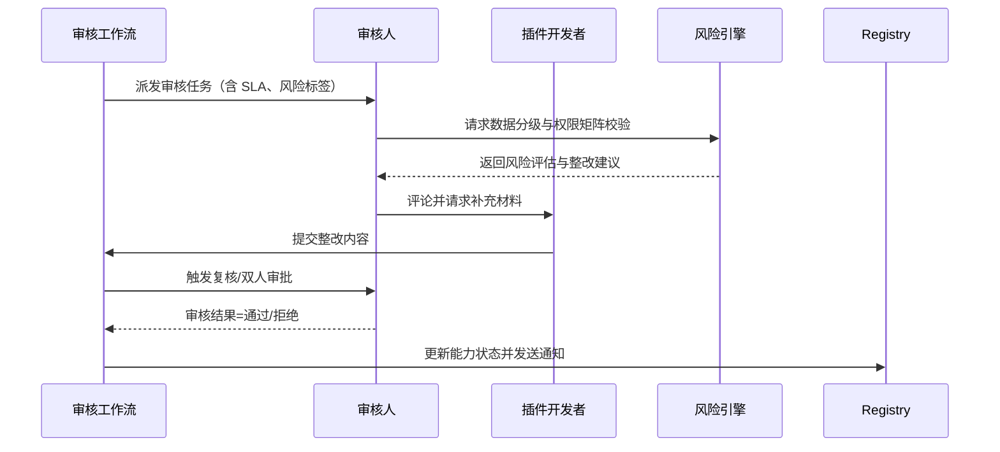

scn_id: SCN-INT-PLUGIN-CAPABILITY-REVIEW-001
title: 插件能力多角色审核与合规把关
status: Draft
version: v0.1.0
owners:
  - name: Grace Lin
    role: Security & Compliance Lead
    contact: compliance@artisan-cloud.com
domains: [integration]
layers: [security]
repos:
  - key: powerx
    scope: core-platform
    responsibility: 审核工作流编排、SLA 配置、评论与整改回路
  - key: powerx
    scope: security
    responsibility: 数据分级策略、权限矩阵审核、风险告警与升级
related_usecases:
  - doc_id: UC-INT-PLUGIN-CAPABILITY-REVIEW-001
    layer: security
    domain: integration
last_reviewed_at: 2025-01-20

---

# Executive Summary

该场景覆盖能力注册后的安全、合规、运营多级审核，确保敏感数据、权限范围、频率限制均符合策略。核心目标是在 SLA（默认 2 个工作日）内完成审核决策，支持评论协作、整改回退、双人复核，并提供审计日志与升级机制，防止未经批准的能力被暴露。

# Scope & Guardrails

- **In Scope**：审核人分配、角色视图、数据分类校验、权限矩阵比对、频率/依赖检查、整改回退、双人复核、SLA 与升级、审核审计。
- **Out of Scope**：能力建模表单、暴露配置与租户授权、订阅通知与下线策略、Marketplace 计费审批。
- **Environment & Flags**：`PX_CAPABILITY_REVIEW_FLOW_V2`；依赖 Workflow Engine、IAM 权限、风险评分服务、通知中心、审计日志系统。

# Participants & Responsibilities

| Scope | Repository | Layer | 责任与交付物 | Owners |
|-------|------------|-------|--------------|--------|
| core-platform | powerx | security | 审核工作流、任务分配、整改回路、SLA 监控 | Grace Lin（Security & Compliance Lead / compliance@artisan-cloud.com） |
| security | powerx | security | 敏感数据策略、权限矩阵、风险规则、升级与告警 | Grace Lin（Security & Compliance Lead / compliance@artisan-cloud.com） |
| ops | powerx | ops | 审核状态通知、日志汇总、指标上报 | Grace Lin（Security & Compliance Lead / compliance@artisan-cloud.com） |

# End-to-End Flow

1. **Stage 1 – 审核任务分派**：注册服务根据标签匹配安全/合规/运营审核人，生成任务队列与 SLA。
2. **Stage 2 – 风险检查与评论协作**：审核人完成数据分类、权限矩阵、频率限制与依赖检查，记录评论、附件与整改建议。
3. **Stage 3 – 整改回退与复核**：开发者提交整改后再次校验，高敏能力触发双人复核或专家会签。
4. **Stage 4 – 审核决策与升级**：通过后能力标记为“可暴露”并通知宿主管理员；超时自动升级至主管并记录审计。

# Key Interactions & Contracts

- **APIs / Events**：`POST /internal/plugins/capabilities/{id}/workflow/assign`、`POST /internal/plugins/capabilities/{id}/workflow/approve`、`POST /internal/plugins/capabilities/{id}/workflow/reject`、事件 `capability.review.sla_breached`、`capability.review.approved`。
- **Configs / Schemas**：`docs/standards/powerx-plugin/integration/04_security_and_compliance/Plugin_Security_Checklist.md`、`docs/standards/powerx-plugin/integration/04_security_and_compliance/ToolGrant_Consumption_Guide.md`。
- **Security / Compliance**：高敏能力需双人复核；拒绝理由结构化存储；所有操作写入 `audit.capability.review.*` 并保留 365 天。

# Usecase Links

- `UC-INT-PLUGIN-CAPABILITY-REVIEW-001` — 高敏能力双人复核并在 SLA 内完成审核决策。

# Acceptance Criteria

1. 审核任务创建后立即绑定 SLA、升级策略与责任人，超时自动通知主管。
2. 高敏能力必须完成双人复核，拒绝理由结构化沉淀并可导出。
3. 审核通过后能力状态更新为“可暴露”，并同步通知宿主管理员与订阅审批队列。

# Telemetry & Ops

- 指标：`capability.review.pending_count`、`capability.review.sla_breach_count`、`capability.review.high_risk_ratio`。
- 告警阈值：SLA 超时率 >5% P1；高敏能力未完成双人复核即通过触发 P0；拒绝率连续 3 天 >30% P2。
- 观测来源：Workflow Metrics 报告、审计日志查询、风险引擎仪表盘。

# Open Issues & Follow-ups

| 风险/事项 | 影响范围 | 负责人 | ETA |
|-----------|----------|--------|-----|
| 风险评分模型未覆盖第三方 API 依赖，需补充检查项 | 合规风险 | Grace Lin | 2025-02-15 |

# Appendix

- `docs/meta/scenarios/powerx/plugin-ecosystem/integration-and-connectivity/plugin-capability-registration-and-exposure/primary.md#子场景-b`
- `docs/standards/powerx-plugin/integration/04_security_and_compliance/Plugin_Security_Checklist.md`
- `docs/standards/powerx-plugin/integration/04_security_and_compliance/ToolGrant_Consumption_Guide.md`
