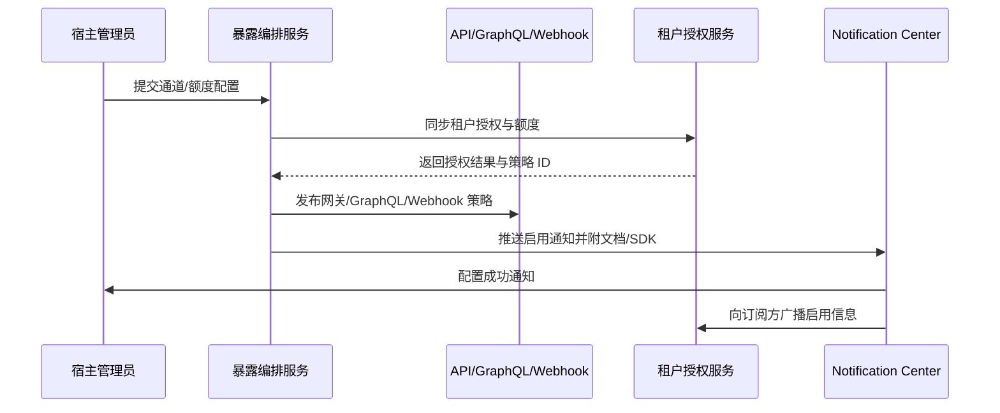

doc_id: UC-INT-PLUGIN-CAPABILITY-EXPOSURE-001
scn_id: SCN-INT-PLUGIN-CAPABILITY-001
title: 能力暴露与消费配置
status: Draft
version: v0.1.0
repo_key: powerx
scope: powerx
layer: service
domain: integration
scenario_title: "插件能力注册与暴露治理闭环"
owners:
  - name: Michael Hu
    role: Tech Steward
    contact: tech@artisan-cloud.com
  - name: Matrix-X
    role: Docs Coordinator
    contact: dev@artisan-cloud.com
contributors: []
linked_requirements:
  - SCN-INT-PLUGIN-CAPABILITY-001#stage-3
  - SCN-INT-PLUGIN-CAPABILITY-EXPOSURE-001
code_refs:
  - repo: powerx
    path: internal/capabilities/exposure/service.go
    description: 暴露配置编排、通道注册与网关策略生成
  - repo: powerx
    path: internal/capabilities/tenants/quota_manager.go
    description: 租户授权、额度与限流策略同步
  - repo: powerx
    path: internal/platform/apigateway/policy_renderer.go
    description: 将暴露策略渲染为 API Gateway/GraphQL/Webhook 规则
  - repo: powerx
    path: scripts/exposure/postman-collection.mjs
    description: 文档、Postman 集合与 SDK 示例生成脚本
feature_flags:
  - PX_CAPABILITY_MULTI_TENANT_GUARD
  - PX_CAPABILITY_EXPOSURE_CHANNELS
optional: false
last_reviewed_at: 2025-01-20

---

# Usecase Overview

- **业务目标**：在能力通过审核后，宿主管理员可在 3 分钟内完成通道配置、租户授权与额度设定，并自动下发文档、Postman 集合与 SDK，让订阅方可以安全启用能力。
- **成功度量**：暴露配置生效时间 ≤3 分钟；授权同步成功率 ≥99%；未授权调用阻断率 100%；文档/示例同步成功率 ≥99%。
- **场景关联**：对应主场景 Stage 3，衔接 `UC-INT-PLUGIN-CAPABILITY-REVIEW-001` 的审批结果，并为 `UC-INT-PLUGIN-CAPABILITY-LIFECYCLE-001` 的后续通知提供基础。

> 该用例确保能力在暴露前具备端到端的鉴权、限流、文档交付与告警机制，是宿主与第三方安全消费插件能力的关键前置条件。

# Context & Assumptions

- **前置条件**
  - Feature Flag `PX_CAPABILITY_MULTI_TENANT_GUARD`、`PX_CAPABILITY_EXPOSURE_CHANNELS` 已开启。
  - 能力状态为“可暴露”，审批流程在 `UC-INT-PLUGIN-CAPABILITY-REVIEW-001` 中完成。
  - API Gateway、GraphQL 服务、Webhook Service、Workflow Engine、Notification Center 正常运行。
  - IAM/RBAC 已同步租户与角色信息，可供额度与鉴权策略引用。
- **输入/输出**
  - 输入：能力 ID、通道类型（REST/GraphQL/Webhook/Workflow/SDK）、租户授权列表、额度配置、限流/熔断策略、文档模板参数。
  - 输出：网关策略、GraphQL schema 绑定、Webhook 订阅、工作流节点配置、SDK 包、Postman 集合、通知消息、审计事件。
- **边界**
  - 不负责能力内部业务逻辑实现；不包含订阅计费策略；终端 UI 嵌入由前端场景覆盖。

# Solution Blueprint

## 体系分解

| 层 | 主要组件/模块 | 责任 | 代码入口 |
|----|---------------|------|---------|
| 暴露编排服务 | `internal/capabilities/exposure/service.go` | 接受暴露请求、校验通道与额度、触发策略生成 | `services/capabilities/exposure` |
| 租户授权管理 | `internal/capabilities/tenants/quota_manager.go` | 维护租户授权、QPS/调用次数、数据域限制，生成 IAM Policy | `services/capabilities/tenants` |
| 网关策略渲染 | `internal/platform/apigateway/policy_renderer.go` | 将暴露策略同步至 API Gateway/GraphQL/Webhook | `platform/apigateway` |
| 文档与交付物生成 | `scripts/exposure/postman-collection.mjs` | 生成文档、Postman 集合、SDK 包并推送门户 | `scripts/exposure` |
| 通知编排 | `internal/notifications/capability/notifier.go` | 通知宿主管理员与订阅方，记录审计日志 | `services/notifications` |

## 流程与时序

1. **Step 1 – 通道配置提交**：宿主管理员选择通道、配置鉴权/限流策略，系统校验参数与冲突。
2. **Step 2 – 授权与额度同步**：写入租户授权、额度阈值，将 IAM Policy、租户 Header、Quota 规则存档并推送到限流组件。
3. **Step 3 – 网关策略发布**：渲染 REST/GraphQL/Webhook/Workflow 节点策略，调用 API Gateway/GraphQL/Workflow 配置接口，写入审计日志。
4. **Step 4 – 文档与通知交付**：生成文档、Postman、SDK，并通过 Notification Center 向管理员与订阅方广播启用消息，保存 `audit.capability.exposure.*` 事件。



# Contracts & Interfaces

- **Inbound APIs / Events**
  - `PATCH /internal/plugins/capabilities/{id}/exposure` — 创建/更新能力暴露配置。
  - `POST /internal/plugins/capabilities/{id}/tenants/{tenantId}/quota` — 设置租户授权与额度。
  - `POST /internal/plugins/capabilities/{id}/exposure/publish` — 发布通道策略并触发交付物生成。
- **Outbound 调用**
  - `POST /platform/apigateway/policies`、`POST /platform/graphql/routes`、`POST /platform/webhooks/register` — 下发通道策略。
  - `POST /internal/iam/policies/apply` — 更新租户权限与隔离 header。
  - `POST /notification/capabilities/activated` — 发送启用通知。
- **配置与脚本**
  - `config/capabilities/exposure.yaml` — 默认通道、限流、熔断模板。
  - `config/capabilities/quota_defaults.yaml` — 租户额度与熔断阈值。
  - `scripts/exposure/postman-collection.mjs`、`scripts/exposure/sdk-generate.mjs` — 文档与示例生成脚本。

# Implementation Checklist

| 项目 | 描述 | 完成状态 | 负责人 |
|------|------|----------|--------|
| 通道配置 API | 支持 REST/GraphQL/Webhook/Workflow/SDK 通道配置校验、版本化 | [ ] | Michael Hu |
| 租户授权与额度 | 实现额度分配、限流/熔断同步、租户 Header 注入 | [ ] | Michael Hu |
| 网关策略发布 | 接入 API Gateway/GraphQL/Webhook 配置接口并记录审计 | [ ] | Michael Hu |
| 文档与示例生成 | 自动输出文档、Postman、SDK、Portal 页面 | [ ] | Matrix-X |
| 通知与审计 | 发布通知、写入 `audit.capability.exposure.*` 事件、失败告警 | [ ] | Grace Lin |

# Testing Strategy

- **单元测试**
  - 暴露配置校验、通道冲突检测、额度计算与熔断策略。
  - IAM Policy 生成、租户 Header 与限流配置推送。
- **集成测试**
  - 使用 `scripts/exposure/postman-collection.mjs --validate` 验证文档与示例生成。
  - 模拟 API Gateway/GraphQL/Webhook 接口，验证策略下发成功与回滚。
- **端到端验证**
  - 执行主场景测试用例 C-1（授权租户成功调用）与 C-2（未授权租户阻断）。
  - 验证通知与审计事件在 Monitoring Dashboard 中可追踪。
- **非功能测试**
  - 压测高并发额度同步；模拟 Gateway 发布失败、通知服务超时、Webhook 回调异常。

# Observability & Ops

- **指标**：`capability.exposure.activate_rate`、`capability.quota.consumption`、`capability.exposure.denied_count`、`capability.exposure.publish_latency_ms`。
- **日志**：记录能力 ID、通道类型、租户授权列表、额度阈值、策略版本、调用者；审计事件写入 `audit.capability.exposure.*`。
- **告警**：暴露配置超过 3 分钟未生效触发 P1；额度超限未触发熔断触发 P0；未授权调用率持续上升触发 P2。
- **Dashboards**：Capability Exposure Dashboard、API Gateway Policy 状态面板、Notification 成功率看板。

# Rollback & Failure Handling

- **回滚步骤**：调用 `POST /internal/plugins/capabilities/{id}/exposure/publish` with `mode=rollback` 恢复上一策略；暂停额度同步并回退 IAM Policy。
- **补救措施**：开启备用通道或只读模式；触发重试队列重新下发策略；通知管理员手动检查通道配置。
- **数据修复**：运行 `scripts/exposure/reconcile-quota.mjs` 校准租户授权与额度；对账审计日志与 Notification 投递结果。

# Follow-ups & Risks

| 风险/事项 | 影响 | 缓解方案 | 负责人 | ETA |
|-----------|------|----------|--------|-----|
| Webhook 通道故障导致通知延迟 | 订阅体验 | 引入重试+死信队列，监控失败率 | Michael Hu | 2025-02-18 |
| 网关策略发布失败未及时回滚 | 服务可用性 | 增加自动回滚与蓝绿策略、加强告警 | Grace Lin | 2025-02-12 |
| 配置漂移导致租户额度不一致 | 合规风险 | 建立每日对账脚本与审计抽查 | Michael Hu | 2025-02-20 |

# References & Links

- 场景文档：`docs/scenarios/integration/SCN-INT-PLUGIN-CAPABILITY-EXPOSURE-001.md`
- 主场景：`docs/scenarios/integration/SCN-INT-PLUGIN-CAPABILITY-001.md`
- Meta 设计稿：`docs/meta/scenarios/powerx/plugin-ecosystem/integration-and-connectivity/plugin-capability-registration-and-exposure/primary.md#子场景-c`
- docmap 节点：
  ```yaml
  - doc_id: UC-INT-PLUGIN-CAPABILITY-EXPOSURE-001
    scope: powerx
    layer: service
    domain: integration
    optional: false
    repo: powerx
    path: docs/usecases-seeds/SCN-INT-PLUGIN-CAPABILITY-001/UC-INT-PLUGIN-CAPABILITY-EXPOSURE-001.md
  ```
- 相关标准：`docs/standards/powerx-plugin/integration/02_capabilities_and_schema/Capability_Design_Guide.md`、`docs/standards/powerx-plugin/integration/03_runtime_and_ops/Quotas_RateLimits_and_Costs.md`
- 脚本与工具：`scripts/exposure/postman-collection.mjs`、`scripts/exposure/sdk-generate.mjs`
