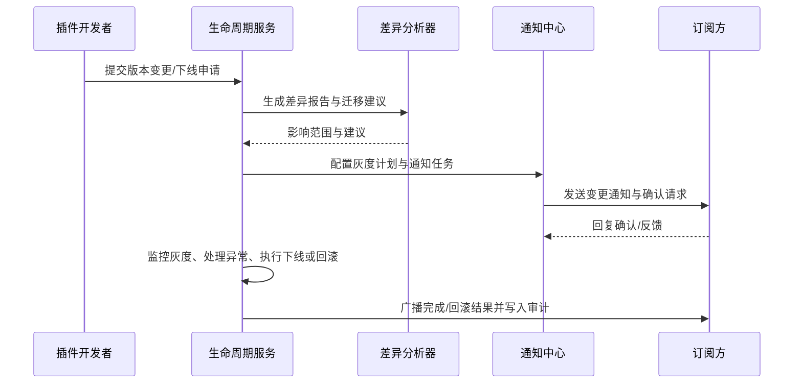

doc_id: UC-INT-PLUGIN-CAPABILITY-LIFECYCLE-001
scn_id: SCN-INT-PLUGIN-CAPABILITY-001
title: 能力生命周期变更与下线治理
status: Draft
version: v0.1.0
repo_key: powerx
scope: powerx
layer: ops
domain: integration
scenario_title: "插件能力注册与暴露治理闭环"
owners:
  - name: Michael Hu
    role: Tech Steward
    contact: tech@artisan-cloud.com
  - name: Matrix-X
    role: Docs Coordinator
    contact: dev@artisan-cloud.com
contributors: []
linked_requirements:
  - SCN-INT-PLUGIN-CAPABILITY-001#stage-4
  - SCN-INT-PLUGIN-CAPABILITY-LIFECYCLE-001
code_refs:
  - repo: powerx
    path: internal/capabilities/lifecycle/service.go
    description: 版本变更与下线编排、灰度策略与状态机
  - repo: powerx
    path: internal/capabilities/lifecycle/diff_analyzer.go
    description: 差异分析、影响范围评估与迁移建议生成
  - repo: powerx
    path: internal/notifications/capability/lifecycle_notifier.go
    description: 多渠道通知、重试、覆盖率统计与审计
  - repo: powerx
    path: scripts/capabilities/lifecycle-reconcile.mjs
    description: 版本对账、调用残留检测与自动回滚脚本
feature_flags:
  - PX_CAPABILITY_CHANGE_NOTICE
  - PX_CAPABILITY_LIFECYCLE_ROLLOUT
optional: false
last_reviewed_at: 2025-01-20

---

# Usecase Overview

- **业务目标**：对已暴露能力的版本升级、参数调整或计划下线进行可控治理，确保订阅方按灰度计划完成迁移，通知覆盖率 100%，并在检测到调用残留或异常时自动暂停或回滚。
- **成功度量**：变更差异分析耗时 ≤2 分钟；通知覆盖率 ≥100%；灰度窗口内双版本可用率 ≥99%；自动暂停/回滚平均响应时间 ≤1 分钟。
- **场景关联**：承接主场景 Stage 4，继承 `UC-INT-PLUGIN-CAPABILITY-EXPOSURE-001` 的启用结果，为订阅方生命周期维持闭环。

> 该用例保障能力升级与下线具备可观测、可回滚的流程，最大限度降低对宿主与订阅方的业务冲击。

# Context & Assumptions

- **前置条件**
  - Feature Flag `PX_CAPABILITY_CHANGE_NOTICE`、`PX_CAPABILITY_LIFECYCLE_ROLLOUT` 已启用。
  - 能力已在目录中暴露，且订阅方列表、调用指标可追踪。
  - Notification Center、EventBus、Workflow Engine、审计日志服务可用。
  - 订阅方渠道（邮件、站内、Webhook）配置完整，可接收通知与确认。
- **输入/输出**
  - 输入：变更申请（版本、字段调整、下线计划）、灰度窗口、通知模板、受影响订阅方、回滚策略。
  - 输出：差异报告、灰度计划、通知记录、监控指标、回滚/暂停状态、审计事件。
- **边界**
  - 不负责订阅方内部改动及验证脚本实现；计费策略与合同调整由财务/Marketplace 场景处理。

# Solution Blueprint

## 体系分解

| 层 | 主要组件/模块 | 责任 | 代码入口 |
|----|---------------|------|---------|
| 生命周期编排服务 | `internal/capabilities/lifecycle/service.go` | 受理变更申请、生成灰度计划、驱动状态机 | `services/capabilities/lifecycle` |
| 差异分析引擎 | `internal/capabilities/lifecycle/diff_analyzer.go` | 比对版本差异、识别受影响字段与订阅方 | `services/capabilities/lifecycle` |
| 通知编排 | `internal/notifications/capability/lifecycle_notifier.go` | 多渠道通知、覆盖率统计、失败重试 | `services/notifications` |
| 监控与对账 | `scripts/capabilities/lifecycle-reconcile.mjs` | 调用残留检测、灰度进度对账、自动暂停/回滚 | `scripts/capabilities` |
| 审计与合规 | `internal/audit/capability_lifecycle_logger.go` | 记录审批、通知、暂停/回滚、确认日志 | `services/audit` |

## 流程与时序

1. **Step 1 – 变更申请与差异分析**：开发者提交版本或下线申请，生命周期服务调用差异分析器生成字段/权限差异与影响范围，输出迁移建议。
2. **Step 2 – 灰度计划配置**：配置灰度窗口、兼容期限、订阅方列表、确认策略，并落地通知模板、回滚策略。
3. **Step 3 – 灰度执行与监控**：执行灰度，允许双版本并行；监控调用、错误率、确认状态；对异常触发自动暂停或回滚。
4. **Step 4 – 下线完成与审计归档**：灰度结束后执行下线；如检测到调用残留则暂停并告警；完成后归档审计、更新文档与 Portal 状态。



# Contracts & Interfaces

- **Inbound APIs / Events**
  - `POST /internal/plugins/capabilities/{id}/versions` — 创建版本变更或下线申请。
  - `POST /internal/plugins/capabilities/{id}/versions/{version}/plan` — 配置灰度窗口、通知策略、回滚方案。
  - `POST /internal/plugins/capabilities/{id}/versions/{version}/confirm` — 管理员确认灰度完成或暂停。
  - `POST /internal/plugins/capabilities/{id}/versions/{version}/rollback` — 触发回滚。
  - 事件 `capability.lifecycle.notice_sent`、`capability.lifecycle.acknowledged`、`capability.lifecycle.rollback_triggered`。
- **Outbound 调用**
  - `POST /notification/capabilities/lifecycle` — 多渠道通知订阅方与管理员。
  - `POST /internal/apigateway/policies/rollback` — 回滚网关策略。
  - `POST /internal/docs/portal/update` — 更新开发者门户文档与状态。
  - `POST /monitoring/metrics/query` — 拉取调用残留、错误率指标。
- **配置与脚本**
  - `config/capabilities/lifecycle.yaml` — 默认灰度时长、通知渠道、确认策略。
  - `config/capabilities/rollback.yaml` — 回滚阈值、暂停条件、升级路径。
  - `scripts/capabilities/lifecycle-reconcile.mjs` — 对账调用残留，自动触发暂停/回滚。

# Implementation Checklist

| 项目 | 描述 | 完成状态 | 负责人 |
|------|------|----------|--------|
| 差异分析引擎 | 输出字段、权限、Schema 差异与迁移建议 | [ ] | Michael Hu |
| 灰度计划编排 | 支持多阶段灰度、订阅方分组、确认策略 | [ ] | Michael Hu |
| 通知与确认 | 集成邮件/站内/Webhook 通道，统计覆盖率并回收确认 | [ ] | Grace Lin |
| 暂停/回滚机制 | 监控调用残留、自动暂停与回滚，提供人工确认入口 | [ ] | Michael Hu |
| 审计与文档同步 | 写入 `audit.capability.lifecycle.*`，更新文档/Portal 状态 | [ ] | Matrix-X |

# Testing Strategy

- **单元测试**
  - 差异分析逻辑、灰度计划配置规则、阈值判断、通知重试、回滚状态机。
- **集成测试**
  - 模拟 Notification Center、API Gateway、Monitoring 指标返回，验证灰度执行、暂停与回滚链路。
  - 运行 `scripts/capabilities/lifecycle-reconcile.mjs --dry-run` 检查对账与残留检测。
- **端到端验证**
  - 根据主场景用例 D-1、D-2 执行能力变更通知与下线回滚流程，确认双版本并行、通知覆盖率、异常暂停。
- **非功能测试**
  - 压测大规模订阅方通知、网络抖动下的通知重试；模拟监控延迟、Webhook 失败、灰度窗口延长。

# Observability & Ops

- **指标**：`capability.lifecycle.notice_coverage`、`capability.lifecycle.dual_version_duration`、`capability.lifecycle.rollback_count`、`capability.lifecycle.pause_triggered_total`。
- **日志**：记录能力 ID、版本、差异摘要、灰度阶段、通知渠道、确认状态、回滚原因；审计事件写入 `audit.capability.lifecycle.*`。
- **告警**：通知覆盖率 <95%（P1）；灰度期异常率 >5%（P1）；回滚连续触发 ≥2 次（P0）；调用残留未清零超过截止时间（P1）。
- **Dashboards**：Capability Lifecycle Dashboard、Notification Coverage Panel、Rollback & Pause Monitoring。

# Rollback & Failure Handling

- **回滚步骤**：调用 `/rollback` 接口恢复上一版本策略；撤销新版本文档；通知订阅方维持旧版本；重置灰度计划。
- **补救措施**：自动暂停灰度，升级给运维与安全负责人；提供脚本 `scripts/capabilities/lifecycle-reconcile.mjs --rollback` 执行对账；为订阅方提供备用版本或模拟数据。
- **数据修复**：运行对账脚本校准订阅方确认状态；人工审核审计日志与通知记录；若需恢复通知，支持手动触发重发。

# Follow-ups & Risks

| 风险/事项 | 影响 | 缓解方案 | 负责人 | ETA |
|-----------|------|----------|--------|-----|
| 订阅方确认流程未与外部协作工具集成 | 协同效率下降，确认时延增加 | 打通钉钉/Slack Webhook，增加自助确认入口 | Grace Lin | 2025-02-20 |
| 大版本升级导致通知量激增，覆盖率下降 | 通知失败率增加，造成合规风险 | 引入批量发送与分批重试，监控失败渠道并自动切换备用通道 | Michael Hu | 2025-02-15 |
| 监控延迟导致暂停/回滚触发滞后 | 影响业务连续性 | 增加指标采样频率，使用事件驱动补偿机制 | Michael Hu | 2025-02-18 |

# References & Links

- 场景文档：`docs/scenarios/integration/SCN-INT-PLUGIN-CAPABILITY-LIFECYCLE-001.md`
- 主场景：`docs/scenarios/integration/SCN-INT-PLUGIN-CAPABILITY-001.md`
- Meta 设计稿：`docs/meta/scenarios/powerx/plugin-ecosystem/integration-and-connectivity/plugin-capability-registration-and-exposure/primary.md#子场景-d`
- docmap 节点：
  ```yaml
  - doc_id: UC-INT-PLUGIN-CAPABILITY-LIFECYCLE-001
    scope: powerx
    layer: ops
    domain: integration
    optional: false
    repo: powerx
    path: docs/usecases-seeds/SCN-INT-PLUGIN-CAPABILITY-001/UC-INT-PLUGIN-CAPABILITY-LIFECYCLE-001.md
  ```
- 相关标准：`docs/standards/powerx-plugin/integration/01_plugin_lifecycle/deprecation.md`、`docs/standards/powerx-plugin/integration/03_runtime_and_ops/Logs_Metrics_and_Tracing.md`
- 工具脚本：`scripts/capabilities/lifecycle-reconcile.mjs`
