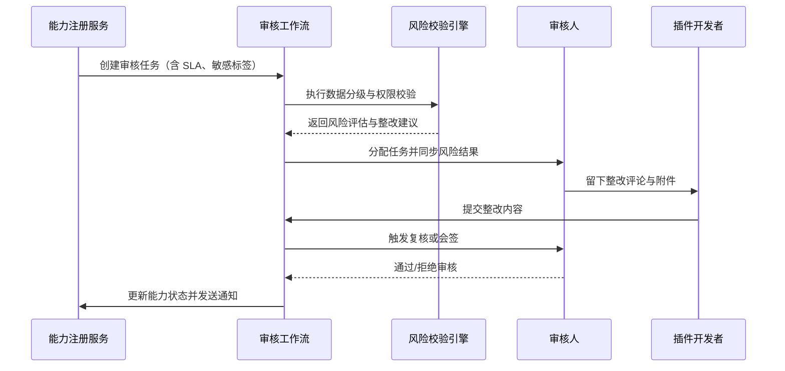

doc_id: UC-INT-PLUGIN-CAPABILITY-REVIEW-001
scn_id: SCN-INT-PLUGIN-CAPABILITY-001
title: 能力多角色审核与合规把关
status: Draft
version: v0.1.0
repo_key: powerx
scope: powerx
layer: security
domain: integration
scenario_title: "插件能力注册与暴露治理闭环"
owners:
  - name: Grace Lin
    role: Security & Compliance Lead
    contact: compliance@artisan-cloud.com
  - name: Michael Hu
    role: Tech Steward
    contact: tech@artisan-cloud.com
contributors: []
linked_requirements:
  - SCN-INT-PLUGIN-CAPABILITY-001#stage-2
  - SCN-INT-PLUGIN-CAPABILITY-REVIEW-001
code_refs:
  - repo: powerx
    path: internal/capabilities/review/workflow_service.go
    description: 审核任务编排、分派、SLA 监控与升级策略
  - repo: powerx
    path: internal/capabilities/review/risk_checker.go
    description: 数据分级、权限矩阵、频率限制与依赖校验
  - repo: powerx
    path: internal/capabilities/review/collaboration.go
    description: 评论、附件、整改回路与复核流程
  - repo: powerx
    path: internal/audit/capability_review_logger.go
    description: `audit.capability.review.*` 审计记录写入与合规留存
feature_flags:
  - PX_CAPABILITY_REVIEW_FLOW_V2
optional: false
last_reviewed_at: 2025-01-20

---

# Usecase Overview

- **业务目标**：在能力注册提交后，自动分派安全、合规、运营审核任务，完成多角色协同与复核，确保敏感数据、权限范围与频率限制均符合策略。
- **成功度量**：审核 SLA（默认 2 个工作日）达成率 ≥95%；高敏能力双人复核覆盖率 100%；拒绝原因结构化记录率 100%；未经审批的能力零外泄。
- **场景关联**：承接主场景 Stage 2，并为 `UC-INT-PLUGIN-CAPABILITY-EXPOSURE-001` 提供“可暴露”状态输入。

> 该用例确保每个能力在对外暴露前都经过严格的安全与合规审查，为生态提供可治理、可追溯的准入机制。

# Context & Assumptions

- **前置条件**
  - Feature Flag `PX_CAPABILITY_REVIEW_FLOW_V2` 已开启。
  - 工作流引擎、Risk Scoring 服务、IAM 权限矩阵、通知中心与审计日志系统可用。
  - 能力注册状态已更新为“待审核”，并携带完整元数据与示例。
- **输入/输出**
  - 输入：能力 ID、元数据、敏感标签、权限矩阵、调用频率、依赖配置、提交人信息。
  - 输出：审核任务与状态、整改评论、风险评估报告、审批结果（通过/拒绝）、审计事件、升级记录。
- **边界**
  - 不负责能力元数据填写（由 `UC-INT-PLUGIN-CAPABILITY-MODELING-001` 处理），也不涉及暴露配置或订阅通知。

# Solution Blueprint

## 体系分解

| 层 | 主要组件/模块 | 责任 | 代码入口 |
|----|---------------|------|---------|
| 审核工作流服务 | `internal/capabilities/review/workflow_service.go` | 创建任务、分派审核人、绑定 SLA、升级策略 | `services/capabilities/review` |
| 风险校验引擎 | `internal/capabilities/review/risk_checker.go` | 数据分级、权限矩阵、频率限制、依赖分析、评分 | `services/capabilities/review` |
| 协作与整改 | `internal/capabilities/review/collaboration.go` | 评论、附件、整改回路、双人复核、会签 | `services/capabilities/review` |
| 审计与合规 | `internal/audit/capability_review_logger.go` | 写入审计事件、结构化拒绝理由、留存 365 天 | `services/audit` |
| 通知与升级 | `internal/notifications/capability/review_notifier.go` | SLA 预警、升级通知、结果广播 | `services/notifications` |

## 流程与时序

1. **Step 1 – 审核任务分派**：注册服务调用审核 API，根据标签（敏感度、业务域）自动分派安全、合规、运营审核人，绑定 SLA 与升级策略。
2. **Step 2 – 风险校验与协作**：审核人执行数据分级、权限矩阵、频率限制、依赖检查，记录评论与整改要求，支持附件与在线沟通。
3. **Step 3 – 整改回退与复核**：开发者提交整改后重新校验，高敏能力或风险评分高的能力触发双人复核或专家会议。
4. **Step 4 – 审核决策与审计**：通过后能力状态更新为“可暴露”并通知宿主管理员；拒绝时记录结构化原因；超时自动升级并写入审计。



# Contracts & Interfaces

- **Inbound APIs / Events**
  - `POST /internal/plugins/capabilities/{id}/workflow/assign` — 创建审核任务、绑定 SLA 与角色。
  - `POST /internal/plugins/capabilities/{id}/workflow/comment` — 添加评论、附件、整改建议。
  - `POST /internal/plugins/capabilities/{id}/workflow/approve` — 审核通过，记录复核信息。
  - `POST /internal/plugins/capabilities/{id}/workflow/reject` — 审核拒绝并写入结构化原因。
  - 事件：`capability.review.sla_breached`、`capability.review.escalated`、`capability.review.approved`。
- **Outbound 调用**
  - `POST /notification/capabilities/review` — 推送审核任务、整改提醒、升级通知。
  - `POST /internal/audit/event` — 写入 `audit.capability.review.*` 审计日志。
  - `POST /internal/risk/score` — 调用风险评分服务，返回敏感度与风险等级。
- **配置与脚本**
  - `config/capabilities/review_workflow.yaml` — 审核角色、SLA、升级策略。
  - `config/capabilities/risk_rules.yaml` — 数据分级、权限矩阵、频率限制规则。
  - `scripts/capabilities/review-sla-monitor.mjs` — 审核 SLA 监控与告警脚本。

# Implementation Checklist

| 项目 | 描述 | 完成状态 | 负责人 |
|------|------|----------|--------|
| 审核任务编排 | 创建任务、分派角色、绑定 SLA、支持升级 | [ ] | Grace Lin |
| 风险校验引擎 | 数据分级、权限矩阵、频率限制、依赖分析 | [ ] | Grace Lin |
| 协作与整改 | 评论、附件、整改回路、双人复核 | [ ] | Michael Hu |
| 审计与拒绝理由 | 结构化记录拒绝原因、写入审计事件 | [ ] | Grace Lin |
| 通知与升级 | SLA 预警、升级通知、结果广播 | [ ] | Michael Hu |

# Testing Strategy

- **单元测试**
  - 审核任务状态机、SLA 定时器、风险评分规则、双人复核控制。
  - 评论与整改回路、拒绝理由结构化存储。
- **集成测试**
  - 模拟风险引擎、通知中心、审计服务，验证审批链路、升级路径。
  - 运行 `scripts/capabilities/review-sla-monitor.mjs --dry-run` 检查 SLA 告警。
- **端到端验证**
  - 对照主场景用例 B-1（高敏双人复核）与 B-2（SLA 超时升级），确保流程与审计结果准确。
- **非功能测试**
  - 压测高并发审核任务、风险服务延迟、通知失败重试；验证长流程断点恢复。

# Observability & Ops

- **指标**：`capability.review.pending_count`、`capability.review.sla_breach_count`、`capability.review.high_risk_ratio`、`capability.review.reject_reason_structured_ratio`。
- **日志**：任务创建/分派、风险评分、整改记录、复核与决策；审计事件写入 `audit.capability.review.*`。
- **告警**：SLA 超时率 >5%（P1）；高敏能力未完成双人复核即通过（P0）；拒绝率连续 3 天 >30%（P2）。
- **Dashboards**：Capability Review SLA Dashboard、Risk Score Panel、Audit Trail Viewer。

# Rollback & Failure Handling

- **回滚步骤**：暂停审核任务、重置状态；在风险引擎或通知失败时切换备用通道；重新提交审计事件。
- **补救措施**：人工接手高风险任务；导出审计日志进行线下复核；提供 `scripts/capabilities/review-reconcile.mjs` 对账审核状态。
- **数据修复**：校准审计记录与任务状态；处理重复通知或误判任务；补录拒绝原因。

# Follow-ups & Risks

| 风险/事项 | 影响 | 缓解方案 | 负责人 | ETA |
|-----------|------|----------|--------|-----|
| 风险评分模型未覆盖第三方 API 依赖 | 合规风险 | 更新模型、加入依赖白名单与人工复核 | Grace Lin | 2025-02-15 |
| 审核评论缺乏模板导致沟通成本高 | 效率下降 | 引入标准化整改模板、关键字段辅助填充 | Michael Hu | 2025-02-12 |

# References & Links

- 场景文档：`docs/scenarios/integration/SCN-INT-PLUGIN-CAPABILITY-REVIEW-001.md`
- 主场景：`docs/scenarios/integration/SCN-INT-PLUGIN-CAPABILITY-001.md`
- Meta 设计稿：`docs/meta/scenarios/powerx/plugin-ecosystem/integration-and-connectivity/plugin-capability-registration-and-exposure/primary.md#子场景-b`
- docmap 节点：
  ```yaml
  - doc_id: UC-INT-PLUGIN-CAPABILITY-REVIEW-001
    scope: powerx
    layer: security
    domain: integration
    optional: false
    repo: powerx
    path: docs/usecases-seeds/SCN-INT-PLUGIN-CAPABILITY-001/UC-INT-PLUGIN-CAPABILITY-REVIEW-001.md
  ```
- 相关标准：`docs/standards/powerx-plugin/integration/04_security_and_compliance/Plugin_Security_Checklist.md`、`docs/standards/powerx-plugin/integration/04_security_and_compliance/ToolGrant_Consumption_Guide.md`
- 脚本与监控：`scripts/capabilities/review-sla-monitor.mjs`
