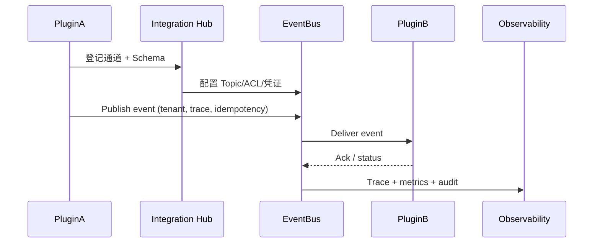

# Positioning & Goals

插件不仅与宿主交互，也需要跨插件协作完成业务闭环。本场景构建“插件间通信”标准：通信通道登记 → 事件联动与幂等 → 共享 Topic 访问控制 → 数据流链路监控。核心目标：

- 100% 通信需求通过 Integration Hub 登记审批，拓扑自动生成；
- 租户隔离与 ACL 生效，未授权订阅全部阻断；
- 事件至少一次送达，重复消费被幂等策略剔除，死信可回放；
- 数据流链路延迟可观测，异常可回滚或补偿。

# Scope & Guardrails

- **In Scope**：通信通道注册、Schema/拓扑治理、事件/消息联动、幂等+死信、共享 Topic ACL & 脱敏、跨插件链路 Trace/SLA。
- **Out of Scope**：插件↔宿主调用（见 `SCN-INT-HOST-CALL-PLUGIN-001` / `SCN-INT-PLUGIN-CALL-HOST-001`）、插件↔第三方系统、插件内部业务逻辑。
- **Environment & Flags**：`PX_PLUGIN_COMM_HUB`, `PX_PLUGIN_EVENT_IDEMPOTENT`, `PX_PLUGIN_TOPIC_ACL`, `PX_PLUGIN_FLOW_MONITOR`; 依赖 Integration Hub、EventBus、Tenant Policy、Observability、Replay 工具。

# Core Capabilities

1. **Channel Registration & Topology**：通信需求登记、Schema 校验、Topic/队列配置、审批与拓扑可视化。
2. **Event Orchestration & Idempotency**：受控事件发布/消费、幂等 ID、重试/死信、反馈状态。
3. **Shared Topic ACL & Data Governance**：租户 ACL、脱敏策略、配额与共享 Topic 监控。
4. **Flow Monitoring & Replay**：跨插件链路 Trace、SLA 仪表、回放/补偿脚本。

# Participants & Responsibilities

| Scope | Repository | Layer | 责任与交付物 | Owners |
|-------|------------|-------|--------------|--------|
| Integration Hub | powerx | service | 通道登记、Schema Registry、审批、拓扑视图 | Integration Platform Squad |
| Event Mesh | powerx | service/security | Topic/Queue 管理、鉴权、幂等、死信与 ACL | Event Platform Squad |
| Observability & Ops | powerx | ops | Trace、指标、审计、回放/补偿任务、链路 SLA | Platform SRE Squad |

# End-to-End Flow

1. **Register & Approve**：插件通过 Hub 登记通信需求，完成 Schema 校验与租户策略审批，生成 Topic/队列配置与凭证。
2. **Publish & Consume**：插件按约定发布/消费事件，EventBus 执行鉴权、幂等、持久化，并记录 Trace ID。
3. **Govern Shared Topics**：共享 Topic 通过 ACL、脱敏与配额管理，未授权访问被阻断，Topic 利用率受监控。
4. **Monitor & Replay**：Observability 记录端到端指标、死信、回放/补偿；数据流链路异常可灰度回滚。

# Key Interactions & Contracts

- **APIs**：`POST /integration-hub/channels`, `POST /integration-hub/schema/validate`, `POST /events/publish`, `POST /events/replay`, `POST /topics/{id}/acl`.
- **Headers/Context**：`tenant_uuid`, `x-plugin-id`, `x-event-id`, `x-trace-id`, `x-schema-version`.
- **Configs**：`integration_channels.yaml`, `event_schema_registry/`, `topic_acl_matrix.yaml`, `flow_monitor_pipelines.yaml`.
- **Events**：`plugin.comm.channel.created`, `plugin.comm.event.deadletter`, `plugin.comm.topic.acl_blocked`, `plugin.comm.flow.alert`.

# Validation Workflow

1. 通道登记→审批→配置下发（含 Schema/凭证）；
2. 事件发布/消费幂等 + 死信回放；
3. 共享 Topic ACL/脱敏测试；
4. 数据流链路延迟监控、回滚与补偿演练。

# Related Links

- `SCN-INT-HOST-CALL-PLUGIN-001`（宿主调用插件场景基础）；
- `SCN-INT-PLUGIN-CALL-HOST-001`（插件调用宿主互补链路）；
- 子场景：`SCN-INT-PLUGIN-COMM-CHANNEL-001`, `SCN-INT-PLUGIN-COMM-IDEMPOTENT-001`, `SCN-INT-PLUGIN-COMM-ACL-001`, `SCN-INT-PLUGIN-COMM-FLOW-001`.

# Acceptance Criteria

1. 通信通道 100% 登记备案，审批 ≤ 1 个工作日，Schema 校验失败率 <5%；
2. 事件至少一次送达，重复消费率 <0.5%，死信可回放并审计；
3. 共享 Topic ACL 拒绝率可观测，脱敏命中率 ≥98%，配额可配置；
4. 数据流链路延迟达标（实时 <5s / 批处理 <15min），Trace 可关联全链路，异常可回滚或补偿。

# Telemetry & Ops

- 指标：`plugin.comm.channel.approval_time`, `plugin.comm.schema.fail_rate`, `plugin.comm.event.latency`, `plugin.comm.event.deadletter`, `plugin.comm.topic.acl_blocked`, `plugin.comm.flow.replay_count`.
- 告警：未经审批通道调用（P0）、死信堆积 >100（P1）、共享 Topic 脱敏失效（P1）、链路延迟超阈值（P1）。
- 可视化：`Plugin Communication Hub` Grafana、Trace Explorer、`reports/_state/plugin-comm.json`。

# Architecture Diagram

# Open Issues & Follow-ups

| 风险/事项 | 影响范围 | 负责人 | ETA |
|-----------|----------|--------|-----|
| `integration_channels.yaml` 尚未支持多 Region 拓扑 | 跨区域协同 | Integration Platform Squad | 2025-03-03 |
| 死信回放脚本缺少租户过滤 | 运维效率 | Event Platform Squad | 2025-02-28 |
| Flow Monitor 未接入批处理 SLA 指标 | 报表插件链路 | SRE Squad | 2025-03-05 |
