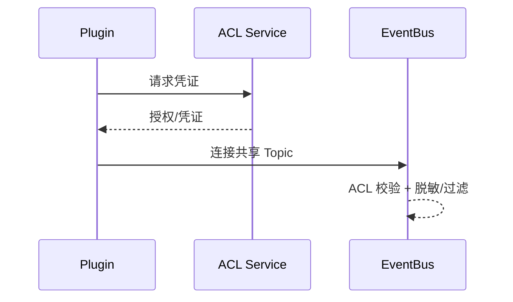

# Executive Summary

> 共享 Topic 允许多个插件协作，但必须通过 ACL、租户隔离、字段脱敏与配额控制保障安全。本子场景确保未授权访问被阻断，敏感字段可脱敏，配额实时监控。

# Scope & Guardrails

- **In Scope**：Topic ACL、凭证签发、租户/插件白名单、字段脱敏、消息过滤、配额与利用率统计。
- **Out of Scope**：通道登记、幂等、链路监控（其他子场景负责）。
- **Environment & Flags**：`PX_PLUGIN_TOPIC_ACL`, `PX_PLUGIN_TOPIC_QUOTA`, `PX_PLUGIN_DATA_MASKING`; 依赖 Tenant Policy、EventBus、Masking Engine、Audit。

# End-to-End Flow

1. Hub 为共享 Topic 配置 ACL/租户策略与配额，生成凭证。
2. 插件接入时使用 SASL/OAuth2 完成鉴权，EventBus 校验 ACL。
3. 消息通过策略过滤/脱敏后投递；消费端根据标签决定处理。
4. 超出配额或未授权访问立即阻断并记录审计/告警。

# Key Interactions & Contracts

- `POST /topics/:id/acl`、`POST /topics/:id/quotas`.
- `POST /topics/:id/tokens` — 生成访问凭证。
- Configs：`topic_acl_matrix.yaml`, `topic_masking_rules.yaml`, `topic_quota.yaml`.
- Audit：`plugin.comm.topic.acl_blocked`, `plugin.comm.topic.quota_breach`.

# Acceptance Criteria

1. 未授权插件连接即被拒绝（403），审计记录租户/插件信息。
2. 脱敏策略命中率 ≥98%，敏感字段未泄露。
3. Topic 配额实时监控，利用率异常触发扩容或限流。

# Telemetry & Ops

- 指标：`plugin.comm.topic.acl_blocks`, `plugin.comm.topic.mask_hits`, `plugin.comm.topic.quota_usage`.
- 告警：ACL 缺失/拒绝失败、脱敏策略失效、配额超限。

# Open Issues & Follow-ups

| 风险/事项 | 影响 | 负责人 | ETA |
|-----------|------|--------|-----|
| ACL 配置缺少版本审计 | 追责困难 | IAM Squad | 2025-03-01 |
| 脱敏策略未覆盖非结构化字段 | 数据泄露风险 | Data Governance Squad | 2025-02-28 |
