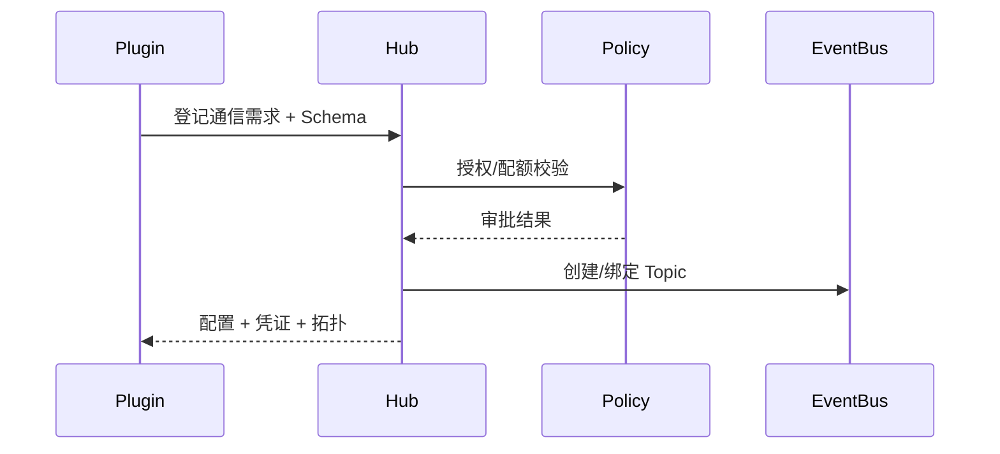

# Executive Summary

> 插件间通信必须先通过 Integration Hub 登记，完成 Schema 校验、租户策略审批与 Topic/队列配置，生成拓扑图与访问凭证，确保接入一致、可追踪、可审计。

# Scope & Guardrails

- **In Scope**：通信需求登记、Schema/版本校验、审批流程、Topic/队列配置、凭证发放、拓扑可视化、配额管理。
- **Out of Scope**：事件幂等（子场景 B）、共享 Topic ACL（子场景 C）、链路监控（子场景 D）。
- **Environment & Flags**：`PX_PLUGIN_COMM_HUB`, `PX_PLUGIN_SCHEMA_REGISTRY`, `PX_PLUGIN_CHANNEL_TOPOLOGY`; 依赖 Integration Hub、Schema Registry、Tenant Policy、Audit Ledger。

# End-to-End Flow

1. 插件提交通信申请（事件类型、Topic、租户范围、Schema）。
2. Hub 校验 Schema 兼容性、租户策略与配额，审批通过后生成配置。
3. Hub 创建或绑定 Topic/队列，生成凭证/endpoint，并更新拓扑图。
4. 插件根据配置接入并进行联调，结果写入审计。

# Key Interactions & Contracts

- `POST /integration-hub/channels`、`GET /integration-hub/channels/:id`.
- `POST /integration-hub/schema/validate`.
- `POST /integration-hub/channels/:id/approve`.
- Configs：`integration_channels.yaml`, `schema_registry/`.
- Audit：`plugin.comm.channel.approved`, `plugin.comm.channel.rejected`.

# Acceptance Criteria

1. 100% 通道通过 Hub 登记与审批，Schema 校验失败率 <5%。
2. Topic/队列命名遵循标准，拓扑视图实时更新。
3. 配置/凭证下发后 5 分钟内可联通，审计记录完整。

# Telemetry & Ops

- 指标：`plugin.comm.channel.approval_time`, `plugin.comm.schema.fail_rate`, `plugin.comm.channel.count`, `plugin.comm.channel.quota_usage`.
- 告警：未经审批的直连检测、Schema 校验服务不可用、Topic 配额超限。

# Open Issues & Follow-ups

| 风险/事项 | 影响 | 负责人 | ETA |
|-----------|------|--------|-----|
| 拓扑图未支持多 Region 视图 | 跨区域部署 | Integration Platform Squad | 2025-03-03 |
| Schema Registry 缓存缺少版本回滚 | 变更风险 | Platform Infra Squad | 2025-02-27 |
