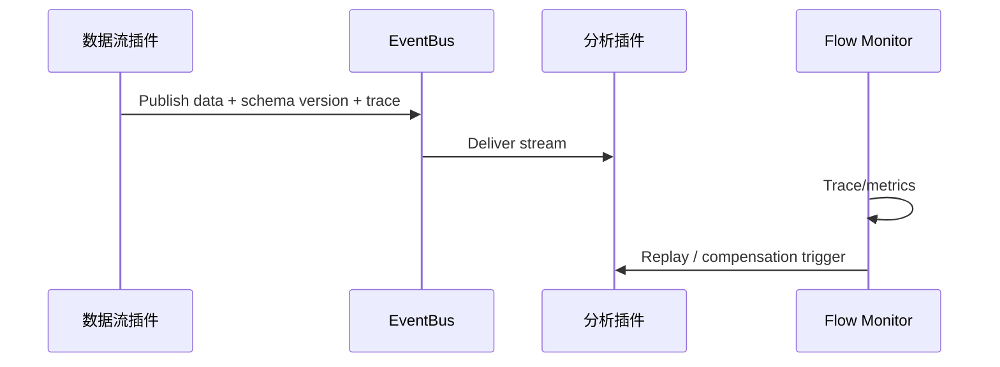

# Executive Summary

> 对于数据流插件与分析插件的联动链路，需要端到端监控、延迟 SLA、异常补偿与回放能力，实时链路延迟 <5s、批处理 <15min，异常可定位并回滚。

# Scope & Guardrails

- **In Scope**：链路 Trace、指标仪表、Schema 版本监控、回放/补偿脚本、异常告警、灰度回滚。
- **Out of Scope**：通道登记、幂等、Topic ACL（其他子场景负责）。
- **Environment & Flags**：`PX_PLUGIN_FLOW_MONITOR`, `PX_PLUGIN_FLOW_REPLAY`, `PX_PLUGIN_SCHEMA_GUARD`; 依赖 Observability、Schema Registry、Workflow Engine。

# End-to-End Flow

1. 数据流插件写入流/批处理通道并携带 Schema 版本与 Trace。
2. 分析插件消费并处理数据，Integration Hub 记录 Trace/指标。
3. Flow Monitor 汇总端到端延迟、吞吐、错误，生成仪表盘。
4. Schema 或结果异常时触发回滚/补偿任务，支持事件回放。

# Key Interactions & Contracts

- `POST /flow-monitor/register`、`POST /flow-monitor/alert`.
- `POST /flow-monitor/replay`、`POST /flow-monitor/compensate`.
- Configs：`flow_monitor_pipelines.yaml`, `schema_version_matrix.yaml`.
- Audit：`plugin.comm.flow.alert`, `plugin.comm.flow.replay`.

# Acceptance Criteria

1. 实时链路延迟 <5s，批处理 <15min；仪表板实时展示。
2. Schema 版本变更能够灰度并回滚，异常自动告警。
3. 回放/补偿脚本可在 5 分钟内恢复异常数据。

# Telemetry & Ops

- 指标：`plugin.comm.flow.latency`, `plugin.comm.flow.throughput`, `plugin.comm.flow.replay_count`, `plugin.comm.flow.compensation_success`.
- 告警：延迟超阈值、Schema 不兼容、补偿失败。

# Open Issues & Follow-ups

| 风险/事项 | 影响 | 负责人 | ETA |
|-----------|------|--------|-----|
| Flow Monitor 未纳入批处理 SLA 指标 | 报表链路不可观测 | SRE Squad | 2025-03-05 |
| Replay Pipeline 缺少租户级限流 | 回放时可能影响生产 | Observability Squad | 2025-02-28 |
