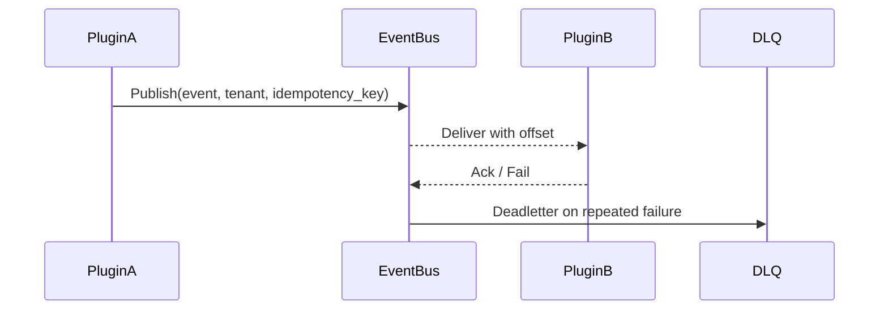

# Executive Summary

> 插件之间通过事件联动时，需要统一的发布/消费协议、幂等 ID、重试/死信与处理反馈，确保至少一次送达、重复消费被过滤、死信可回放。

# Scope & Guardrails

- **In Scope**：事件发布/消费 SDK、幂等键、重试/退避、死信队列、消费状态回写、Trace/租户上下文。
- **Out of Scope**：通信通道登记（子场景 A）、Topic ACL（子场景 C）、链路监控（子场景 D）。
- **Environment & Flags**：`PX_PLUGIN_EVENT_IDEMPOTENT`, `PX_PLUGIN_EVENT_RETRY`, `PX_PLUGIN_EVENT_DLQ`; 依赖 EventBus、Deadletter 服务、Observability。

# End-to-End Flow

1. 插件 A 发布事件（携带租户、Trace、`idempotency_key`），EventBus 鉴权并持久化。
2. EventBus 执行幂等校验、写入 offset，并按消费组投递插件 B。
3. 插件 B 处理后 ACK 或标记失败，失败事件自动重试，超过阈值进入死信。
4. SRE 可查询死信并回放，所有步骤写入审计。

# Key Interactions & Contracts

- `POST /events/publish`、`POST /events/bulk`.
- Headers：`x-idempotency-key`, `tenant_uuid`, `x-trace-id`.
- `POST /events/ack`, `POST /events/replay`.
- Config：`event_schema_registry`, `event_retry_policies.yaml`.

# Acceptance Criteria

1. 发布/消费至少一次送达，重复消息被幂等过滤（重复率 <0.5%）。
2. 死信队列可查询和回放，回放成功率 ≥ 98%。
3. 事件处理成功率 ≥99%，失败会生成告警与审计记录。

# Telemetry & Ops

- 指标：`plugin.comm.event.throughput`, `plugin.comm.event.latency`, `plugin.comm.event.duplicate_rate`, `plugin.comm.event.deadletter`.
- 告警：重复率 >1%、死信堆积 >100、ACK 失败率 >1%。

# Open Issues & Follow-ups

| 风险/事项 | 影响 | 负责人 | ETA |
|-----------|------|--------|-----|
| 幂等存储尚未支持多租户分片 | 高吞吐租户性能 | Event Platform Squad | 2025-03-04 |
| 死信回放缺少审计 ID | 合规性 | Observability Squad | 2025-02-27 |
