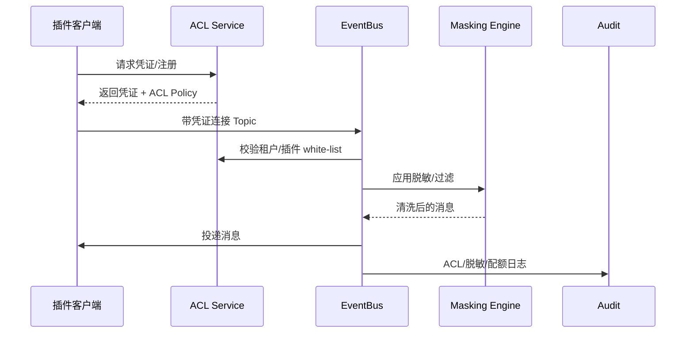

doc_id: UC-INT-PLUGIN-COMM-ACL-001
scn_id: SCN-INT-PLUGIN-COMM-001
title: 共享 Topic 访问控制（security/integration）
status: Draft
version: v0.1.0
repo_key: powerx
scope: powerx
layer: security
domain: integration
scenario_title: "插件间通信"
owners:
  - name: Grace Lin
    role: Security & Compliance Lead
    contact: compliance@artisan-cloud.com
contributors:
  - name: Michael Hu
    role: Plugin Tech Lead
    contact: tech@artisan-cloud.com
linked_requirements:
  - id: SCN-INT-PLUGIN-COMM-ACL-001
    description: 子场景《共享 Topic 访问控制》
code_refs:
  - repo: powerx
    path: services/integration/topic_acl/acl_service.ts
    description: Topic ACL 管理、凭证签发、租户白名单
  - repo: powerx
    path: services/integration/topic_acl/masking_engine.ts
    description: 字段脱敏策略执行、过滤标签与审计
  - repo: powerx
    path: services/integration/topic_acl/quota_monitor.ts
    description: 共享 Topic 配额统计、告警与扩容建议
feature_flags:
  - PX_PLUGIN_TOPIC_ACL
  - PX_PLUGIN_TOPIC_QUOTA
  - PX_PLUGIN_DATA_MASKING
optional: false
last_reviewed_at: 2025-02-20

---

# Usecase Overview

- **业务目标**：为共享 Topic 提供租户级安全隔离与配额管理，阻断未授权访问、对敏感字段执行脱敏策略，并实时监控 Topic 利用率，防止串租或资源滥用。
- **成功度量**：ACL 拒绝率达到 100% 覆盖、脱敏命中率 ≥ 98%、Topic 配额利用率可视化且超限 < 0.5%、异常访问 1 分钟内触发告警。
- **场景关联**：对应 `SCN-INT-PLUGIN-COMM-ACL-001` 子场景，为 Channel 登记/事件幂等/数据流监控提供基础安全与租户隔离能力。

> 插件通过受控凭证访问共享 Topic，平台统一执行 ACL、脱敏与配额策略，保障跨插件协同的安全与可追踪性。

# Context & Assumptions

- **前置条件**：
  - Feature Flags `PX_PLUGIN_TOPIC_ACL`, `PX_PLUGIN_TOPIC_QUOTA`, `PX_PLUGIN_DATA_MASKING` 已开启。
  - Integration Hub 已为目标 Topic 完成 Schema 注册与租户策略审批。
  - 租户策略服务提供最新 ACL 白名单、字段脱敏/过滤规则。
  - EventBus 支持 SASL/OAuth2 鉴权、ACL Plugin 与配额统计；审计系统可写入 ACL 拒绝与脱敏命中事件。
- **输入/输出**：
  - 输入：插件接入请求（凭证、租户、插件 ID）、Topic 元数据、脱敏策略、配额阈值。
  - 输出：鉴权结果（允许/拒绝）、脱敏后的消息、配额使用指标、告警/审计日志。
- **边界**：
  - 不处理通道审批（见 Channel 子场景）或事件幂等（见 Idempotent 子场景）。
  - 插件内部需遵循平台返回的脱敏结果，平台不对下游展示做额外管控。

# Solution Blueprint

## 体系分解

| 层 | 主要组件/模块 | 责任 | 代码入口 |
|----|---------------|------|---------|
| ACL 管理服务 | `services/integration/topic_acl/acl_service.ts` | 维护租户/插件白名单、凭证签发、ACL 缓存与回滚 | `services/integration/topic_acl/acl_service.ts` |
| 脱敏与过滤引擎 | `services/integration/topic_acl/masking_engine.ts` | 根据策略对消息做字段脱敏/过滤，写入审计 | `services/integration/topic_acl/masking_engine.ts` |
| 配额监控 | `services/integration/topic_acl/quota_monitor.ts` | 统计 Topic 吞吐、配额使用率，触发告警/扩容建议 | `services/integration/topic_acl/quota_monitor.ts` |

## 流程与时序

1. **Step 1 – Register & Issue Credential**：Hub 将共享 Topic 的 ACL/配额策略写入 `topic_acl_matrix.yaml`，ACL 服务签发插件凭证。
2. **Step 2 – Connect & Authenticate**：插件使用凭证连接 Topic，EventBus 调用 ACL 服务校验租户/插件白名单。
3. **Step 3 – Mask & Filter**：消息通过 `masking_engine` 执行字段脱敏/过滤，未通过策略的字段被剥除或替换。
4. **Step 4 – Enforce Quota & Audit**：`quota_monitor` 统计吞吐并判断是否超配额；所有拒绝/脱敏事件写入审计与告警系统。

# Contracts & Interfaces

- **Inbound APIs / Events**
  - `POST /topics/{id}/acl` — 配置白名单、字段策略、配额。
  - `POST /topics/{id}/tokens` — 为插件签发访问凭证（SASL/OAuth2）。
  - `POST /topics/{id}/acl/rollback` — 一键回滚 ACL 配置。
- **Outbound 调用**
  - `Tenant Policy Service` — 获取租户授权、字段标签。
  - `Audit Ledger` — 写入 `plugin.comm.topic.acl_blocked`, `plugin.comm.topic.mask_hit`。
  - `Notification/Alert` — 配额超限或脱敏失败时通知值班。
- **配置与脚本**
  - `topic_acl_matrix.yaml`, `topic_masking_rules.yaml`, `topic_quota.yaml`。
  - `scripts/ops/topic-acl-sync.mjs` 用于推送/校验配置。

# Implementation Checklist

| 项目 | 描述 | 完成状态 | 负责人 |
|------|------|----------|--------|
| ACL 服务 | 支持多租户白名单、凭证签发、缓存与回滚 | [ ] | Security Squad |
| 脱敏引擎 | 支持结构化/半结构化字段脱敏、审计打点 | [ ] | Data Governance Squad |
| 配额监控 | 实时统计 Topic 吞吐、配额告警、扩容建议 | [ ] | Observability Squad |
| Infra 脚本 | `topic-acl-sync.mjs`、配额校验脚本 | [ ] | DevEx Squad |

# Testing Strategy

- **单元测试**：ACL 白名单匹配、凭证签发、脱敏规则、配额计算。
- **集成测试**：
  - 授权/未授权插件连接，验证 200 vs 403。
  - 脱敏规则（PII 字段）命中率；未配置时拒绝。
  - 大吞吐下配额告警/扩容建议。
- **端到端**：
  - 沙箱插件注册→凭证→访问共享 Topic → 脱敏日志。
  - 未授权插件接入→告警与审计。
- **非功能**：ACL 缓存回滚、策略热更新、脱敏引擎性能。

# Observability & Ops

- **指标**：`plugin.comm.topic.acl_blocks`, `plugin.comm.topic.mask_hits`, `plugin.comm.topic.quota_usage`, `plugin.comm.topic.quota_alerts`。
- **日志**：记录 `tenant_id`, `plugin_id`, `topic_id`, `policy_version`, `decision`。
- **告警**：
  - 未经授权连接（P0）。
  - 脱敏失败或遗漏（P1）。
  - 配额使用率 > 90%（P2）、>100%（P1）。
- **Dashboards**：`Topic ACL & Quota Monitor`，Audit Explorer。

# Rollback & Failure Handling

- `topic-acl-sync.mjs --rollback <topic>` 恢复上一版本 ACL。
- 配额配置错误时立即回滚并补发通知；必要时临时提升配额以保障服务。
- 脱敏引擎故障：自动切换为“安全模式”（拒绝含敏感字段的消息），同时告警。

# Follow-ups & Risks

| 风险/事项 | 影响 | 缓解方案 | 负责人 | ETA |
|-----------|------|----------|--------|-----|
| ACL 版本缺少审计追踪 | 难以定位责任 | Security Squad | 2025-03-01 |
| 脱敏策略未覆盖非结构化字段 | 数据泄露风险 | Data Governance Squad | 2025-02-28 |
| 配额不可视化导致 Topic 资源紧张 | 影响多租协同 | Observability Squad | 2025-03-03 |

# References & Links

- 场景文档：`docs/scenarios/integration/SCN-INT-PLUGIN-COMM-001.md`
- 子场景：`docs/scenarios/integration/SCN-INT-PLUGIN-COMM-ACL-001.md`
- 配置：`topic_acl_matrix.yaml`, `topic_masking_rules.yaml`, `topic_quota.yaml`
- 脚本：`scripts/ops/topic-acl-sync.mjs`
- 发布指引：`npm run publish:usecases -- --scn-id SCN-INT-PLUGIN-COMM-001 --validate-only`
