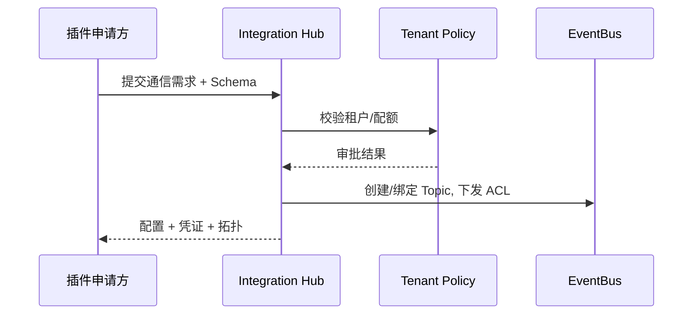

doc_id: UC-INT-PLUGIN-COMM-CHANNEL-001
scn_id: SCN-INT-PLUGIN-COMM-001
title: 通信通道注册与拓扑编排（service/integration）
status: Draft
version: v0.1.0
repo_key: powerx
scope: powerx
layer: service
domain: integration
scenario_title: "插件间通信"
owners:
  - name: Michael Hu
    role: Plugin Tech Lead
    contact: tech@artisan-cloud.com
contributors:
  - name: Grace Lin
    role: Security & Compliance Lead
    contact: compliance@artisan-cloud.com
linked_requirements:
  - id: SCN-INT-PLUGIN-COMM-CHANNEL-001
    description: 子场景《通信通道注册与拓扑编排》
code_refs:
  - repo: powerx
    path: services/integration/channel_registry/channel_service.ts
    description: 通信需求登记、审批、配置生成
  - repo: powerx
    path: services/integration/channel_registry/schema_validator.ts
    description: Schema/版本校验、兼容性检测、错误反馈
  - repo: powerx
    path: services/integration/channel_registry/topology_renderer.ts
    description: 拓扑图生成、配额可视化、凭证下发
feature_flags:
  - PX_PLUGIN_COMM_HUB
  - PX_PLUGIN_SCHEMA_REGISTRY
  - PX_PLUGIN_CHANNEL_TOPOLOGY
optional: false
last_reviewed_at: 2025-02-20

---

# Usecase Overview

- **业务目标**：将插件间通信需求统一登记到 Integration Hub，完成 Schema 校验、租户策略审批、Topic/队列配置与拓扑可视化，保证通道可追溯、可审计。
- **成功度量**：审批时长 ≤ 1 个工作日；Schema 校验失败率 < 5%；配置下发后 5 分钟内可联调；拓扑图实时更新。
- **场景关联**：支撑 `SCN-INT-PLUGIN-COMM-CHANNEL-001`，也是 Idempotent/ACL/Flow 子场景的前置步骤。

> 所有插件间通信必须通过官方 Hub 登记，平台统一生成配置与凭证，防止私自直连导致的安全和治理风险。

# Context & Assumptions

- **前置条件**：
  - Feature Flags `PX_PLUGIN_COMM_HUB`, `PX_PLUGIN_SCHEMA_REGISTRY`, `PX_PLUGIN_CHANNEL_TOPOLOGY` 已启用。
  - 插件已在 `SCN-INT-PLUGIN-CAPABILITY-001` 中完成能力注册，具备 Schema 与租户信息。
  - 租户策略服务可返回授权范围/配额；EventBus 支持动态创建 Topic/队列。
- **输入/输出**：
  - 输入：通信申请（发布/订阅插件、租户、Schema、协议、吞吐预估）、审批意见。
  - 输出：Topic/队列配置、访问凭证、拓扑图、审计记录。
- **边界**：不负责事件幂等、共享 Topic ACL 或链路监控。

# Solution Blueprint

## 体系分解

| 层 | 主要组件/模块 | 责任 | 代码入口 |
|----|---------------|------|---------|
| Channel Service | 受理通信需求、审批、生成配置与凭证 | `services/integration/channel_registry/channel_service.ts` |
| Schema Validator | 校验 Schema/版本、返回兼容性报告 | `services/integration/channel_registry/schema_validator.ts` |
| Topology Renderer | 写入 `integration_channels.yaml`、生成拓扑图、配额视图 | `services/integration/channel_registry/topology_renderer.ts` |

## 流程与时序

1. **Register**：插件在 Hub 提交通信需求，附 Schema、租户范围、协议、吞吐预测。
2. **Validate & Approve**：Schema 校验、租户策略审批、配额评估；通过后写入 `integration_channels.yaml`。
3. **Provision**：自动创建 Topic/队列或绑定已有资源，签发访问凭证并同步到 EventBus。
4. **Publish Configs**：生成拓扑图/文档，下发至双方插件，审计记录审批流程。

# Contracts & Interfaces

- `POST /integration-hub/channels` — 提交通道申请。
- `POST /integration-hub/schema/validate` — Schema 校验。
- `POST /integration-hub/channels/:id/approve` — 审批与配置发布。
- 配置：`integration_channels.yaml`, `schema_registry/`, `channel_topology.json`。
- 脚本：`scripts/ops/integration-channel-sync.mjs`。

# Implementation Checklist

| 项目 | 描述 | 完成状态 | 负责人 |
|------|------|----------|--------|
| 通道申请 API | 支持多插件/租户/协议参数，写入队列等待审批 | [ ] | Integration Hub Squad |
| Schema Registry | 校验与兼容性报告、版本回滚 | [ ] | Platform Infra Squad |
| 配置/拓扑生成 | 输出 Topic/队列配置、拓扑图、配额视图 | [ ] | Integration Hub Squad |
| 审计链路 | 审批、配置变更、凭证签发写入 Audit | [ ] | Security Squad |

# Testing Strategy

- **单元测试**：Schema 校验、审批状态机、配置生成、拓扑图导出。
- **集成测试**：
  - 正向：申请→审批→配置→联调；
  - 逆向：Schema 不兼容、租户未授权、配额不足；
  - 配置回滚/重新下发。
- **端到端**：沙箱插件登记→Topic 创建→凭证下发→事件通路打通。

# Observability & Ops

- 指标：`plugin.comm.channel.approval_time`, `plugin.comm.schema.fail_rate`, `plugin.comm.channel.count`, `plugin.comm.channel.quota_usage`。
- 告警：未经审批尝试直连、Schema 校验服务不可用、Topic 创建失败。
- Dashboards：`Plugin Communication Hub`（展示拓扑与配额）。

# Rollback & Failure Handling

- 支持 `integration-channel-sync.mjs --rollback <channel_id>` 恢复前一版本配置。
- Schema/策略更新失败时保持旧配置并发出告警；必要时冻结该通道。
- Topic 创建失败则回滚所有配置并通知申请方。

# Follow-ups & Risks

| 风险/事项 | 影响 | 缓解方案 | 负责人 | ETA |
|-----------|------|----------|--------|-----|
| 拓扑视图未支持多 Region | 跨区域协同受阻 | Integration Platform Squad | 2025-03-03 |
| 配额审批缺少自动化 | 容量规划效率低 | SRE Squad | 2025-02-28 |
| Schema 校验缓存缺版本回滚 | 误判风险 | Platform Infra Squad | 2025-03-01 |

# References & Links

- 场景：`docs/scenarios/integration/SCN-INT-PLUGIN-COMM-001.md`
- 子场景：`docs/scenarios/integration/SCN-INT-PLUGIN-COMM-CHANNEL-001.md`
- 配置：`integration_channels.yaml`, `schema_registry/**`
- 脚本：`scripts/ops/integration-channel-sync.mjs`
- 发布指引：`npm run publish:usecases -- --scn-id SCN-INT-PLUGIN-COMM-001 --validate-only`
