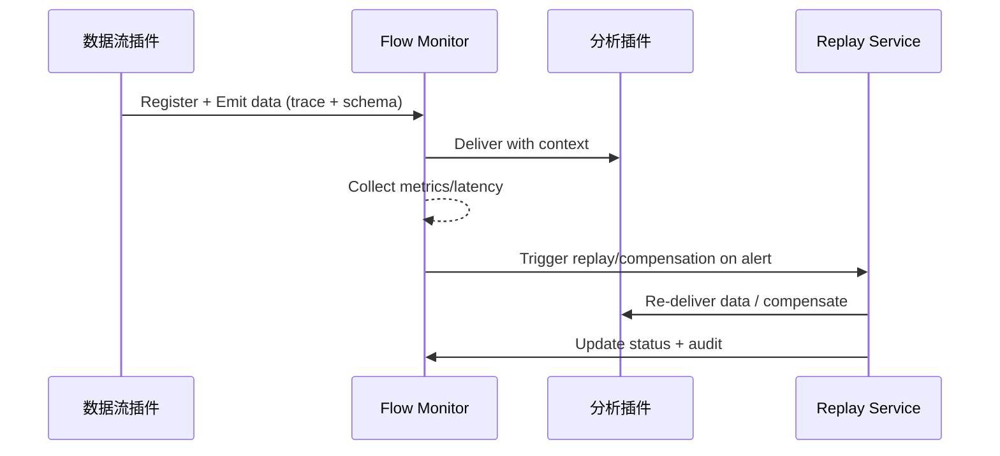

doc_id: UC-INT-PLUGIN-COMM-FLOW-001
scn_id: SCN-INT-PLUGIN-COMM-001
title: 数据流链路监控与回放补偿（ops/integration）
status: Draft
version: v0.1.0
repo_key: powerx
scope: powerx
layer: ops
domain: integration
scenario_title: "插件间通信"
owners:
  - name: Michael Hu
    role: Plugin Tech Lead
    contact: tech@artisan-cloud.com
contributors:
  - name: Grace Lin
    role: Security & Compliance Lead
    contact: compliance@artisan-cloud.com
linked_requirements:
  - id: SCN-INT-PLUGIN-COMM-FLOW-001
    description: 子场景《数据流链路监控与回放补偿》
code_refs:
  - repo: powerx
    path: services/integration/flow_monitor/pipeline.ts
    description: 链路注册、Trace/指标收集、SLA 仪表
  - repo: powerx
    path: services/integration/flow_monitor/replay_service.ts
    description: 回放/补偿任务、灰度回滚、审计
  - repo: powerx
    path: scripts/ops/plugin-flow-replay.mjs
    description: CLI 工具，注入延迟、触发回放、生成报告
feature_flags:
  - PX_PLUGIN_FLOW_MONITOR
  - PX_PLUGIN_FLOW_REPLAY
  - PX_PLUGIN_SCHEMA_GUARD
optional: false
last_reviewed_at: 2025-02-20

---

# Usecase Overview

- **业务目标**：为数据流插件→分析插件链路提供端到端监控、SLA 指标和回放补偿能力，确保实时链路延迟 <5s、批处理 <15min，异常可定位并可滚动回放。
- **成功度量**：`plugin.comm.flow.latency_rt < 5s`, `plugin.comm.flow.latency_batch < 15min`, 回放成功率 ≥ 98%，异常检测/告警 < 2 分钟响应。
- **场景关联**：落地 `SCN-INT-PLUGIN-COMM-FLOW-001`，与 Channel/Idempotent/ACL 子场景共享配置与上下文。

# Context & Assumptions

- **前置条件**：
  - Feature Flags `PX_PLUGIN_FLOW_MONITOR`, `PX_PLUGIN_FLOW_REPLAY`, `PX_PLUGIN_SCHEMA_GUARD` 已启用。
  - Flow Monitor 能接入 Trace、Metrics、Audit；Schema Registry 保存数据流 Schema 版本。
  - 数据流插件与分析插件已通过 Channel/ACL 审批，具备租户上下文。
- **输入/输出**：
  - 输入：数据流消息（含 Schema 版本、Trace ID、批次 ID）、插件处理结果、异常告警。
  - 输出：链路指标、Trace、延迟告警、回放/补偿结果、审计记录。
- **边界**：不负责通信通道注册/ACL 或幂等策略；插件内部业务逻辑由各团队负责。

# Solution Blueprint

## 体系分解

| 层 | 主要组件/模块 | 责任 | 代码入口 |
|----|---------------|------|---------|
| Flow Monitor Pipeline | `services/integration/flow_monitor/pipeline.ts` | 链路注册、Trace/指标采集、阈值配置 | `services/integration/flow_monitor/pipeline.ts` |
| Replay Service | `services/integration/flow_monitor/replay_service.ts` | 回放/补偿任务调度、灰度回滚、审计 | `services/integration/flow_monitor/replay_service.ts` |
| CLI 工具 | `scripts/ops/plugin-flow-replay.mjs` | 故障注入、快速回放、报告产出 | `scripts/ops/plugin-flow-replay.mjs` |

## 流程与时序

1. **Register Flow**：在 Flow Monitor 中注册数据流插件与分析插件链路，记录 Schema 版本、SLA。
2. **Collect Metrics**：运行时采集 Trace、吞吐、延迟、错误并写入仪表盘。
3. **Detect & Alert**：当延迟/错误超阈值、Schema 不兼容时触发告警并准备回滚。
4. **Replay & Compensate**：调用 Replay Service/CLI 回放异常批次或执行补偿任务，完成后更新审计与指标。

# Contracts & Interfaces

- `POST /flow-monitor/register`、`POST /flow-monitor/alert`, `POST /flow-monitor/replay`。
- Schema/配置：`flow_monitor_pipelines.yaml`, `schema_version_matrix.yaml`。
- 工具：`scripts/ops/plugin-flow-replay.mjs`。
- 外部依赖：Trace/Audit/Notification 服务。

# Implementation Checklist

| 项目 | 描述 | 完成状态 | 负责人 |
|------|------|----------|--------|
| Flow Monitor API | 链路注册、SLA 配置、指标采集 | [ ] | Observability Squad |
| Replay Service | 回放/补偿调度、灰度回滚 | [ ] | SRE Squad |
| CLI 工具 | `plugin-flow-replay.mjs` 用于注入/恢复 | [ ] | DevEx Squad |
| Schema Guard | 版本变更检测、灰度策略 | [ ] | Platform Infra |

# Testing Strategy

- **单元测试**：延迟计算、告警判断、回放状态机、Schema 版本差异。
- **集成测试**：
  - 正向实时链路：延迟/吞吐指标达到 SLA；
  - 批处理链路：15 分钟内完成；
  - 注入延迟/错误，验证告警与回放流程。
- **端到端**：沙箱数据流插件→分析插件→Flow Monitor/Replay→审计闭环。

# Observability & Ops

- 指标：`plugin.comm.flow.latency`, `plugin.comm.flow.throughput`, `plugin.comm.flow.replay_count`, `plugin.comm.flow.compensation_success`。
- 告警：延迟超阈值、Schema 不兼容、回放失败、补偿失败。
- Dashboard：`Plugin Flow Monitor`、Trace Explorer。

# Rollback & Failure Handling

- `plugin-flow-replay.mjs --batch <id>` 回放异常批次；
- Schema 变更失败则自动回滚上一版本，并恢复旧链路；
- Replay 服务异常时切换到手动补偿模式并告警。

# Follow-ups & Risks

| 风险/事项 | 影响 | 缓解方案 | 负责人 | ETA |
|-----------|------|----------|--------|-----|
| Flow Monitor 未纳入批处理 SLA 指标 | 报表链路不可观测 | SRE Squad | 2025-03-05 |
| 回放缺少租户限流 | 回放时影响业务 | Observability Squad | 2025-02-28 |
| Schema 版本灰度流程不完善 | 误更新导致链路中断 | Platform Infra | 2025-03-01 |

# References & Links

- 场景：`docs/scenarios/integration/SCN-INT-PLUGIN-COMM-001.md`
- 子场景：`docs/scenarios/integration/SCN-INT-PLUGIN-COMM-FLOW-001.md`
- 配置：`flow_monitor_pipelines.yaml`, `schema_version_matrix.yaml`
- 脚本：`scripts/ops/plugin-flow-replay.mjs`
- 发布指引：`npm run publish:usecases -- --scn-id SCN-INT-PLUGIN-COMM-001 --validate-only`
