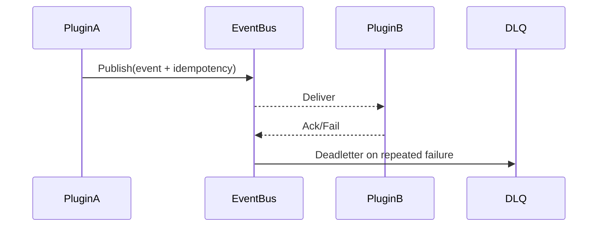

doc_id: UC-INT-PLUGIN-COMM-IDEMPOTENT-001
scn_id: SCN-INT-PLUGIN-COMM-001
title: 事件联动与幂等治理（service/integration）
status: Draft
version: v0.1.0
repo_key: powerx
scope: powerx
layer: service
domain: integration
scenario_title: "插件间通信"
owners:
  - name: Michael Hu
    role: Plugin Tech Lead
    contact: tech@artisan-cloud.com
contributors:
  - name: Grace Lin
    role: Security & Compliance Lead
    contact: compliance@artisan-cloud.com
linked_requirements:
  - id: SCN-INT-PLUGIN-COMM-IDEMPOTENT-001
    description: 子场景《事件联动与幂等治理》
code_refs:
  - repo: powerx
    path: services/integration/eventmesh/publish_controller.ts
    description: 事件发布入口、幂等 ID 生成、上下文注入
  - repo: powerx
    path: services/integration/eventmesh/consumer_manager.ts
    description: 消费组管理、offset/ACK、重试与死信
  - repo: powerx
    path: services/integration/eventmesh/idempotent_store.ts
    description: 幂等键存储、重复检测、审计打点
feature_flags:
  - PX_PLUGIN_EVENT_IDEMPOTENT
  - PX_PLUGIN_EVENT_RETRY
  - PX_PLUGIN_EVENT_DLQ
optional: false
last_reviewed_at: 2025-02-20

---

# Usecase Overview

- **业务目标**：保障插件 A 发布的事件在插件 B 侧稳定消费，提供统一的幂等 ID、重试/死信与处理反馈，避免重复执行或数据丢失。
- **成功度量**：至少一次送达、重复消费率 <0.5%、死信回放成功率 ≥98%、处理成功率 ≥99%。
- **场景关联**：对应 `SCN-INT-PLUGIN-COMM-IDEMPOTENT-001`，与 Channel/ACL/FLOW 场景共享通道和监控。

# Context & Assumptions

- Feature Flags `PX_PLUGIN_EVENT_IDEMPOTENT`, `PX_PLUGIN_EVENT_RETRY`, `PX_PLUGIN_EVENT_DLQ` 已启用。
- Channels 已在 Hub 登记并通过 ACL 审批；租户上下文可用。
- EventBus 支持幂等存储、消费组、死信队列与追踪。

# Solution Blueprint

## 体系分解

| 层 | 模块 | 责任 | 代码入口 |
|----|------|------|---------|
| Publish Controller | 生成幂等 ID、注入 Trace/租户上下文，推送到 EventBus | `services/integration/eventmesh/publish_controller.ts` |
| Consumer Manager | 管理消费组、offset、ACK、重试与反馈 | `services/integration/eventmesh/consumer_manager.ts` |
| Idempotent Store | 保存幂等键、检测重复、写入审计 | `services/integration/eventmesh/idempotent_store.ts` |

## 流程与时序

1. 插件 A 调用 Publish Controller，携带 `tenant_uuid`, `trace_id`, `idempotency_key`。
2. EventBus 进行鉴权、幂等校验并持久化事件。
3. Consumer Manager 将事件投递给插件 B；插件 B 处理后 ACK 或标记失败。
4. 连续失败进入重试/死信，SRE 可使用回放脚本恢复。

# Contracts & Interfaces

- `POST /events/publish`, `POST /events/bulk`, `POST /events/replay`。
- Headers：`x-idempotency-key`, `tenant_uuid`, `x-trace-id`。
- Config：`event_schema_registry/`, `event_retry_policies.yaml`, `idempotent_store.yaml`。

# Implementation Checklist

| 项目 | 描述 | 完成状态 | 负责人 |
|------|------|----------|--------|
| 发布入口 | 幂等 ID、上下文注入、租户鉴权 | [ ] | Event Platform Squad |
| 消费管理 | 消费组、offset、ACK、重试/死信 | [ ] | Event Platform Squad |
| 幂等存储 | 重复检测、审计、TTL | [ ] | Platform Infra Squad |
| 回放工具 | 死信查询/重放脚本、仪表盘 | [ ] | SRE Squad |

# Testing Strategy

- 单元：幂等键生成、重复检测、重试/退避算法。
- 集成：正向事件流、重复事件过滤、死信/回放、租户上下文校验。
- 端到端：沙箱事件发布→消费→死信→回放。

# Observability & Ops

- 指标：`plugin.comm.event.throughput`, `plugin.comm.event.latency`, `plugin.comm.event.duplicate_rate`, `plugin.comm.event.deadletter`。
- 告警：重复率 >1%、死信堆积 >100、ACK 失败 >1%。
- Dashboard：`Plugin Event Mesh` 与 Audit Explorer。

# Rollback & Failure Handling

- 提供 CLI 回放死信批次；
- 幂等存储故障时自动降级为“疑似重复”模式并告警；
- 连续失败会触发降级/人工补偿，恢复后重放。

# Follow-ups & Risks

| 风险/事项 | 影响 | 缓解方案 | 负责人 | ETA |
|-----------|------|----------|--------|-----|
| 幂等存储未分片 | 高吞吐性能瓶颈 | Event Platform Squad | 2025-03-04 |
| 死信回放缺少审计 ID | 追责困难 | Observability Squad | 2025-02-27 |
| 回放缺少租户限流 | 回放期间影响生产 | SRE Squad | 2025-03-02 |

# References & Links

- 场景：`docs/scenarios/integration/SCN-INT-PLUGIN-COMM-001.md`
- 子场景：`docs/scenarios/integration/SCN-INT-PLUGIN-COMM-IDEMPOTENT-001.md`
- 配置：`event_schema_registry/`, `event_retry_policies.yaml`
- 脚本：`scripts/ops/plugin-event-replay.mjs`
- 发布指引：`npm run publish:usecases -- --scn-id SCN-INT-PLUGIN-COMM-001 --validate-only`
