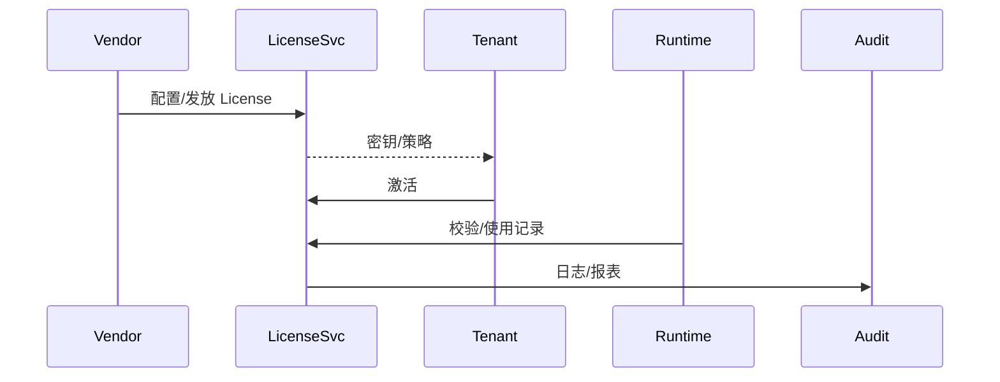

# Positioning & Goals

> 打造统一的插件 License 生命周期管理，从策略配置、发放、激活、续费到变更审计，保障商业收益与合规安全。

目标：
- License 发放/审批 SLA ≤ 1 工作日，密钥与策略绑定。
- 激活/运行时校验阻断率 100%，越权或过期自动停用。
- 续费提醒触达率 ≥ 98%，过期停用/恢复符合 SLA。
- 变更/审计日志可追溯，支持监管/对账需求。

# Scope & Guardrails

- **In Scope**：License 策略配置、密钥生成、激活校验、续费/到期处理、变更与审计。
- **Out of Scope**：详细计费结算、CRM、硬件加密方案。
- **Environment & Flags**：`PX_PLUGIN_LICENSE_SERVICE`, `PX_PLUGIN_LICENSE_RUNTIME`, `PX_PLUGIN_LICENSE_RENEWAL`, `PX_PLUGIN_LICENSE_AUDIT`。

# Core Capabilities

1. **Policy & Key Issuance**：产品包配置、License Key 生成、审批/分发。
2. **Activation & Runtime Enforcement**：租户激活、运行时校验、能力开关、越权阻断。
3. **Renewal & Expiration Handling**：续费提醒、支付确认、到期降级/停用、恢复。
4. **Change & Audit**：策略变更审批、撤销/下架、日志导出、合规对账。

# Participants & Responsibilities

| Scope | Repository | Layer | 责任与交付物 | Owners |
|-------|------------|-------|--------------|--------|
| License Service | powerx | service | 策略配置、密钥生成/存储、API | License Platform Squad |
| Runtime Enforcement | powerx | ops | 激活、运行时校验、能力控制 | Runtime Platform Squad |
| Renewal Ops | powerx | ops | 续费提醒、到期处理、通知 | Commercial Ops Squad |
| Audit & Finance | powerx | security | 审计导出、变更审批、对账 | Governance Squad |

# End-to-End Flow

1. **Issue**：Vendor 配置产品包 → 审批 → 生成 License Key → 分发。
2. **Activate**：租户激活并绑定 → 插件运行时校验令牌 → 记录使用。
3. **Renew**：到期前提醒 → 续费更新 → 到期停用/恢复。
4. **Audit**：变更/撤销/合规报告，由 SOC/财务导出。

# Key Interactions & Contracts

- `POST /licenses`, `POST /licenses/:id/approve`, `POST /licenses/:id/activate`, `POST /licenses/:id/renew`, `POST /licenses/:id/revoke`。
- `POST /runtime/licenses/verify`, `POST /runtime/licenses/usage`。
- Logs：`license.issue`, `license.activate`, `license.enforce.fail`, `license.renew`, `license.audit`。

# Validation Workflow

1. License 发放审批（正/逆向）；
2. 激活与运行时校验；
3. 续费提醒与停用恢复；
4. 变更与审计导出。

# Acceptance Criteria

1. License 生命周期全程审计；
2. 未授权/过期插件无法使用；
3. 续费流程自动化，停用策略可配置；
4. 变更与下架支持审批/回滚。

# Telemetry & Ops

- 指标：`license.issue.sla`, `license.activate.success_rate`, `license.expire.enforce_time`, `license.audit.coverage`。
- 告警：未授权使用、校验失败、提醒失效、变更失败。

# Architecture Diagram

# Open Issues & Follow-ups

| 风险/事项 | 影响 | 负责人 | ETA |
|-----------|------|--------|-----|
| License 渠道加密方案待评估 | 传输安全 | Security Platform Squad | 2025-03-05 |
| 续费提醒渠道不足 | 触达率 | Commercial Ops Squad | 2025-03-07 |
