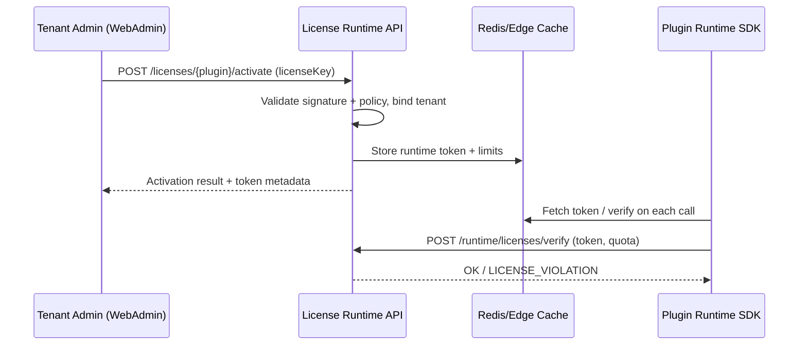

doc_id: UC-INT-PLUGIN-LICENSE-ACTIVATE-001
scn_id: SCN-INT-PLUGIN-LICENSE-001
title: 租户激活与运行时校验
status: Draft
version: v0.2.0
repo_key: powerx
scope: powerx
layer: ops
domain: integration
scenario_title: "License 管理"
owners:
  - name: Michael Hu
    role: Plugin Tech Lead
    contact: tech@artisan-cloud.com
  - name: Matrix-X
    role: Docs Coordinator
    contact: dev@artisan-cloud.com
contributors: []
linked_requirements:
  - id: SCN-INT-PLUGIN-LICENSE-ACTIVATE-001
    type: scenario
code_refs:
  - path: backend/internal/license/runtime
    description: License runtime service（激活与校验核心流程）
  - path: backend/cmd/license-runtime
    description: Activation / enforcement API 入口
  - path: apps/web-admin/src/pages/tenants/plugins/license-activate
    description: WebAdmin 激活界面与调用逻辑
feature_flags:
  - PX_PLUGIN_LICENSE_RUNTIME
  - PX_PLUGIN_LICENSE_ENFORCE
last_reviewed_at: 2025-02-22

---

# Usecase Overview

- **业务目标**：提供租户级插件 License 激活与运行时校验闭环，确保只有经过审批且绑定租户的 License Key 能启用插件能力，并在执行阶段持续阻断越权/超限调用。
- **成功度量**：激活成功率 ≥ 99%；重复/跨租户激活阻断率 100%；运行时校验覆盖率 100%；越权阻断响应 ≤ 2s；异常告警发送成功率 ≥ 98%。
- **场景关联**：支撑 `SCN-INT-PLUGIN-LICENSE-001` 及其子场景 `SCN-INT-PLUGIN-LICENSE-ACTIVATE-001`，与 `UC-INT-PLUGIN-LICENSE-ISSUE-001`（发放）、`UC-INT-PLUGIN-LICENSE-RENEW-001`（续费）协同。

> 摘要：当租户管理员提交 License Key 时，License Runtime 服务校验签名与策略，生成绑定令牌并同步到插件运行时；每次插件调用均携带令牌接受校验，若过期或越权立即降级/停用并通知各方。

# Context & Assumptions

- **前置条件**：
  - Feature Flags `PX_PLUGIN_LICENSE_RUNTIME`、`PX_PLUGIN_LICENSE_ENFORCE` 已开启；对应配置（Redis 集群地址、JWT 秘钥、限流规则）注入。
  - License Service 已成功发放 Key 并处于 `issued` 状态；WebAdmin 用户具备租户管理员角色。
  - Runtime 节点可访问 License Runtime API、事件总线 `license.activation`、审计日志管道。
- **输入/输出**：
  - 输入：License Key、租户 ID、插件 ID、实例标识、可选限额配置。
  - 输出：激活结果（成功/失败原因）、运行时令牌（JWT/Edge Token）、租户-插件绑定关系、日志/指标事件。
- **边界**：
  - 不负责 License 发放策略、续费计费、变更审计（其它 usecase 覆盖）。
  - 离线激活流程仅记录需求，不在本次交付范围；硬件加密狗/第三方 DRM 也不在 scope。

# Solution Blueprint

## 体系分解

| 层 | 主要组件/模块 | 责任 | 代码入口 |
|----|---------------|------|---------|
| Web Admin (UI) | `apps/web-admin/src/pages/tenants/plugins/license-activate` | 租户管理员输入 License Key、展示状态、触发激活 API | `apps/web-admin/src/pages/tenants/plugins/license-activate/index.tsx` |
| License Runtime API | `backend/cmd/license-runtime`、`internal/license/runtime/service.go` | 校验 Key、生成运行时令牌、写入数据库/Redis | `backend/cmd/license-runtime/main.go` |
| License Store & Audit | `internal/license/store`, `internal/audit/logger` | 维护租户-插件绑定、能力开关、审计日志 | `backend/internal/license/store` |
| Plugin Runtime SDK | `pkg/plugins/runtime/license` | 在插件/Agent 执行前携带并校验令牌，触发降级 | `backend/pkg/plugins/runtime/license/enforcer.go` |

## 流程与时序

1. **Trigger – WebAdmin 激活**：租户管理员在 Plugin Manager / License 页输入 License Key；前端调用 `POST /licenses/{pluginId}/activate` 并携带租户上下文与 Key。
2. **Validation & Binding**：Runtime API 校验 Key 签名、状态、产品包范围、剩余激活次数；若合法则创建 `tenant_plugin_license` 记录并生成运行时 JWT（含限额、过期时间、能力列表），写入 Redis 供边缘节点快速校验。
3. **Propagation**：通过事件总线 `license.activation` 通知插件运行时/调度器刷新缓存；在审计日志中记录操作人、IP、Key 哈希。
4. **Runtime Enforcement**：插件执行任务前调用 `POST /runtime/licenses/verify` 或使用 SDK 内置缓存校验令牌；超限会返回 `403 LICENSE_VIOLATION` 并触发降级/停用逻辑，向租户和 Vendor 发送告警。
5. **Completion**：WebAdmin 显示激活成功、有效期与能力列表；失败时提示原因与申诉链接；Dashboard 更新激活状态。

# Contracts & Interfaces

- **Inbound APIs / Events**
  - `POST /licenses/{pluginId}/activate` — Body: `{ licenseKey, tenantId, pluginVersion }`；鉴权：租户管理员 SSO + CSRF；失败自动重试一次。
  - `POST /runtime/licenses/verify` — Body: `{ token, tenantId, pluginInstanceId, capability, usage }`；鉴权：签名 + mTLS；0 超时策略 500ms。
  - Event `license.activation` — Payload：租户、插件、tokenId、issued_at、expire_at、limits。
- **Outbound 调用**
  - `LicenseService.getKey(key)` — 校验 Key 状态、产品包；超时 1s，失败 fallback 为拒绝激活。
  - `NotificationService.send(template=licenseViolation)` — 向租户/ Vendor 发送邮件 & IM；失败记录并触发重试队列。
- **配置与脚本**
  - `config/license.yaml`：令牌 TTL、允许的并发数、限流策略。
  - `scripts/license/rotate-secret.mjs`：定期滚动 JWT 密钥对。
  - `terraform/modules/license-runtime`：部署激活 API 所需 infra。

# Implementation Checklist

| 项目 | 描述 | 完成状态 | 负责人 |
|------|------|----------|--------|
| 数据模型 | `tenant_plugin_license` 表、新增 `license_tokens` Redis schema、审计日志字段 | [ ] | |
| 业务逻辑 | 激活 API、token 生成/刷新、运行时校验 SDK、越权降级逻辑 | [ ] | |
| 权限治理 | WebAdmin ACL、激活操作审计、mTLS 校验 | [ ] | |
| 配置发布 | Feature Flag 开启、configmap 注入、Terraform 变量 | [ ] | |
| 文档同步 | 更新 `docs/standards/integration/license-runtime.md`、WebAdmin 手册、告警手册 | [ ] | |

# Testing Strategy

- **单元测试**：
  - `internal/license/runtime/service_test.go` 验证 Key 签名、状态机转换、重复激活。
  - `pkg/plugins/runtime/license/enforcer_test.go` 覆盖越权、缓存失效、降级逻辑。
- **集成测试**：
  - 通过 `npm run test:license:activate` 启动内存版 License Service，模拟 WebAdmin 调用，验证数据库/Redis 状态。
  - 使用 `scripts/test/webhook-license-violation.mjs` 模拟越权事件，确认通知与审计写入。
- **端到端验证**：
  - 在沙箱租户运行完整插件激活 → 任务执行流程，验证 Dashboard 及告警；自动化脚本 `tests/e2e/license-activation.spec.ts`。
- **非功能测试**：
  - 压测 `POST /runtime/licenses/verify`（QPS 5k）确保 P95 < 150ms。
  - Chaos 测试 Redis 失效场景，验证 SDK fallback 逻辑。

# Observability & Ops

- **指标**：`license.activation.success_rate`, `license.activation.latency`, `license.runtime.verify.qps`, `license.runtime.violation.count`, `license.token.cache_hit_ratio`。
- **日志**：`license.activate`（包含租户、插件、key_hash、operator）、`license.verify.fail`（capability、reason）、`license.enforce.degrade`（instance_id、action）。日志经由 Loki/ELK，保留 90 天。
- **告警**：
  - `ALERT:LicenseActivationSpike` — 5 分钟激活失败率 > 5%。
  - `ALERT:LicenseViolationBurst` — 越权/过期阻断连续 3 次，通知 SRE 与商务。
  - `ALERT:LicenseCacheMiss` — cache 命中率 < 80%，提示检查 Redis。
- **Dashboards**：`Grafana/powerx-license-runtime` 面板，含地区/租户维度 drill-down；WebAdmin 插件面板嵌入激活状态卡片。

# Rollback & Failure Handling

- **回滚步骤**：通过 ArgoCD/Helm 回滚 `license-runtime` 部署；撤销数据库迁移（保留快照），并恢复旧版 configmap/JWT 密钥；WebAdmin 回退至稳定版本标签。
- **补救措施**：
  - 激活 API 故障 → 切换到备用副本、触发 `scripts/license/failover.mjs`。
  - Redis 不可用 → SDK 退化为直连 API，开启限流保护。
  - 越权误判 → 在控制台手动白名单 token，重新下发。
- **数据修复**：提供 `sql/fix-tenant-plugin-license.sql` 用于纠正绑定状态；Redis 令牌可通过 `scripts/license/purge-token.ts` 清除后重新下发。

# Follow-ups & Risks

| 风险/事项 | 影响 | 缓解方案 | 负责人 | ETA |
|-----------|------|----------|--------|-----|
| 离线/私有化客户激活流程缺少落地方案 | 覆盖不到断网场景 | 设计离线签名 + 批量导入脚本 | Runtime Platform Squad | 2025-03-15 |
| License 令牌密钥轮转自动化不足 | 可能导致令牌被复用 | 引入 HSM/Secrets Manager，自动滚动并广播缓存失效 | Security Platform Squad | 2025-03-08 |
| 告警噪音偏高 | 影响值班效率 | 增加告警抑制与聚合策略、迭代规则 | SRE Duty | 2025-03-05 |

# References & Links

- 场景文档：`docs/scenarios/integration/SCN-INT-PLUGIN-LICENSE-ACTIVATE-001.md`
- 主场景概览：`docs/scenarios/integration/SCN-INT-PLUGIN-LICENSE-001.md`
- 相关规范：`docs/standards/integration/license-runtime.md`（待补充），`docs/standards/security/tenant-acl.md`
- 设计材料：Figma `Plugin License Runtime v1.2`、ADR `adr/2025-01-license-runtime.md`
- 运维指南：`docs/runbooks/license-runtime.md`

> 完成后请更新 `docs/_data/docmap.yaml` 映射，并通过 `npm run publish:usecases -- --scn-id SCN-INT-PLUGIN-LICENSE-001` 分发到下游仓库。
