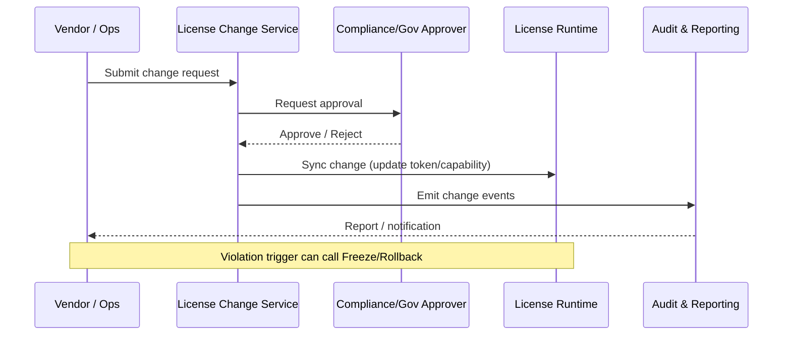

doc_id: UC-INT-PLUGIN-LICENSE-AUDIT-001
scn_id: SCN-INT-PLUGIN-LICENSE-001
title: License 变更与审计
status: Draft
version: v0.2.0
repo_key: powerx
scope: powerx
layer: security
domain: integration
scenario_title: "License 管理"
owners:
  - name: Grace Lin
    role: Security & Compliance Lead
    contact: compliance@artisan-cloud.com
  - name: Michael Hu
    role: Plugin Tech Lead
    contact: tech@artisan-cloud.com
contributors:
  - name: Matrix-X
    role: Docs Coordinator
    contact: dev@artisan-cloud.com
linked_requirements:
  - id: SCN-INT-PLUGIN-LICENSE-AUDIT-001
    type: scenario
code_refs:
  - path: backend/internal/license/change
    description: 变更审批、撤销、回滚逻辑
  - path: backend/cmd/license-audit
    description: 审计日志导出与报表接口
  - path: backend/internal/audit/bus
    description: 审计事件收集、落盘、对账
feature_flags:
  - PX_PLUGIN_LICENSE_AUDIT
  - PX_PLUGIN_LICENSE_CHANGE
  - PX_PLUGIN_LICENSE_WHITELIST
last_reviewed_at: 2025-02-22

---

# Usecase Overview

- **业务目标**：提供面向 License 变更、撤销与合规巡检的端到端流程——支持 Vendor 发起策略调整、合规/安全审批、运行时同步和违规封禁，并输出可以监管复查的审计报表。
- **成功度量**：变更审批 SLA ≤ 1 天；审计日志覆盖率 100%；违规 License 冻结响应 ≤ 5 分钟；报表导出成功率 ≥ 99%；回滚成功率 100%。
- **场景关联**：对应 `SCN-INT-PLUGIN-LICENSE-AUDIT-001` 子场景，依赖 `UC-INT-PLUGIN-LICENSE-ISSUE-001`（发放）和 `UC-INT-PLUGIN-LICENSE-ACTIVATE-001`（激活）提供的数据；与 `UC-INT-PLUGIN-LICENSE-RENEW-001` 在续费封禁策略上共享 Hook。

> 摘要：Vendor 发起 License 变更 → License Service 进入审批流 → 审批通过后同步运行时能力并记录审计事件 → 审计团队定期导出报表，对违规使用执行冻结/回滚。

# Context & Assumptions

- **前置条件**：
  - Feature Flag `PX_PLUGIN_LICENSE_AUDIT`、`PX_PLUGIN_LICENSE_CHANGE` 已开启；审计日志管道（Kafka/AuditDB）正常。
  - Vendor / Governance 用户拥有变更审批权限；WebAdmin/CLI 暴露变更入口。
  - License Runtime 可接收变更事件并刷新令牌、能力开关。
- **输入/输出**：
  - 输入：变更请求（新增/减少模块、席位、临时白名单、停用/撤销）、审批意见、终端同步事件、违规检测指标。
  - 输出：变更记录、审批结果、运行时能力更新、审计日志、对账报表、冻结/回滚操作。
- **边界**：
  - 不处理具体计费/支付流程；不覆盖 License 发放/激活（其它 usecase）；硬件 DRM、离线导出由独立项目负责。

## 体系分解

| 层 | 主要组件/模块 | 责任 | 代码入口 |
|----|---------------|------|---------|
| Web Admin / Vendor Portal | `apps/web-admin/src/pages/licenses/change` | 变更申请、审批、冻结操作界面 | `apps/web-admin/.../licenses/change/index.tsx` |
| License Change Service | `backend/internal/license/change` | 校验申请、状态机、审计事件写入 | `backend/cmd/license-service/main.go` |
| Audit & Reporting | `backend/cmd/license-audit`, `internal/audit/bus` | 聚合日志、生成报表、对账导出 | `backend/cmd/license-audit/main.go` |
| Runtime Sync & Enforcement | `internal/license/runtime/sync`, `pkg/plugins/runtime/license` | 接收变更事件、刷新令牌、执行封禁/回滚 | `backend/internal/license/runtime/syncer.go` |

## 流程与时序

1. **变更申请**：Vendor/运营在 WebAdmin 选择插件与租户，提交变更类型（新增模块、减席位、暂停、撤销、临时白名单）。
2. **审批流程**：License Change Service 根据配置路由审批人（合规、安全、商务）。审批通过则进入 “待执行”，拒绝则反馈原因。
3. **执行与同步**：执行时更新 License DB（策略、限额、状态），通知 Runtime Sync Service 刷新令牌/能力。若是撤销或冻结，则调用 Runtime Enforcement 停用。
4. **审计记录**：全程写入 `license.change`、`license.freeze`、`license.rollback` 等事件；审计服务归档并可导出报表。
5. **违规处理**：监控检测到越权或滥用时可自动触发冻结/白名单审批。
6. **回滚**：如变更造成生产事故，可一键回滚到上一个版本并重新同步。

# Contracts & Interfaces

- **Inbound APIs / Events**
  - `POST /licenses/{id}/changes` — Body: `{tenantId, pluginId, type, payload}`；鉴权：Vendor/Admin 权限 + CSRF；冪等键 `changeId`。
  - `POST /licenses/{id}/freeze`、`POST /licenses/{id}/rollback` — 触发冻结/回滚；需要双人审批或 OTP。
  - Event `license.change.approved`、`license.freeze.triggered` — Runtime/外部系统订阅。
- **Outbound 调用**
  - `RuntimeSyncService.apply(change)` — 刷新 token、能力；超时 2s，失败自动重试。
  - `NotificationService.send(template=licenseChange)` — 通知租户/Vendor；失败进入 DLQ。
  - `AuditStorage.append(event)` — 向 Kafka/AuditDB 写审计日志，保证至少一次。
- **配置与脚本**
  - `config/license-change.yaml`：审批人、SLA、自动冻结策略。
  - `scripts/license/export-audit-report.mjs`：导出 CSV/PDF 报表。
  - `cron/license-diff`：每日对账任务，检测 License 与 Runtime 状态不一致。

# Implementation Checklist

| 项目 | 描述 | 完成状态 | 负责人 |
|------|------|----------|--------|
| 数据模型 | `license_change_requests`, `license_change_history`, 审计表索引、报表视图 | [ ] | |
| 业务逻辑 | 变更状态机、审批流、冻结/回滚 API、Runtime 同步、白名单逻辑 | [ ] | |
| 权限治理 | 审批权限、双人确认、操作审计、租户隔离策略 | [ ] | |
| 配置发布 | Feature Flag、告警阈值、报表定时任务配置 | [ ] | |
| 文档同步 | 更新 `docs/standards/integration/license-change.md`、运维手册、告警 runbook | [ ] | |

# Testing Strategy

- **单元测试**：
  - `internal/license/change/service_test.go` 覆盖审批状态机、回滚、异常路径。
  - `internal/audit/bus/writer_test.go` 验证事件写入、失败重试。
- **集成测试**：
  - `npm run test:license:change` 启动模拟审批流，与 Runtime Sync、Notification 集成验证。
  - `tests/integration/license-audit.spec.ts` 模拟变更→审计→报表导出全链路。
- **端到端验证**：
  - 在沙箱租户执行“变更模块 → 审批 → 同步 → 冻结/解冻”流程，确认 WebAdmin、Runtime、告警一致；脚本 `tests/e2e/license-change-flow.spec.ts`。
- **非功能测试**：
  - 压测日常审计报表导出（10k 变更记录，P95 < 10s）。
  - Chaos 注入：Kafka 不可用、审批服务延迟，确认降级告警与重试策略。

# Observability & Ops

- **指标**：`license.change.sla`, `license.change.approval_pending`, `license.freeze.triggered`, `license.audit.report_latency`, `license.runtime.desync.count`。
- **日志**：`license.change`（包含 before/after、审批人、理由）、`license.freeze`, `license.rollback`, `license.audit.export`；采用结构化 JSON，保留 180 天。
- **告警**：
  - `ALERT:LicenseChangeSlaBreach` — 待审批 > 24h。
  - `ALERT:LicenseRuntimeDesync` — 状态不一致超过 5 分钟。
  - `ALERT:AuditExportFailure` — 报表导出失败连续 3 次。
- **Dashboards**：Grafana `powerx-license-audit`，含变更漏斗、审批 SLA、违规 TOPN；WebAdmin 内嵌变更状态卡片。

# Rollback & Failure Handling

- **回滚步骤**：利用 Change Service 的 `rollback` 接口恢复上一版本策略；如代码问题，通过 ArgoCD/Helm 回退；数据库使用快照/备份恢复。
- **补救措施**：
  - 审批服务不可用 → 切换到备用实例或启用手动审批流程，操作记录事后补录。
  - 审计队列积压 → 触发 `scripts/license/audit-replay.mjs` 重放；必要时扩容 Kafka 分区。
  - 错误冻结 → 执行解冻命令并重新生成令牌。
- **数据修复**：提供 `sql/license-change-fix.sql` 用于纠正状态；`scripts/license/export-manual.ts` 可导出离线报表协助核对。

# Follow-ups & Risks

| 风险/事项 | 影响 | 缓解方案 | 负责人 | ETA |
|-----------|------|----------|--------|-----|
| 审批人缺席导致 SLA 超时 | 阻塞生产变更 | 引入备份审批链路与超时自动提醒 | Governance Squad | 2025-03-06 |
| 审计日志容量暴增 | 存储与查询压力 | 分层存储、冷热数据拆分、引用压缩 | Security Platform Squad | 2025-03-10 |
| 违规检测逻辑误报 | 频繁冻结影响租户体验 | 引入风险评分、人工复核环节 | Commercial Ops Squad | 2025-03-08 |

# References & Links

- 场景文档：`docs/scenarios/integration/SCN-INT-PLUGIN-LICENSE-AUDIT-001.md`
- 主场景概览：`docs/scenarios/integration/SCN-INT-PLUGIN-LICENSE-001.md`
- 规范：`docs/standards/integration/license-change.md`（拟新增）、`docs/standards/security/audit-log.md`
- PR/实现示例：`https://github.com/ArtisanCloud/PowerX/pull/<id>`（占位）
- 设计材料：Figma「License Audit Console」、ADR `adr/2025-02-license-change.md`

> 完成后请更新 `docs/_data/docmap.yaml` 映射，并通过 `npm run publish:usecases -- --scn-id SCN-INT-PLUGIN-LICENSE-001` 分发到下游仓库。
