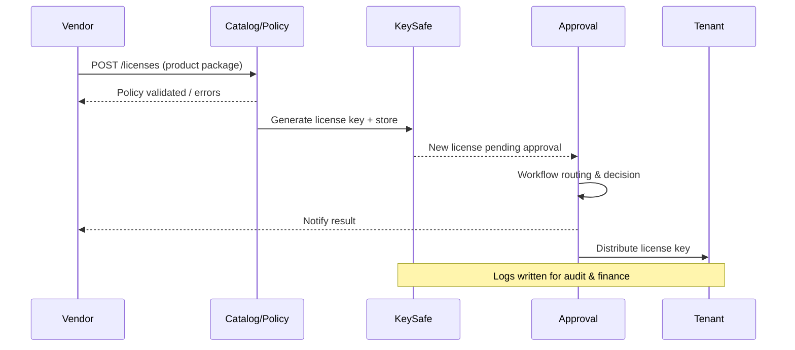

doc_id: UC-INT-PLUGIN-LICENSE-ISSUE-001
scn_id: SCN-INT-PLUGIN-LICENSE-001
title: License 策略配置与密钥发放
status: Draft
version: v0.2.0
repo_key: powerx
scope: powerx
layer: service
domain: integration
scenario_title: "License 管理"
owners:
  - name: Grace Lin
    role: Security & Compliance Lead
    contact: compliance@artisan-cloud.com
  - name: Michael Hu
    role: Plugin Tech Lead
    contact: tech@artisan-cloud.com
contributors:
  - name: Matrix-X
    role: Docs Coordinator
    contact: dev@artisan-cloud.com
linked_requirements:
  - id: SCN-INT-PLUGIN-LICENSE-ISSUE-001
    type: scenario
code_refs:
  - path: backend/cmd/license-service
    description: License 服务主入口，提供产品包与审批 API
  - path: backend/internal/license/catalog
    description: 产品包/策略配置解析与校验模块
  - path: backend/internal/license/keysafe
    description: 密钥生成、加密存储与分发日志
feature_flags:
  - PX_PLUGIN_LICENSE_SERVICE
  - PX_PLUGIN_LICENSE_KEYSAFE
last_reviewed_at: 2025-02-22

---

# Usecase Overview

- **业务目标**：为 Vendor/商务团队提供安全可控的 License 产品包配置、审批与密钥发放能力，使授权策略、额度、有效期与密钥绑定，确保后续激活/运行时阶段可据此执行。
- **成功度量**：审批 SLA ≤ 1 个工作日；策略校验失败率 < 1%；密钥重复生成 0；发放日志完整可追溯；密钥泄露演练 TTR ≤ 30 分钟。
- **场景关联**：与主场景 `SCN-INT-PLUGIN-LICENSE-001` 以及子场景 `SCN-INT-PLUGIN-LICENSE-ISSUE-001` 对应，向 `UC-INT-PLUGIN-LICENSE-ACTIVATE-001` 提供合法 License Key、策略数据，向 `UC-INT-PLUGIN-LICENSE-AUDIT-001` 输出发放日志与变更记录。

> 摘要：Vendor 在 License 控制台配置产品包 → License Service 校验策略、生成密钥 → 商务/合规审批 → 加密存储并分发给租户或下游系统，同时记录审计日志与财务对账数据。

# Context & Assumptions

- **前置条件**：
  - Feature Flags `PX_PLUGIN_LICENSE_SERVICE`、`PX_PLUGIN_LICENSE_KEYSAFE` 打开，确保密钥生成与 KeySafe 加密存储可用。
  - 产品包 catalog、策略规则已配置（如 `license_product_catalog.yaml`、`license_policy_rules.yaml`）。
  - Vendor/商务用户具备控制台权限；审批环节（合规、商务、财务）已设定。
- **输入/输出**：
  - 输入：产品包选择、租户/实例信息、功能模块、席位数、有效期、限制条件、备注。
  - 输出：License 记录（状态 `pending_activation`）、加密存储的 License Key、分发日志、通知与审计事件。
- **边界**：
  - 不负责后续激活（交由 Activate usecase）、运行时校验或续费；不处理计费扣款逻辑（由财务系统负责）。

## 体系分解

| 层 | 主要组件/模块 | 责任 | 代码入口 |
|----|---------------|------|---------|
| Web Admin / API Gateway | `apps/web-admin/src/pages/licenses/issue`, `backend/api/license` | Vendor/商务配置产品包、提交申请、查看状态 | `apps/web-admin/.../licenses/issue/index.tsx` |
| License Catalog & Policy | `internal/license/catalog`, `internal/license/policy` | 解析产品包、校验字段、计算额度/有效期 | `backend/internal/license/catalog/service.go` |
| KeySafe & Issuance Service | `internal/license/keysafe`, `cmd/license-service` | 生成密钥、加密存储、关联策略、写入 DB | `backend/internal/license/keysafe/generator.go` |
| Approval & Distribution | `internal/license/approval`, `internal/license/distribution` | 审批流、通知、分发日志、对接财务 | `backend/internal/license/approval/workflow.go` |

## 流程与时序

1. **产品包配置**：Vendor 选择产品包/插件，输入租户/实例数、功能模块、有效期、SLA 等；前端校验必填项并提交 `POST /licenses`。
2. **策略校验**：License Catalog & Policy 服务校验字段，计算额度、生成策略快照；如字段缺失或超出限制，返回错误并记录 `license.policy.validation_error`。
3. **密钥生成**：KeySafe 生成唯一 License Key（UUID + 校验位），使用 HSM/Secrets Manager 加密存储，仅存储哈希供审计；状态置为 `pending_approval`。
4. **审批流**：审批模块根据产品包路由审批人；审批通过后状态更新为 `approved`，触发密钥可分发；拒绝则记录原因并通知申请人。
5. **分发与日志**：通过通知中心把 License Key 安全地发送到指定渠道（WebAdmin 下载、邮件、API）；记录日志与财务对账；同步至数据仓库。
6. **锁定与变更**：生成的 License 可被 Activate/Runtime usecase 引用；如需变更由 Audit usecase 承接。

# Contracts & Interfaces

- **Inbound APIs / Events**
  - `POST /licenses` — Body: `{ tenantId, pluginId, packageId, seats, features[], expiry_at, notes }`; 鉴权：Vendor/Admin + CSRF；重复提交通过 `clientRequestId` 去重。
  - `POST /licenses/{id}/approve`、`/reject` — 审批动作，记录审批人、意见、时间。
  - `POST /licenses/{id}/distribute` — 指定渠道（Web、Email、Webhook）分发；执行时检查状态。
- **Outbound 调用**
  - `KeySafe.encrypt(keyPayload)` — 返回密文 & keyId，必要时可轮转密钥；失败则告警。
  - `NotificationService.send(template=licenseIssued)` — 发送邮件/IM/Webhook，带追踪 ID。
  - `FinanceService.recordLicense(orderId, licenseId)` — 对账；失败进入重试队列。
- **配置与脚本**
  - `license_product_catalog.yaml`、`license_policy_rules.yaml`：定义产品包、可选功能、限制。
  - `scripts/license/import-package.ts`：批量导入/更新产品包配置。
  - `scripts/license/key-rotation.mjs`：周期性轮换 KeySafe 主密钥。

# Implementation Checklist

| 项目 | 描述 | 完成状态 | 负责人 |
|------|------|----------|--------|
| 数据模型 | `license_products`, `license_policies`, `license_keys`, `license_distributions` 表及索引、审计日志字段 | [ ] | |
| 业务逻辑 | 产品包配置 API、策略校验器、密钥生成与加密、审批流、分发流水 | [ ] | |
| 权限治理 | Vendor/商务权限、审批 ACL、下载授权、审计日志 | [ ] | |
| 配置发布 | Catalog/Policy YAML、KeySafe/HSM 配置、Webhook/通知渠道 | [ ] | |
| 文档同步 | 更新 `docs/standards/integration/license-issuance.md`、WebAdmin 指南、财务对接文档 | [ ] | |

# Testing Strategy

- **单元测试**：
  - `internal/license/catalog/service_test.go` 覆盖字段校验、默认值、限额计算。
  - `internal/license/keysafe/generator_test.go` 验证密钥生成、加密、哈希。
- **集成测试**：
  - `npm run test:license:issue` 启动 in-memory DB/HSM 模拟，覆盖 `POST /licenses` → 审批 → 分发。
  - Mock Notification/Finance 服务，验证重试与日志。
- **端到端验证**：
  - 沙箱租户执行完整发放流程并通过 WebAdmin 下载 License Key，随后激活，确保数据在上下游一致；脚本 `tests/e2e/license-issue-activate.spec.ts`。
- **非功能测试**：
  - 负载测试 1k QPS 发放请求，确保策略校验与密钥生成 P95 < 200ms。
  - 安全测试：KeySafe 密钥泄露演练、SQL 注入、API 权限绕过。

# Observability & Ops

- **指标**：`license.issue.request_count`, `license.issue.fail_rate`, `license.policy.validation_error`, `license.approval.sla`, `license.keysafe.error`。
- **日志**：`license.issue`（含产品包、租户、operator）、`license.approve`, `license.distribute`, `license.keysafe.ops`；结构化 JSON，敏感字段脱敏。
- **告警**：
  - `ALERT:LicenseGenerationFailure` — 密钥生成失败连续 3 次。
  - `ALERT:LicenseDuplicateDetected` — 同租户/包重复申请触发。
  - `ALERT:LicenseApprovalSlaBreach` — 待审批 > SLA。
- **Dashboards**：Grafana `powerx-license-issuance` 仪表盘，展示发放漏斗、审批队列、密钥生成健康度；WebAdmin 嵌入状态卡片。

# Rollback & Failure Handling

- **回滚步骤**：通过 ArgoCD/Helm 回滚 `license-service`；恢复 YAML 配置与 KeySafe 密钥版本；撤销错误的 License 记录或标记为 `revoked`。
- **补救措施**：
  - KeySafe 故障 → 切换备用密钥服务、手动触发 `scripts/license/failover-keysafe.mjs`。
  - 审批系统不可用 → 改为手动审批流程并补录；防止堆积。
  - 分发失败 → 重试通知或提供安全下载链接。
- **数据修复**：提供 `sql/license-issue-patch.sql` 修复错误记录，`scripts/license/reissue.ts` 重新发放并同步日志。

# Follow-ups & Risks

| 风险/事项 | 影响 | 缓解方案 | 负责人 | ETA |
|-----------|------|----------|--------|-----|
| 产品包配置复杂度高 | 人工出错概率上升 | 引入模板、预设校验、双人复核 | Product Ops | 2025-03-07 |
| KeySafe 实施成本高 | 密钥存储安全风险 | 评估 HSM 托管或云 KMS，确保密钥轮转 | Security Platform Squad | 2025-03-05 |
| 财务对账流程缺少自动化 | 手工操作易遗漏 | 接入自动化对账脚本、Webhook 通知 | Finance Ops | 2025-03-08 |

# References & Links

- 场景文档：`docs/scenarios/integration/SCN-INT-PLUGIN-LICENSE-ISSUE-001.md`
- 主场景概览：`docs/scenarios/integration/SCN-INT-PLUGIN-LICENSE-001.md`
- 规范：`docs/standards/integration/license-issuance.md`、`docs/standards/security/key-management.md`
- ADR：`adr/2025-01-license-issuing.md`
- 设计稿：Figma《License Service Console》

> 完成后请更新 `docs/_data/docmap.yaml` 映射，并通过 `npm run publish:usecases -- --scn-id SCN-INT-PLUGIN-LICENSE-001` 分发到下游仓库。
