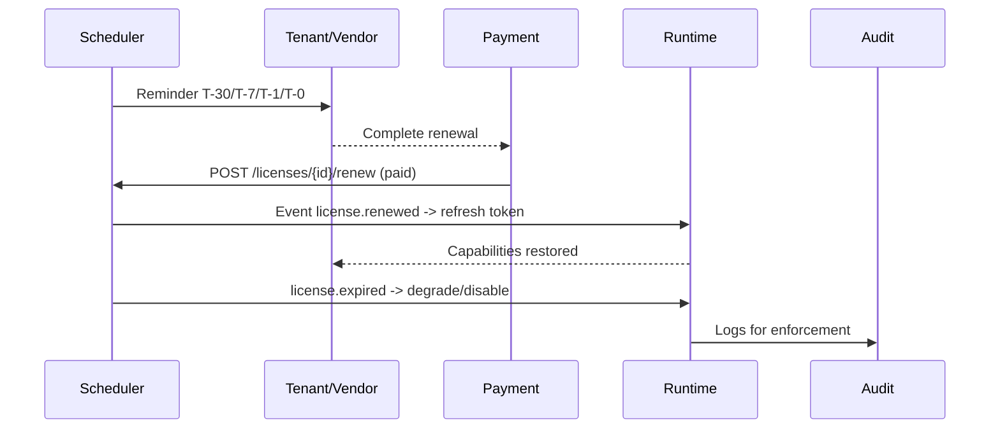

doc_id: UC-INT-PLUGIN-LICENSE-RENEW-001
scn_id: SCN-INT-PLUGIN-LICENSE-001
title: 续费提醒与到期处理
status: Draft
version: v0.2.0
repo_key: powerx
scope: powerx
layer: ops
domain: integration
scenario_title: "License 管理"
owners:
  - name: Grace Lin
    role: Security & Compliance Lead
    contact: compliance@artisan-cloud.com
  - name: Michael Hu
    role: Plugin Tech Lead
    contact: tech@artisan-cloud.com
contributors:
  - name: Matrix-X
    role: Docs Coordinator
    contact: dev@artisan-cloud.com
linked_requirements:
  - id: SCN-INT-PLUGIN-LICENSE-RENEW-001
    type: scenario
code_refs:
  - path: backend/internal/license/renewal
    description: 续费提醒、计时器与状态机实现
  - path: backend/cmd/license-runtime
    description: 运行时能力降级/恢复入口
  - path: apps/web-admin/src/pages/licenses/renew
    description: WebAdmin 续费提示与付款确认 UI
feature_flags:
  - PX_PLUGIN_LICENSE_RENEWAL
  - PX_PLUGIN_LICENSE_EXPIRY
  - PX_PLUGIN_LICENSE_RECOVER
last_reviewed_at: 2025-02-22

---

# Usecase Overview

- **业务目标**：构建面向插件 License 的续费提醒、支付确认、到期停用与恢复闭环，确保租户在授权到期前及时收到通知、可快速续费，若过期则由运行时执行降级/停用并可在续费后自动恢复。
- **成功度量**：提醒触达率 ≥ 98%；续费后能力恢复时延 < 5 分钟；到期停用 SLA ≤ 10 分钟；误停用率 < 0.5%；告警/日志覆盖率 100%。
- **场景关联**：支持 `SCN-INT-PLUGIN-LICENSE-RENEW-001` 子场景，与 `UC-INT-PLUGIN-LICENSE-ISSUE-001` 和 `UC-INT-PLUGIN-LICENSE-ACTIVATE-001` 共享 License 数据，与 `UC-INT-PLUGIN-LICENSE-AUDIT-001` 协同输出日志与异常处理。

> 摘要：平台每天扫描即将到期的 License，分阶段推送提醒；收到续费成功信号后更新有效期并通知 Runtime 恢复能力；到期仍未续费则自动降级/停用并记录审计事件。

# Context & Assumptions

- **前置条件**：
  - Feature Flags `PX_PLUGIN_LICENSE_RENEWAL`、`PX_PLUGIN_LICENSE_EXPIRY`、`PX_PLUGIN_LICENSE_RECOVER` 已启用，Scheduler、Notification、Runtime API 可访问。
  - License Service 存储有效期、状态、联系人信息；支付/订单系统已与续费 API 对接。
  - 插件运行时支持能力降级与恢复 Hook。
- **输入/输出**：
  - 输入：License 到期时间、通知渠道配置（邮件、站内、Webhook）、支付结果（成功/失败）、运行时状态。
  - 输出：提醒通知记录、续费更新（新的有效期、状态）、到期停用任务、恢复事件、审计日志。
- **边界**：
  - 不处理具体支付扣款逻辑，仅消费支付回调；离线合同续费由商务线下导入；License 变更审计在其它 usecase。

## 体系分解

| 层 | 主要组件/模块 | 责任 | 代码入口 |
|----|---------------|------|---------|
| Scheduler & Renewal Service | `internal/license/renewal/scheduler` | 扫描即将到期 License、生成提醒任务、触发停用/恢复 | `backend/internal/license/renewal/scheduler.go` |
| Notification & Reminder | `internal/notification`, `apps/web-admin/src/pages/licenses/renew` | 多渠道提醒、站内提示、Webhook | `backend/internal/notification/service.go` |
| Payment/Order Bridge | `internal/license/renewal/payment` | 处理续费成功/失败回调、触发延长逻辑 | `backend/internal/license/renewal/payment_handler.go` |
| Runtime Enforcement | `backend/cmd/license-runtime`, `pkg/plugins/runtime/license` | 到期降级/停用、续费后恢复能力 | `backend/pkg/plugins/runtime/license/enforcer.go` |
| Audit & Logging | `internal/audit/logger`, `renewal_reporter` | 记录提醒、停用、恢复流水，供审计/对账 | `backend/internal/audit/license_renewal.go` |

## 流程与时序

1. **Reminder Scheduling**：每日 Cron 或事件驱动扫描 `license.expire_at`，为 T-30/T-7/T-1/T-0 生成提醒任务。
2. **Notification Delivery**：调用 Notification 服务发送邮件/IM/Webhook，并在 WebAdmin Dashboard 展示；记录触达状态。
3. **Payment Confirmation**：支付系统调用 `POST /licenses/{id}/renew`，附带订单信息；Renewal Service 校验订单并延长 `expire_at`，写入历史表。
4. **Runtime Sync**：续费成功事件广播至 Runtime，刷新 token/能力；若 License 已过期则触发恢复流程。
5. **Expiration Handling**：到期未续费时自动将状态标记为 `expired`，调用 Runtime 降级/停用；通知租户/Vendor 并记录审计。
6. **Recovery**：续费后从停用状态恢复（重新启用能力、解除限流），同步 Dashboard 与日志。

# Contracts & Interfaces

- **Inbound APIs / Events**
  - `POST /licenses/{id}/renew` — Body: `{ orderId, amount, payStatus, newExpireAt }`；鉴权：支付系统签名 + IP 白名单；冪等键 `orderId`。
  - `POST /licenses/{id}/expire` — 用于人工触发到期/停用；需要系统管理员 ACL。
  - Event `license.renewal.notification`、`license.expired`, `license.restored`。
- **Outbound 调用**
  - `NotificationService.send(template=licenseRenew)` — 多渠道提醒；失败入 DLQ。
  - `RuntimeService.applyExpiration(tenant, plugin)` — 执行降级/恢复；超时 2s。
  - `FinanceService.getOrder(orderId)` — 校验订单状态；失败阻断续费。
- **配置与脚本**
  - `config/license-renewal.yaml`：提醒时间点、渠道、阈值、停用策略。
  - `scripts/license/manual-renew.ts`：离线客户续费导入脚本。
  - `cronjobs/license-expiry`：K8s Cron 配置，定期扫描到期 License。

# Implementation Checklist

| 项目 | 描述 | 完成状态 | 负责人 |
|------|------|----------|--------|
| 数据模型 | `license_renewal_jobs`, `license_reminders`, `license_expiration_history`、审计表 | [ ] | |
| 业务逻辑 | 提醒调度、通知发送、续费 API、到期停用、恢复流程、Webhook | [ ] | |
| 权限治理 | 管理员手动停用/恢复权限、通知收件人管理、审计 | [ ] | |
| 配置发布 | CronJob、通知渠道配置、Feature Flags、限流规则 | [ ] | |
| 文档同步 | 更新 `docs/standards/integration/license-renewal.md`、运营 Runbook、告警手册 | [ ] | |

# Testing Strategy

- **单元测试**：
  - `internal/license/renewal/scheduler_test.go` 覆盖提醒时间计算、状态机。
  - `pkg/plugins/runtime/license/enforcer_test.go` 验证到期降级、恢复逻辑。
- **集成测试**：
  - `npm run test:license:renewal` 执行内存版 Cron + Notification + Payment 模拟，覆盖提醒→续费→恢复流程。
  - Webhook/通知集成测试，验证失败重试与 DLQ。
- **端到端验证**：
  - 沙箱租户创建即将到期 License，触发提醒、模拟续费、验证运行时恢复；脚本 `tests/e2e/license-renewal-flow.spec.ts`。
- **非功能测试**：
  - 负载场景：1 万条 License 批量到期，确保 Cron & Notification P95 < 2s。
  - 容灾：Notification/Payment 不可用时的降级、补偿策略。

# Observability & Ops

- **指标**：`license.renewal.reminder_sent`, `license.renewal.touch_rate`, `license.expiration.executed`, `license.recover.duration`, `license.renewal.fail_rate`。
- **日志**：`license.reminder`, `license.renew`, `license.expire`, `license.recover`, 包含租户、插件、渠道、操作者、结果，敏感字段脱敏。
- **告警**：
  - `ALERT:LicenseReminderFailure` — 触达率低于 95%。
  - `ALERT:LicenseExpiryNotExecuted` — 过期任务延迟 > SLA。
  - `ALERT:LicenseRecoveryFailure` — 恢复失败/耗时 > 10 分钟。
- **Dashboards**：Grafana `powerx-license-renewal` 面板，显示提醒漏斗、到期/恢复分布、告警状态；WebAdmin 续费看板。

# Rollback & Failure Handling

- **回滚步骤**：回滚 Renewal Service 版本、撤销 Cron 配置、恢复旧版 configmap；必要时将错误的 `expire_at` 重置并通知租户。
- **补救措施**：
  - Reminders 未发送 → 触发补发脚本 `scripts/license/resend-reminders.ts`。
  - 误停用 → 手动恢复 License 状态并重新推送恢复事件。
  - 支付回调缺失 → 运行手动对账脚本并重放 Webhook。
- **数据修复**：`sql/license-renewal-fix.sql` 修复错误状态；`scripts/license/bulk-extend.ts` 批量延长有效期。

# Follow-ups & Risks

| 风险/事项 | 影响 | 缓解方案 | 负责人 | ETA |
|-----------|------|----------|--------|-----|
| 离线客户提醒渠道不足 | 续费延迟、收入风险 | 引入短信/人工坐席提醒、支持导入私有化联系人 | Commercial Ops Squad | 2025-03-07 |
| 大批量 License 同时到期 | Cron/通知压力大 | 分片调度、按租户批次推送、增加弹性 Worker | Runtime Platform Squad | 2025-03-06 |
| 误停用导致业务中断 | 客户体验差 | 双重确认、白名单、快速恢复脚本 | SRE Duty | 2025-03-05 |

# References & Links

- 场景文档：`docs/scenarios/integration/SCN-INT-PLUGIN-LICENSE-RENEW-001.md`
- 主场景概览：`docs/scenarios/integration/SCN-INT-PLUGIN-LICENSE-001.md`
- 规范：`docs/standards/integration/license-renewal.md`（规划中）、`docs/standards/ops/notification.md`
- Runbook：`docs/runbooks/license-renewal.md`

> 完成后请更新 `docs/_data/docmap.yaml` 映射，并通过 `npm run publish:usecases -- --scn-id SCN-INT-PLUGIN-LICENSE-001` 分发到下游仓库。
