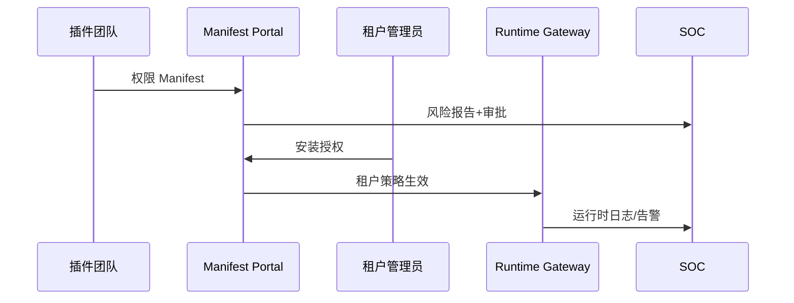

# Positioning & Goals

> 统一插件的权限申报、租户授权、运行时访问控制与越权审计，保障多租户环境的最小权限与合规要求。

目标：
- Manifest 权限清单 100% 审核，敏感权限需多级审批；
- 租户授权可视化且细粒度，策略同步延迟 < 1 分钟；
- 运行时 Scope 校验覆盖所有插件调用，越权阻断率 100%；
- 越权告警 MTTR < 15 分钟，审计材料可追溯。

# Scope & Guardrails

- **In Scope**：权限清单申报、租户授权、运行时访问控制、越权监控与响应。
- **Out of Scope**：插件内部业务权限、 License/计费控制、运行时行为检测。
- **Environment & Flags**：`PX_PLUGIN_PERMISSION_MANIFEST`, `PX_PLUGIN_TENANT_POLICY`, `PX_PLUGIN_RUNTIME_SCOPE`, `PX_PLUGIN_PERMISSION_SIEM`。

# Core Capabilities

1. **Permission Manifest & Review**：插件声明所需 Scope、数据类别、敏感级别；安全审核生成权限模板。
2. **Tenant Authorization Workflow**：安装/更新时展示权限说明，生成租户策略并支持细粒度授权与撤销。
3. **Runtime Access Control**：API 网关/运行时校验 Scope、租户上下文、速率限制，并支持动态降级。
4. **Overage Detection & Response**：SIEM/SOAR 监控越权行为，触发隔离、审计与复盘。

# Participants & Responsibilities

| Scope | Repository | Layer | 责任与交付物 | Owners |
|-------|------------|-------|--------------|--------|
| Permission Manifest Portal | powerx | security | Manifest 模板、审核工作流、风险报告 | Security Governance Squad |
| Tenant Policy Engine | powerx | service | 授权向导、策略生成、租户隔离、撤销 | Platform Policy Squad |
| Runtime Gateway | powerx | ops | Token/Scope 校验、动态调整、日志 & 告警 | Runtime Platform Squad |
| SOC / SIEM | powerx | ops | 越权检测、SOAR 剧本、复盘 | Security Operations Squad |

# End-to-End Flow

1. **Declare & Approve**：插件团队提交权限 Manifest → 自动风险评估 → 安全审核 → 生成模板 ID。
2. **Authorize**：租户管理员安装插件，确认权限说明 → 生成租户策略 & 复核计划 → 生效并记录审计。
3. **Enforce**：运行时颁发 Scope Token，API 网关校验租户/Scope/速率 → 异常调用触发动态降级或阻断。
4. **Monitor & Respond**：SIEM 聚合日志 → 超阈值告警 → SOAR 执行隔离/撤销 → 复盘并更新模板。

# Key Interactions & Contracts

- `POST /permissions/manifest`, `POST /permissions/templates/:id/approve`, `POST /tenant-policies`, `POST /runtime/tokens`, `POST /permissions/adjust`。
- 日志：`plugin.permission.apply`, `plugin.permission.authorize`, `plugin.runtime.scope.fail`, `plugin.permission.incident`。

# Validation Workflow

1. Manifest 审核正/逆向；
2. 租户授权流程（可视化 + 策略落地）；
3. 运行时越权阻断；
4. SIEM 告警 → SOAR 响应 → 复盘。

# Related Links

- 子场景：`SCN-INT-PLUGIN-PERMISSION-MANIFEST-001`, `SCN-INT-PLUGIN-PERMISSION-AUTHZ-001`, `SCN-INT-PLUGIN-PERMISSION-RUNTIME-001`, `SCN-INT-PLUGIN-PERMISSION-INCIDENT-001`。
- 依赖：`SCN-INT-HOST-CALL-PLUGIN-001`, `SCN-INT-PLUGIN-CALL-HOST-001`。

# Acceptance Criteria

1. Manifest 权限声明均通过审批流程，敏感权限具备业务说明；
2. 租户授权界面清晰展示 Scope，可细分组织/数据分类；
3. 运行时所有调用携带 Scope，越权即阻断并告警；
4. 权限变更/撤销全程审计，可在 15 分钟内定位问题插件。

# Telemetry & Ops

- 指标：`permission.review.sla`, `tenant.policy.sync_latency`, `runtime.scope.block_count`, `permission.alert.mttr`。
- 告警：权限申请异常、策略同步失败、越权告警、审计日志缺失。

# Architecture Diagram

# Open Issues & Follow-ups

| 风险/事项 | 影响 | 负责人 | ETA |
|-----------|------|--------|-----|
| Manifest 风险评估缺少机器辅助 | 审核效率 | Security Governance Squad | 2025-03-05 |
| 租户策略 UI 未支持批量更新 | 大租户配置繁琐 | Platform Policy Squad | 2025-03-10 |
| 动态降级策略尚未与 SOAR 联动 | 响应滞后 | Security Ops Squad | 2025-03-07 |
