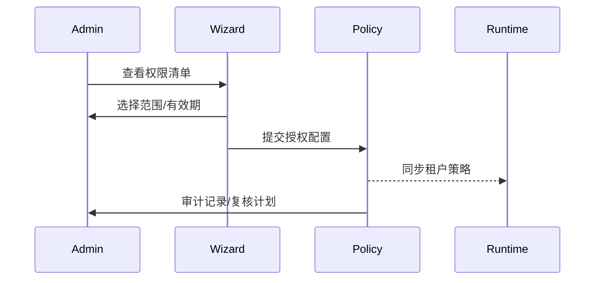

doc_id: UC-INT-PLUGIN-PERMISSION-AUTHZ-001
scn_id: SCN-INT-PLUGIN-PERMISSION-001
title: 安装授权与租户策略落地（service/integration）
status: Draft
version: v0.1.0
repo_key: powerx
scope: powerx
layer: service
domain: integration
scenario_title: "插件权限与访问控制"
owners:
  - name: Michael Hu
    role: Plugin Tech Lead
    contact: tech@artisan-cloud.com
contributors:
  - name: Grace Lin
    role: Security & Compliance Lead
    contact: compliance@artisan-cloud.com
linked_requirements:
  - id: SCN-INT-PLUGIN-PERMISSION-AUTHZ-001
    description: 子场景《安装授权与租户策略落地》
code_refs:
  - repo: powerx
    path: services/tenant-policy/authz_wizard.ts
    description: 安装向导 & 权限说明渲染
  - repo: powerx
    path: services/tenant-policy/policy_engine.ts
    description: 租户策略生成、同步与撤销
  - repo: powerx
    path: services/tenant-policy/review_scheduler.ts
    description: 复核计划、授权有效期、提醒
feature_flags:
  - PX_PLUGIN_TENANT_POLICY
  - PX_PLUGIN_AUTHZ_WIZARD
  - PX_PLUGIN_POLICY_REVIEW
optional: false
last_reviewed_at: 2025-02-22

---

# Usecase Overview

- **业务目标**：在插件安装或权限更新时，向租户管理员展示清晰的权限说明，支持细粒度授权/撤销，并自动生成租户策略与复核计划。
- **成功度量**：授权确认后 1 分钟内同步策略；撤销成功率 100%；复核计划覆盖率 ≥ 95%。
- **场景关联**：对接 `SCN-INT-PLUGIN-PERMISSION-001` 子场景 B，依赖 Manifest 审核结果，并为运行时访问控制提供策略输入。

# Context & Assumptions

- Feature Flags `PX_PLUGIN_TENANT_POLICY`, `PX_PLUGIN_AUTHZ_WIZARD`, `PX_PLUGIN_POLICY_REVIEW` 已启用。
- Manifest/模板已通过审核，权限说明与用途可从模板查询。
- 租户策略引擎、审计与复核调度服务可用。

# Solution Blueprint

## 体系分解

| 层 | 主要组件/模块 | 责任 | 代码入口 |
|----|---------------|------|---------|
| Authorization Wizard | `authz_wizard.ts` | 渲染权限说明、收集授权范围、确认 | services/tenant-policy/authz_wizard.ts |
| Policy Engine | `policy_engine.ts` | 生成/更新/撤销租户策略、推送到运行时 | services/tenant-policy/policy_engine.ts |
| Review Scheduler | `review_scheduler.ts` | 设置复核计划、通知管理员、自动撤回 | services/tenant-policy/review_scheduler.ts |

## 流程与时序

1. 安装向导读取权限模板、展示用途与风险提示。
2. 管理员勾选授权范围（组织、数据域、有效期），确认后调用 `policy_engine` 生成策略。
3. 策略推送至 Runtime Gateway/API 网关，并记录审计日志。
4. `review_scheduler` 创建复核计划，到期提醒或自动撤销未使用的权限。

# Contracts & Interfaces

- `POST /tenant-policies`, `PATCH /tenant-policies/:id`, `DELETE /tenant-policies/:id`, `POST /tenant-policies/:id/review`。
- 配置：`tenant_policy_templates.yaml`, `policy_review_rules.yaml`。

# Implementation Checklist

| 项目 | 描述 | 完成状态 | 负责人 |
|------|------|----------|--------|
| 授权向导 | UI/后端接口、权限说明渲染、确认流程 | [ ] | Platform Policy Squad |
| 策略引擎 | 生成/同步/撤销策略、审计打点 | [ ] | Platform Policy Squad |
| 复核计划 | 调度任务、提醒通知、自动撤销 | [ ] | Governance Squad |

# Testing Strategy

- 单元：权限说明渲染、策略生成、撤销逻辑。
- 集成：安装正向流程、权限冲突阻断、撤销/复核。
- 端到端：沙箱授权→策略落地→运行时验证→复核撤回。

# Observability & Ops

- 指标：`tenant.policy.sync_latency`, `tenant.policy.revoke.count`, `tenant.policy.review.coverage`。
- 告警：策略同步失败、复核任务超时、授权冲突。

# Rollback & Failure Handling

- 策略生成失败：回滚到旧策略并提示管理员；
- 授权误操作：提供撤销 API + 审计记录；
- 复核任务失败：重试并通知安全团队。

# Follow-ups & Risks

| 风险/事项 | 影响 | 缓解方案 | 负责人 | ETA |
|-----------|------|----------|--------|-----|
| 租户策略 UI 未支持批量更新 | 大租户操作繁琐 | Platform Policy Squad | 2025-03-10 |
| 权限说明缺少多语言 | 跨区域沟通困难 | Localization Squad | 2025-03-08 |

# References & Links

- 场景：`docs/scenarios/integration/SCN-INT-PLUGIN-PERMISSION-001.md`
- 子场景：`docs/scenarios/integration/SCN-INT-PLUGIN-PERMISSION-AUTHZ-001.md`
- 配置：`tenant_policy_templates.yaml`, `policy_review_rules.yaml`
- 发布指引：`npm run publish:usecases -- --scn-id SCN-INT-PLUGIN-PERMISSION-001 --validate-only`
