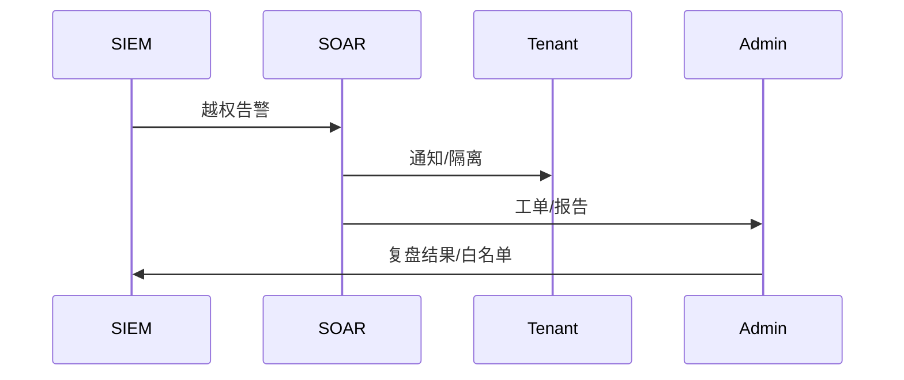

doc_id: UC-INT-PLUGIN-PERMISSION-INCIDENT-001
scn_id: SCN-INT-PLUGIN-PERMISSION-001
title: 越权检测与审计响应（ops/integration）
status: Draft
version: v0.1.0
repo_key: powerx
scope: powerx
layer: ops
domain: integration
scenario_title: "插件权限与访问控制"
owners:
  - name: Grace Lin
    role: Security & Compliance Lead
    contact: compliance@artisan-cloud.com
contributors:
  - name: Michael Hu
    role: Plugin Tech Lead
    contact: tech@artisan-cloud.com
linked_requirements:
  - id: SCN-INT-PLUGIN-PERMISSION-INCIDENT-001
    description: 子场景《越权检测与审计响应》
code_refs:
  - repo: powerx
    path: services/security/siem/permission_alerts.ts
    description: 越权告警规则、日志聚合
  - repo: powerx
    path: services/security/soar/permission_playbooks.ts
    description: 自动化隔离/撤销、租户通知、白名单管理
  - repo: powerx
    path: services/security/audit/permission_postmortem.ts
    description: 复盘报告、整改任务、审计导出
feature_flags:
  - PX_PLUGIN_PERMISSION_SIEM
  - PX_PLUGIN_PERMISSION_SOAR
  - PX_PLUGIN_PERMISSION_WHITELIST
optional: false
last_reviewed_at: 2025-02-22

---

# Usecase Overview

- **业务目标**：在检测到插件越权或权限滥用时，利用 SIEM/SOAR 快速触发隔离、撤销与租户通知，最终产出可审计的复盘报告。
- **成功度量**：告警 MTTR < 15 分钟，自动化处置覆盖 ≥80%，复盘闭环率 100%，误报率 < 5%。
- **场景关联**：对应 `SCN-INT-PLUGIN-PERMISSION-INCIDENT-001`，与 Manifest/授权/运行时控制形成闭环。

# Context & Assumptions

- Feature Flags `PX_PLUGIN_PERMISSION_SIEM`, `PX_PLUGIN_PERMISSION_SOAR`, `PX_PLUGIN_PERMISSION_WHITELIST` 已启用。
- SIEM 接收运行时日志、授权变更、租户举报；SOAR 有权限执行隔离/通知。
- 租户通知渠道可用，审计系统支持日志导出。

# Solution Blueprint

## 体系分解

| 层 | 模块 | 责任 | 代码入口 |
|----|------|------|---------|
| SIEM Alerts | `permission_alerts.ts` | 规则匹配、告警生成、噪声过滤 | services/security/siem/permission_alerts.ts |
| SOAR Playbooks | `permission_playbooks.ts` | 自动化隔离/撤销、通知、白名单管理 | services/security/soar/permission_playbooks.ts |
| Audit/Postmortem | `permission_postmortem.ts` | 复盘模板、整改任务、审计导出 | services/security/audit/permission_postmortem.ts |

## 流程与时序

1. SIEM 汇聚日志 → 触发越权告警。
2. SOAR 执行 Playbook：冻结插件、撤销策略、通知租户/插件方。
3. 安全团队复盘：收集调用明细、授权变更、撰写报告，必要时发布公告。
4. 复盘闭环后更新白名单或改进项。

# Contracts & Interfaces

- `POST /siem/alerts`, `POST /soar/playbooks/permission`, `POST /notifications/tenants`, `POST /permissions/whitelist`。
- Config：`permission_alert_rules.yaml`, `soar_playbooks.yaml`。

# Implementation Checklist

| 项目 | 描述 | 完成状态 | 负责人 |
|------|------|----------|--------|
| SIEM 规则 | 越权/滥用规则、噪声过滤、上下文补全 | [ ] | Security Ops Squad |
| SOAR Playbooks | 隔离/撤销/通知/白名单流程 | [ ] | Security Ops Squad |
| Audit & Postmortem | 模板、任务管理、审计导出 | [ ] | Governance Squad |

# Testing Strategy

- 单元：规则匹配、Playbook 执行、白名单恢复。
- 集成：正向越权→告警→隔离/通知→复盘；误报白名单流程；告警风暴分级。
- 端到端：沙箱越权演练、租户通知、复盘报告导出。

# Observability & Ops

- 指标：`permission.alert.count`, `permission.mttr`, `permission.autoplaybook.coverage`, `permission.postmortem.close_rate`。
- 告警：告警风暴、Playbook 失败、通知失败。

# Rollback & Failure Handling

- 隔离/撤销误操作：通过白名单恢复并重新授权。
- SOAR 失败：降级为手动流程，记录审计。
- SIEM 日志缺失：触发备份通道并告警。

# Follow-ups & Risks

| 风险/事项 | 影响 | 缓解方案 | 负责人 | ETA |
|-----------|------|----------|--------|-----|
| 告警风暴缺少去噪策略 | 噪声干扰响应 | Security Ops Squad | 2025-03-06 |
| 审计日志格式不统一 | 复盘困难 | Observability Squad | 2025-03-08 |

# References & Links

- 场景：`docs/scenarios/integration/SCN-INT-PLUGIN-PERMISSION-001.md`
- 子场景：`docs/scenarios/integration/SCN-INT-PLUGIN-PERMISSION-INCIDENT-001.md`
- 配置：`permission_alert_rules.yaml`, `soar_playbooks.yaml`
- 发布指引：`npm run publish:usecases -- --scn-id SCN-INT-PLUGIN-PERMISSION-001 --validate-only`
