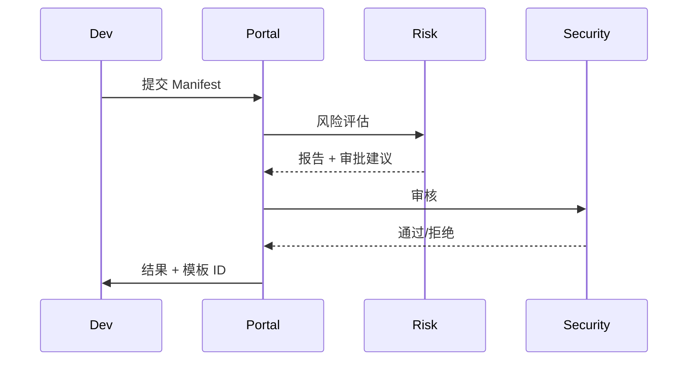

doc_id: UC-INT-PLUGIN-PERMISSION-MANIFEST-001
scn_id: SCN-INT-PLUGIN-PERMISSION-001
title: 权限清单申报与安全审核（security/integration）
status: Draft
version: v0.1.0
repo_key: powerx
scope: powerx
layer: security
domain: integration
scenario_title: "插件权限与访问控制"
owners:
  - name: Grace Lin
    role: Security & Compliance Lead
    contact: compliance@artisan-cloud.com
contributors:
  - name: Michael Hu
    role: Plugin Tech Lead
    contact: tech@artisan-cloud.com
linked_requirements:
  - id: SCN-INT-PLUGIN-PERMISSION-MANIFEST-001
    description: 子场景《权限清单申报与安全审核》
code_refs:
  - repo: powerx
    path: services/permissions/manifest_portal/application_service.ts
    description: Manifest 提交、字段校验、审计记录
  - repo: powerx
    path: services/permissions/manifest_portal/risk_engine.ts
    description: 权限白名单匹配、敏感度评估、风险报告
  - repo: powerx
    path: services/permissions/manifest_portal/template_sync.ts
    description: 审核通过后生成模板 ID 并同步 Marketplace/策略库
feature_flags:
  - PX_PLUGIN_PERMISSION_MANIFEST
  - PX_PLUGIN_PERMISSION_RISK
optional: false
last_reviewed_at: 2025-02-22

---

# Usecase Overview

- **业务目标**：插件团队必须通过 Manifest 声明所需权限，经过自动校验与安全审核后生成权限模板，为租户授权与运行时控制提供可信基线。
- **成功度量**：Manifest 审核 SLA ≤ 1 工作日；敏感权限多级审批覆盖率 100%；审核日志可追溯。
- **场景关联**：对应 `SCN-INT-PLUGIN-PERMISSION-001` 子场景 A，先于授权/运行时/越权响应执行。

# Context & Assumptions

- Feature Flags `PX_PLUGIN_PERMISSION_MANIFEST`, `PX_PLUGIN_PERMISSION_RISK` 已启用。
- 权限白名单/黑名单、敏感度分级、组织信息齐备；审计系统可写入风险与审批记录。

# Solution Blueprint

## 体系分解

| 层 | 模块 | 责任 | 代码入口 |
|----|------|------|---------|
| Manifest Portal | `application_service.ts` | 接收申请、校验字段、审计 | `services/permissions/manifest_portal/application_service.ts` |
| Risk Engine | `risk_engine.ts` | 比对白名单、生成风险报告、触发多级审批 | `services/permissions/manifest_portal/risk_engine.ts` |
| Template Sync | `template_sync.ts` | 审批通过后生成模板 ID，推送 Marketplace/策略库 | `services/permissions/manifest_portal/template_sync.ts` |

## 流程与时序

1. 插件团队提交 Manifest（Scope、数据类别、理由）→ Portal 校验字段。
2. Risk Engine 生成风险报告：匹配白名单、标记敏感权限，必要时触发多级审批。
3. 审核员评估并记录结论 → Template Sync 生成模板 ID 并同步至 Marketplace/策略库。

# Contracts & Interfaces

- `POST /permissions/manifest`, `POST /permissions/manifest/:id/approve`, `POST /permissions/manifest/:id/reject`。
- `GET /permissions/manifest/:id/report`。
- Config：`permission_whitelist.yaml`, `permission_risk_rules.yaml`。

# Implementation Checklist

| 项目 | 描述 | 完成状态 | 负责人 |
|------|------|----------|--------|
| Manifest Portal | 表单 & API、字段校验、审计 | [ ] | Security Governance Squad |
| Risk Engine | 白名单/敏感度匹配、风险评分 | [ ] | Security Governance Squad |
| Template Sync | 模板生成、同步 Marketplace/策略库 | [ ] | Plugin Governance Squad |

# Testing Strategy

- 单元：字段校验、风险评分、审批状态机。
- 集成：正向审核、敏感权限多级审批、拒绝/整改流程。
- 端到端：沙箱 Manifest → 审核 → 模板同步。

# Observability & Ops

- 指标：`manifest.review.sla`, `manifest.reject.rate`, `manifest.sensitive.scope_ratio`。
- 告警：敏感权限未多级审批、风险引擎失败、审计记录缺失。

# Rollback & Failure Handling

- 审批误操作可通过 `POST /permissions/manifest/:id/reopen` 重新评估。
- 风险引擎故障：降级为手动审批并告警。

# Follow-ups & Risks

| 风险/事项 | 影响 | 缓解方案 | 负责人 | ETA |
|-----------|------|----------|--------|-----|
| 风险评估缺少自动建议 | 审核效率 | Security Governance Squad | 2025-03-05 |
| Manifest 模板缺多语言 | 国际化体验 | Localization Squad | 2025-03-08 |

# References & Links

- 场景：`docs/scenarios/integration/SCN-INT-PLUGIN-PERMISSION-001.md`
- 子场景：`docs/scenarios/integration/SCN-INT-PLUGIN-PERMISSION-MANIFEST-001.md`
- 配置：`permission_whitelist.yaml`, `permission_risk_rules.yaml`
- 发布指引：`npm run publish:usecases -- --scn-id SCN-INT-PLUGIN-PERMISSION-001 --validate-only`
