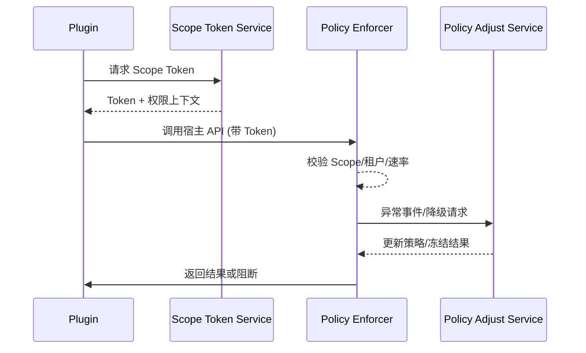

doc_id: UC-INT-PLUGIN-PERMISSION-RUNTIME-001
scn_id: SCN-INT-PLUGIN-PERMISSION-001
title: 运行时访问控制与动态调整（ops/integration）
status: Draft
version: v0.1.0
repo_key: powerx
scope: powerx
layer: ops
domain: integration
scenario_title: "插件权限与访问控制"
owners:
  - name: Michael Hu
    role: Plugin Tech Lead
    contact: tech@artisan-cloud.com
contributors:
  - name: Grace Lin
    role: Security & Compliance Lead
    contact: compliance@artisan-cloud.com
linked_requirements:
  - id: SCN-INT-PLUGIN-PERMISSION-RUNTIME-001
    description: 子场景《运行时访问控制与动态调整》
code_refs:
  - repo: powerx
    path: services/runtime/gateway/scope_token_service.ts
    description: 颁发/撤销 Scope Token、记录上下文
  - repo: powerx
    path: services/runtime/gateway/policy_enforcer.ts
    description: 调用时校验 Scope、租户、速率，并执行降级/冻结
  - repo: powerx
    path: services/runtime/gateway/policy_adjust_service.ts
    description: 实时调整权限范围或租户策略，推送至各节点
feature_flags:
  - PX_PLUGIN_RUNTIME_SCOPE
  - PX_PLUGIN_DYNAMIC_POLICY
  - PX_PLUGIN_RATE_LIMIT
optional: false
last_reviewed_at: 2025-02-22

---

# Usecase Overview

- **业务目标**：在每次插件调用宿主 API 时强制执行 Scope、租户上下文和速率限制，支持秒级动态调整与自动化降级，确保越权行为被即时阻断并可追溯。
- **成功度量**：越权阻断率 100%；动态策略调整生效时间 < 5s；被吊销的 Token 在 1s 内失效；相关日志 100% 写入审计。
- **场景关联**：落实 `SCN-INT-PLUGIN-PERMISSION-RUNTIME-001`，依赖 Manifest/授权子场景的策略输入，为越权事件响应提供数据。

# Context & Assumptions

- Feature Flags `PX_PLUGIN_RUNTIME_SCOPE`, `PX_PLUGIN_DYNAMIC_POLICY`, `PX_PLUGIN_RATE_LIMIT` 已启用。
- 租户策略已在授权阶段生成，运行时可拉取最新策略。
- API 网关具备 Token 校验、速率限制、审计与告警能力。

# Solution Blueprint

## 体系分解

| 层 | 主要组件/模块 | 责任 | 代码入口 |
|----|---------------|------|---------|
| Scope Token Service | `scope_token_service.ts` | 颁发/刷新/吊销 Token，写入上下文 | services/runtime/gateway/scope_token_service.ts |
| Policy Enforcer | `policy_enforcer.ts` | 调用时校验 Scope、租户、速率，触发阻断/降级 | services/runtime/gateway/policy_enforcer.ts |
| Policy Adjust Service | `policy_adjust_service.ts` | 安全/管理员实时调整策略、降级或冻结，并同步到运行时 | services/runtime/gateway/policy_adjust_service.ts |

## 流程与时序

1. **Token Issuance**：插件在运行时获取带 Scope 的 Token（含租户/插件 ID、有效期）。
2. **Runtime Enforcement**：每次调用由 Policy Enforcer 校验 Token、租户上下文、限流，并记录日志。
3. **Dynamic Adjustment**：检测到异常调用时，自动降级权限或冻结 Token；管理员也可手动调整策略。
4. **Audit & Notify**：所有阻断、降级和调整写入审计与告警，供 SOC/租户查看。

# Contracts & Interfaces

- `POST /runtime/tokens`, `POST /runtime/tokens/revoke`, `POST /runtime/policies/adjust`, `POST /runtime/policies/freeze`。
- Config：`runtime_scope_policy.yaml`, `rate_limit_rules.yaml`, `dynamic_policy_rules.yaml`。

# Implementation Checklist

| 项目 | 描述 | 完成状态 | 负责人 |
|------|------|----------|--------|
| Token Service | 颁发/刷新/吊销接口、上下文记录 | [ ] | Runtime Platform Squad |
| Policy Enforcer | Scope/租户/限流校验、阻断/降级、日志 | [ ] | Runtime Platform Squad |
| Adjust Service | 动态策略调整、冻结/解冻、API & UI | [ ] | Security Ops Squad |
| Telemetry & Audit | 指标、日志、告警、审计导出 | [ ] | Observability Squad |

# Testing Strategy

- 单元：Token 颁发/吊销、Scope 校验、限流、策略调整。
- 集成：正向调用、越权阻断、速率触发、动态降级/恢复。
- 端到端：沙箱插件调用 → Scope 验证 → 异常注入 → 冻结/解冻流程。

# Observability & Ops

- 指标：`runtime.scope.block_count`, `runtime.policy.adjust_latency`, `runtime.token.revoke.count`, `runtime.rate_limit.hit`。
- 告警：连续越权、策略同步失败、冻结/解冻失败。
- Dashboards：`Plugin Runtime Access Control`。

# Rollback & Failure Handling

- Policy 调整失败时自动回滚至上一版本并提示管理员。
- Token 服务故障：切换到缓存策略并记录降级；必要时阻断新调用。
- 误冻结：提供白名单恢复/重新授权并写入审计。

# Follow-ups & Risks

| 风险/事项 | 影响 | 缓解方案 | 负责人 | ETA |
|-----------|------|----------|--------|-----|
| 动态策略未与 SOAR 联动 | 响应滞后 | Security Ops Squad | 2025-03-07 |
| 缓存策略配置不当导致同步延迟 | 越权窗口扩大 | Runtime Platform Squad | 2025-03-04 |

# References & Links

- 场景：`docs/scenarios/integration/SCN-INT-PLUGIN-PERMISSION-001.md`
- 子场景：`docs/scenarios/integration/SCN-INT-PLUGIN-PERMISSION-RUNTIME-001.md`
- 配置：`runtime_scope_policy.yaml`, `rate_limit_rules.yaml`
- 发布指引：`npm run publish:usecases -- --scn-id SCN-INT-PLUGIN-PERMISSION-001 --validate-only`
