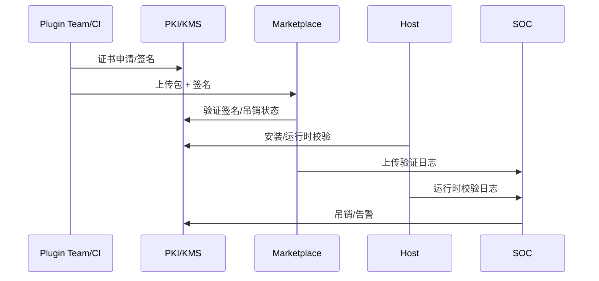

# Positioning & Goals

> 确保所有进入 PowerX 生态的插件自构建、分发到运行全程都具备可信签名与验证机制，实现供应链安全、合规审计与运行时防护。

目标：
- 证书签发/吊销可追溯，业务 SLA ≤ 1 工作日；
- 100% 插件构建产物签名并在上传、安装、运行阶段重复校验；
- 未签名或失效签名插件自动阻断并触发告警，运行时校验失败可隔离；
- 统一的日志/指标支持 SOC 在 SLA 内响应并复盘签名事件。

# Scope & Guardrails

- **In Scope**：证书申请与管理、构建签名与上传校验、安装/运行时校验、吊销与事件响应、日志审计。
- **Out of Scope**：插件业务测试、第三方市场审核规则、运行时沙箱/行为检测（另有场景）。
- **Environment & Flags**：`PX_PLUGIN_SIGNING_PKI`, `PX_PLUGIN_ARTIFACT_VERIFY`, `PX_PLUGIN_RUNTIME_VERIFY`, `PX_PLUGIN_SIGNING_SIEM`。

# Core Capabilities

1. **Certificate Lifecycle Management**：插件团队/CI 获取签名证书，KMS/KPI 托管私钥、自动续期与吊销。
2. **Build Artifact Signing**：CI 调用 KMS 对产物签名，上传时校验签名 + 哈希 + 吊销列表。
3. **Install & Runtime Verification**：宿主安装、运行、更新阶段执行签名 & 哈希校验并应用租户策略。
4. **Monitoring & Incident Response**：集中化日志、告警、吊销流程与事件复盘，支持死链回滚/补丁。

# Participants & Responsibilities

| Scope | Repository | Layer | 责任与交付物 | Owners |
|-------|------------|-------|--------------|--------|
| PKI / KMS | powerx | security | 证书签发、托管、吊销、KMS API | Security Platform Squad |
| Signing Pipeline | powerx | service | CI 集成、签名 CLI/SDK、上传校验、审计 | Build Infra Squad |
| Runtime Verifier | powerx | ops | 安装器/运行时校验、隔离、日志与告警 | Runtime Platform Squad |
| SOC / SIEM | powerx | ops | 事件监控、吊销自动化、复盘 | Security Operations Center |

# End-to-End Flow

1. **Plan & Issue**：团队在证书门户登记 → 审批 → KMS 签发证书/私钥策略 → CI 获取临时签名能力。
2. **Sign & Upload**：构建产物生成签名+哈希 → 上传到 Marketplace/分发服务 → 验证签名/证书状态，写入审计。
3. **Deploy & Validate**：宿主安装/更新阶段校验签名 → 运行时周期性验证文件完整性并记录日志。
4. **Monitor & Respond**：异常签名进入 SIEM/SOAR → 根据策略吊销证书、隔离插件、通知租户并复盘。

# Key Interactions & Contracts

- **APIs**：`POST /kms/certificates`, `POST /kms/sign`, `POST /marketplace/upload`, `POST /host/plugins/verify`, `POST /security/revoke`。
- **Artifacts**：签名文件、哈希指纹、证书 (x509)、CRL/OCSP。
- **Logs**：`plugin.signing.apply`, `plugin.signing.upload.verify`, `plugin.runtime.verify.fail`, `plugin.signing.revoke`。

# Validation Workflow

1. 证书申请/审批/吊销流程演练；
2. 构建签名 + 上传验证（正向/逆向）
3. 安装/运行时校验 + 阻断；
4. SOC 告警 → 吊销 → 租户通知 → 复盘。

# Related Links

- 子场景：`SCN-INT-PLUGIN-SIGN-CERT-001`, `SCN-INT-PLUGIN-SIGN-BUILD-001`, `SCN-INT-PLUGIN-SIGN-RUNTIME-001`, `SCN-INT-PLUGIN-SIGN-RESPONSE-001`。
- 依赖：`SCN-INT-PLUGIN-CAPABILITY-001`, `SCN-INT-HOST-CALL-PLUGIN-001`。

# Acceptance Criteria

1. 证书签发/吊销全流程审计可查，审批 SLA ≤ 1d；
2. Marketplace/分发上传阶段签名验证成功率 ≥ 99%，未签名包自动阻断；
3. 安装/运行时校验失败立即阻止加载并触发 P1 告警；
4. SOC 可在 15 分钟内响应异常签名事件，吊销 & 通知链路自动化比例 ≥ 80%。

# Telemetry & Ops

- 指标：`plugin.signing.cert.issue_time`, `plugin.signing.upload.fail_rate`, `plugin.signing.runtime.block_count`, `plugin.signing.mttr`。
- 告警：证书过期/吊销失败、上传验证失败率 >1%、运行时校验失败、SIEM 无日志。
- 观测：`Signing & Verification Dashboard`, SIEM/SOAR Playbooks。

# Architecture Diagram

# Open Issues & Follow-ups

| 风险/事项 | 影响范围 | 负责人 | ETA |
|-----------|----------|--------|-----|
| Sandbox 未接入 KMS 吊销流程 | 演练缺失 | Security Platform Squad | 2025-02-28 |
| Marketplace 上传缺少指纹查询 API | 审计追踪受限 | Build Infra Squad | 2025-03-05 |
| 运行时校验未覆盖热补丁场景 | 可被绕过 | Runtime Platform Squad | 2025-03-08 |
