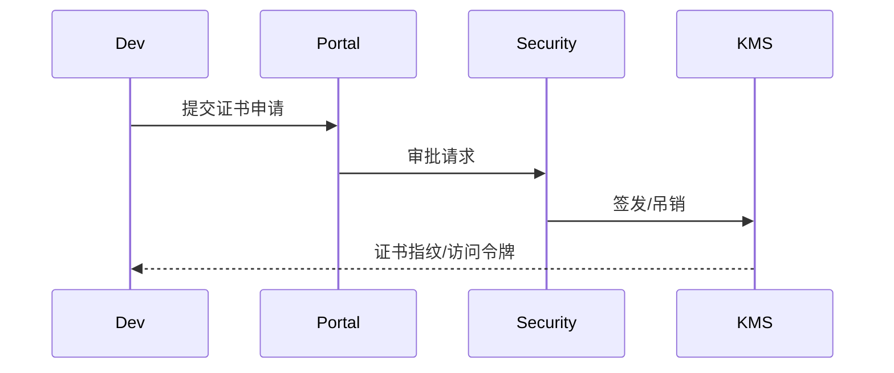

# Executive Summary

> 插件团队必须通过 PKI/KMS 申请签名证书并受控管理私钥，本子场景定义申请、审批、签发、轮换与吊销的治理流程，保证证书与插件标识绑定且可追溯。

# Scope & Guardrails

- **In Scope**：证书申请门户、组织/插件信息校验、审批与审计、证书签发、私钥托管策略、轮换/吊销/续期提醒。
- **Out of Scope**：构建签名、上传校验、运行时验证（其他子场景）。
- **Environment & Flags**：`PX_PLUGIN_SIGNING_PKI`, `PX_PLUGIN_CERT_PORTAL`, `PX_PLUGIN_CERT_ROTATION`；依赖 PKI/KMS、IAM、Audit。

# End-to-End Flow

1. **申请**：插件团队提交证书申请（组织、插件 ID、CI 项目、租户范围）。
2. **审批**：安全团队审核 → KMS 签发证书 & 指纹，记录审计。
3. **托管**：配置私钥托管策略（HSM/KMS）、访问授权、有效期与吊销条件。
4. **轮换/吊销**：到期提醒、自动续期、异常吊销与白名单恢复。

# Key Interactions & Contracts

- `POST /signing/certificates/apply`, `POST /signing/certificates/{id}/approve`, `POST /signing/certificates/{id}/revoke`, `GET /signing/certificates/{id}`。
- 与 KMS/HSM API 集成：`/kms/sign`, `/kms/token`。
- 审计事件：`plugin.cert.apply`, `plugin.cert.issue`, `plugin.cert.revoke`。

# Acceptance Criteria

1. 证书申请→审批 SLA ≤ 1 工作日，流程全量审计。
2. 证书与插件/CI 项目绑定，私钥托管在 KMS/HSM 内，不允许本地导出。
3. 轮换/吊销自动化，过期证书比例 < 2%，异常申请触发告警。

# Telemetry & Ops

- 指标：`cert.issue.time`, `cert.revocation.count`, `cert.expired.rate`。
- 告警：频繁申请、即将过期、吊销失败。
- 仪表：`Plugin Signing PKI Dashboard`。

# Open Issues & Follow-ups

| 风险/事项 | 影响 | 负责人 | ETA |
|-----------|------|--------|-----|
| Sandbox 未接入真实 CRL/OCSP | 演练准确度 | Security Platform Squad | 2025-02-28 |
| 证书申请缺少 CI 项目校验 | 可能滥用 | Plugin Governance Squad | 2025-03-01 |
