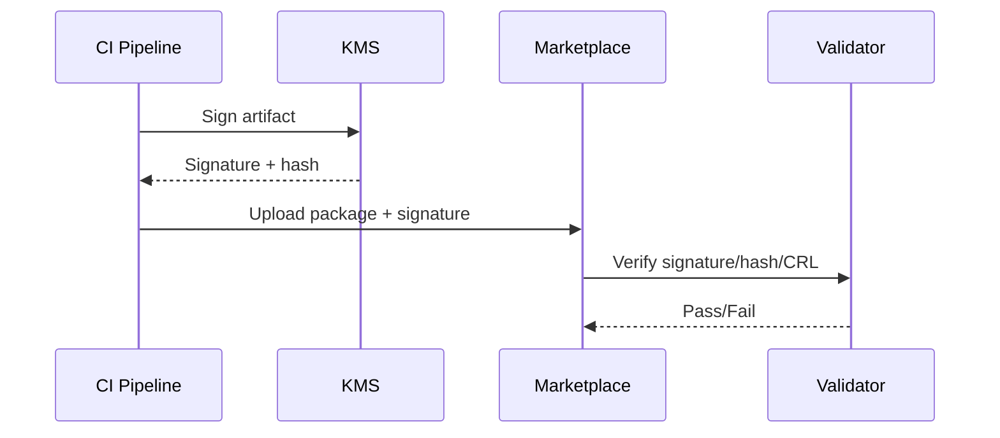

doc_id: UC-INT-PLUGIN-SIGN-BUILD-001
scn_id: SCN-INT-PLUGIN-SIGN-001
title: 构建产物签名与上传校验（service/integration）
status: Draft
version: v0.1.0
repo_key: powerx
scope: powerx
layer: service
domain: integration
scenario_title: "插件签名与验证"
owners:
  - name: Michael Hu
    role: Plugin Tech Lead
    contact: tech@artisan-cloud.com
contributors:
  - name: Grace Lin
    role: Security & Compliance Lead
    contact: compliance@artisan-cloud.com
linked_requirements:
  - id: SCN-INT-PLUGIN-SIGN-BUILD-001
    description: 子场景《构建产物签名与上传校验》
code_refs:
  - repo: powerx
    path: services/signing/build/signing_cli.ts
    description: CI 调用的签名 CLI/SDK，封装 KMS API
  - repo: powerx
    path: services/marketplace/upload_validator.ts
    description: 上传验证签名、哈希与证书状态的服务
  - repo: powerx
    path: services/signing/hash_ledger.ts
    description: 哈希指纹登记、重复检测与审计
feature_flags:
  - PX_PLUGIN_ARTIFACT_SIGN
  - PX_PLUGIN_UPLOAD_VERIFY
  - PX_PLUGIN_HASH_LEDGER
optional: false
last_reviewed_at: 2025-02-21

---

# Usecase Overview

- **业务目标**：确保每个插件构建产物由授权证书签名，在上传分发平台时校验签名/哈希/证书状态，保障供应链完整性。
- **成功度量**：签名验证通过率 ≥ 99%、未签名包阻断率 100%、哈希重复率 < 0.1%、验证日志完整可追溯。
- **场景关联**：对应 `SCN-INT-PLUGIN-SIGN-BUILD-001`，与证书治理/运行时验证/事件响应子场景协同。

# Context & Assumptions

- Feature Flags `PX_PLUGIN_ARTIFACT_SIGN`, `PX_PLUGIN_UPLOAD_VERIFY`, `PX_PLUGIN_HASH_LEDGER` 已启用。
- CI 已集成 KMS，能安全获取签名令牌。
- Marketplace/分发平台具备验证 API 与审计日志写入能力。

# Solution Blueprint

## 体系分解

| 层 | 模块 | 责任 | 代码入口 |
|----|------|------|---------|
| Signing CLI/SDK | `services/signing/build/signing_cli.ts` | CI 触发签名、生成哈希指纹 | `services/signing/build/signing_cli.ts` |
| Upload Validator | `services/marketplace/upload_validator.ts` | 校验签名、哈希、证书状态，记录审计 | `services/marketplace/upload_validator.ts` |
| Hash Ledger | `services/signing/hash_ledger.ts` | 存储指纹、检测重复/碰撞 | `services/signing/hash_ledger.ts` |

## 流程与时序

1. 构建完成 → Signing CLI 调用 KMS 签名，生成 `.sig` & `.hash`。
2. 上传插件包 + 签名/哈希至 Marketplace。
3. Upload Validator 验证签名、哈希、CRL/OCSP → 写入审计。
4. 验证通过则进入审核/发布，失败则阻断并告警。

# Contracts & Interfaces

- `POST /signing/sign`, `GET /signing/hash/{artifact}`。
- `POST /marketplace/plugins`, `POST /marketplace/plugins/:id/verify`。
- 配置：`signing_policies.yaml`, `hash_ledger.jsonl`。

# Implementation Checklist

| 项目 | 描述 | 完成状态 | 负责人 |
|------|------|----------|--------|
| 签名 CLI | 封装 KMS 签名、支持多语言 CI | [ ] | Build Infra Squad |
| Upload Validator | 校验签名/哈希/证书状态、写入审计 | [ ] | Marketplace Squad |
| Hash Ledger | 记录指纹、碰撞检测、API 查询 | [ ] | Security Platform Squad |

# Testing Strategy

- 单元：签名 CLI、哈希生成、CRL 检查。
- 集成：正向上传、签名不匹配、吊销证书、哈希重复。
- 端到端：CI 构建→签名→上传→发布审批。

# Observability & Ops

- 指标：`artifact.sign.fail_rate`, `artifact.verify.fail_rate`, `artifact.hash.collision`。
- 告警：签名失败、验证失败率 >1%、吊销检查失败、哈希碰撞。

# Rollback & Failure Handling

- 上传失败回滚：自动删除包及签名记录。
- 签名服务异常时可触发备用 KMS 或阻断流水线。
- 哈希碰撞：标记风险、阻止发布、通知安全团队。

# Follow-ups & Risks

| 风险/事项 | 影响 | 缓解方案 | 负责人 | ETA |
|-----------|------|----------|--------|-----|
| CI 未强制签名脚本 | 可能漏签 | Dev Productivity Squad | 2025-02-28 |
| Marketplace 缺哈希查询 API | 审计追踪困难 | Marketplace Squad | 2025-03-05 |

# References & Links

- 场景：`docs/scenarios/integration/SCN-INT-PLUGIN-SIGN-001.md`
- 子场景：`docs/scenarios/integration/SCN-INT-PLUGIN-SIGN-BUILD-001.md`
- 配置：`signing_policies.yaml`, `hash_ledger.jsonl`
- 脚本：`scripts/ops/plugin-signing-cli.mjs`
- 发布指引：`npm run publish:usecases -- --scn-id SCN-INT-PLUGIN-SIGN-001 --validate-only`
