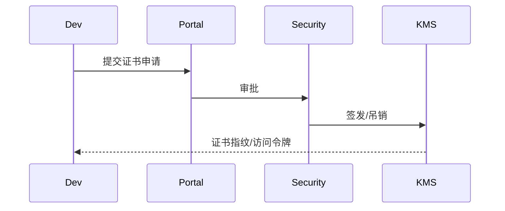

doc_id: UC-INT-PLUGIN-SIGN-CERT-001
scn_id: SCN-INT-PLUGIN-SIGN-001
title: 签名证书申请与治理（security/integration）
status: Draft
version: v0.1.0
repo_key: powerx
scope: powerx
layer: security
domain: integration
scenario_title: "插件签名与验证"
owners:
  - name: Grace Lin
    role: Security & Compliance Lead
    contact: compliance@artisan-cloud.com
contributors:
  - name: Michael Hu
    role: Plugin Tech Lead
    contact: tech@artisan-cloud.com
linked_requirements:
  - id: SCN-INT-PLUGIN-SIGN-CERT-001
    description: 子场景《签名证书申请与治理》
code_refs:
  - repo: powerx
    path: services/signing/cert_portal/application_service.ts
    description: 证书申请、审批、审计入口
  - repo: powerx
    path: services/signing/cert_portal/kms_adapter.ts
    description: 与 PKI/KMS 交互，签发/吊销/轮换证书
  - repo: powerx
    path: services/signing/cert_portal/policy_manager.ts
    description: 有效期、吊销条件、私钥托管策略
feature_flags:
  - PX_PLUGIN_SIGNING_PKI
  - PX_PLUGIN_CERT_PORTAL
  - PX_PLUGIN_CERT_ROTATION
optional: false
last_reviewed_at: 2025-02-21

---

# Usecase Overview

- **业务目标**：提供受治理的证书申请、审批、签发、轮换与吊销流程，确保插件签名证书与团队/CI 项目绑定、私钥受控、流程可审计。
- **成功度量**：证书申请→签发 SLA ≤ 1 工作日；过期证书占比 <2%；异常申请和吊销事件 100% 有审计记录。
- **场景关联**：支持 `SCN-INT-PLUGIN-SIGN-001` 子场景 A，并为构建签名/运行时校验提供可信证书。

# Context & Assumptions

- Feature Flags `PX_PLUGIN_SIGNING_PKI`, `PX_PLUGIN_CERT_PORTAL`, `PX_PLUGIN_CERT_ROTATION` 已开启。
- PKI/KMS 可签发 x509 证书、提供 CRL/OCSP；IAM 中有组织/插件备案信息。
- 私钥托管必须在 HSM/KMS 内，不允许明文导出。

# Solution Blueprint

## 体系分解

| 层 | 模块 | 责任 | 代码入口 |
|----|------|------|---------|
| 证书门户 | `application_service.ts` | 收集申请、审批、审计、通知 | services/signing/cert_portal/application_service.ts |
| KMS Adapter | `kms_adapter.ts` | 调用 PKI/KMS 签发/吊销、生成指纹 | services/signing/cert_portal/kms_adapter.ts |
| 策略管理 | `policy_manager.ts` | 有效期、吊销/续期策略、私钥托管 | services/signing/cert_portal/policy_manager.ts |

## 流程与时序

1. **申请**：插件团队提交组织/插件/CI 信息 → 证书门户校验字段。
2. **审批**：安全负责人审批，KMS 签发证书 + 指纹，记录审计。
3. **托管**：配置私钥托管策略、颁发访问令牌给 CI，创建续期提醒。
4. **轮换/吊销**：到期自动续期；异常事件触发吊销、白名单恢复。

# Contracts & Interfaces

- `POST /signing/certificates/apply`, `POST /signing/certificates/{id}/approve`, `POST /signing/certificates/{id}/revoke`, `POST /signing/certificates/{id}/rotate`。
- `GET /signing/certificates/{id}` — 查询状态、指纹、审计。
- Config：`certificate_policies.yaml`, `revocation_rules.yaml`。

# Implementation Checklist

| 项目 | 描述 | 完成状态 | 负责人 |
|------|------|----------|--------|
| 申请门户 | 表单、字段校验、审批流、通知 | [ ] | Security Platform Squad |
| KMS 集成 | 证书签发/吊销 API、私钥托管 | [ ] | Security Platform Squad |
| 策略管理 | 有效期、续期、吊销条件、提醒 | [ ] | Governance Squad |
| 审计/日志 | `plugin.cert.*` 事件写入 | [ ] | Security Ops Squad |

# Testing Strategy

- 单元：字段校验、审批状态机、KMS mock。
- 集成：正向申请→审批→签发；逆向缺失字段、重复插件 ID、吊销流程。
- 端到端：Sandbox 证书申请→CI 使用→吊销/续期演练。

# Observability & Ops

- 指标：`cert.issue.sla`, `cert.revocation.count`, `cert.expired.rate`。
- 告警：即将过期、吊销失败、申请异常、KMS 不可用。

# Rollback & Failure Handling

- 审批误操作可通过 `POST /signing/certificates/{id}/revoke` + 白名单恢复。
- KMS 故障时，阻断新签发并通知 CI；必要时切换备用通道。

# Follow-ups & Risks

| 风险/事项 | 影响 | 缓解方案 | 负责人 | ETA |
|-----------|------|----------|--------|-----|
| Sandbox 未接入真实 CRL/OCSP | 演练准确度 | Security Platform Squad | 2025-02-28 |
| 申请缺少 CI 项目校验 | 滥用风险 | Plugin Governance Squad | 2025-03-01 |

# References & Links

- 场景：`docs/scenarios/integration/SCN-INT-PLUGIN-SIGN-001.md`
- 子场景：`docs/scenarios/integration/SCN-INT-PLUGIN-SIGN-CERT-001.md`
- 配置：`certificate_policies.yaml`, `revocation_rules.yaml`
- 发布指引：`npm run publish:usecases -- --scn-id SCN-INT-PLUGIN-SIGN-001 --validate-only`
