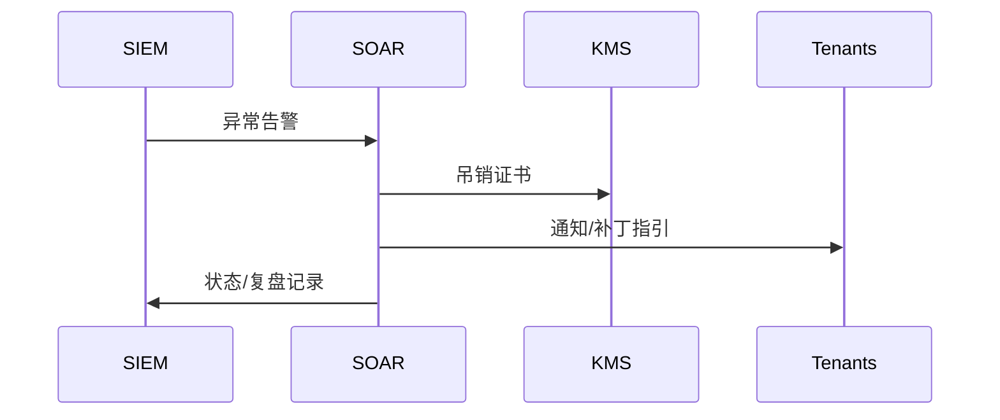

doc_id: UC-INT-PLUGIN-SIGN-RESPONSE-001
scn_id: SCN-INT-PLUGIN-SIGN-001
title: 签名事件监控与应急响应（ops/integration）
status: Draft
version: v0.1.0
repo_key: powerx
scope: powerx
layer: ops
domain: integration
scenario_title: "插件签名与验证"
owners:
  - name: Grace Lin
    role: Security & Compliance Lead
    contact: compliance@artisan-cloud.com
contributors:
  - name: Michael Hu
    role: Plugin Tech Lead
    contact: tech@artisan-cloud.com
linked_requirements:
  - id: SCN-INT-PLUGIN-SIGN-RESPONSE-001
    description: 子场景《签名事件监控与应急响应》
code_refs:
  - repo: powerx
    path: services/signing/siem/log_ingestor.ts
    description: 收集签名验证日志、证书状态变更并投递至 SIEM
  - repo: powerx
    path: services/signing/soar/playbook_runner.ts
    description: 执行吊销、隔离、租户通知等自动化 Playbook
  - repo: powerx
    path: services/signing/incident/postmortem_service.ts
    description: 事件复盘、白名单管理、整改跟踪
feature_flags:
  - PX_PLUGIN_SIGNING_SIEM
  - PX_PLUGIN_REVOKE_AUTOMATION
  - PX_PLUGIN_INCIDENT_PLAYBOOK
optional: false
last_reviewed_at: 2025-02-21

---

# Usecase Overview

- **业务目标**：监控插件签名验证日志与证书状态，一旦发现异常即触发自动吊销、隔离并通知租户，最终形成可审计的复盘报告。
- **成功度量**：签名异常事件 MTTR < 15 分钟；吊销/通知自动化覆盖 ≥80%；复盘闭环率 100%。
- **场景关联**：落实 `SCN-INT-PLUGIN-SIGN-RESPONSE-001`，与证书/构建/运行时子场景形成闭环。

# Context & Assumptions

- Feature Flags `PX_PLUGIN_SIGNING_SIEM`, `PX_PLUGIN_REVOKE_AUTOMATION`, `PX_PLUGIN_INCIDENT_PLAYBOOK` 已启用。
- SIEM/SOAR 可接收日志并执行 Playbook；KMS 支持快速吊销；租户通知通道可用。

# Solution Blueprint

## 体系分解

| 层 | 模块 | 责任 | 代码入口 |
|----|------|------|---------|
| Log Ingestor | `log_ingestor.ts` | 汇聚签名日志、证书状态、运行时校验失败 | `services/signing/siem/log_ingestor.ts` |
| SOAR Playbook Runner | `playbook_runner.ts` | 吊销证书、隔离插件、通知租户、白名单管理 | `services/signing/soar/playbook_runner.ts` |
| Postmortem Service | `postmortem_service.ts` | 复盘、白名单恢复、整改任务 | `services/signing/incident/postmortem_service.ts` |

## 流程与时序

1. **Ingest**：签名验证日志、运行时失败、证书状态变更 → SIEM。
2. **Detect & Trigger**：规则命中后触发 SOAR Playbook（吊销、隔离、通知）。
3. **Communicate**：向受影响租户/团队发送通知、提供补丁或回滚指引。
4. **Postmortem**：生成事件复盘、白名单调整、改进任务。

# Contracts & Interfaces

- `POST /siem/logs`、`POST /siem/alerts`。
- `POST /soar/playbooks/revoke`, `POST /soar/playbooks/isolate`, `POST /notifications/tenants`。
- 配置：`incident_playbooks.yaml`, `revocation_rules.yaml`。

# Implementation Checklist

| 项目 | 描述 | 完成状态 | 负责人 |
|------|------|----------|--------|
| Log Ingestor | 采集签名/运行时日志、转换为 SIEM 事件 | [ ] | Security Ops Squad |
| Playbook Runner | 自动吊销、隔离、通知、白名单控制 | [ ] | Security Ops Squad |
| Postmortem Service | 复盘模板、任务、白名单恢复 | [ ] | Governance Squad |

# Testing Strategy

- 单元：日志 parsing、规则匹配、Playbook 流程、白名单修改。
- 集成：异常签名→告警→吊销→通知→复盘闭环。
- 逆向：误报场景（白名单恢复）、告警风暴（分级策略）。

# Observability & Ops

- 指标：`plugin.signing.alert.count`, `plugin.signing.revoke.time`, `plugin.signing.false_positive_rate`, `plugin.signing.postmortem.close_rate`。
- 告警：SIEM 日志缺失、Playbook 执行失败、通知失败。

# Rollback & Failure Handling

- 吊销失败：自动重试并通知 KMS 团队；必要时手动执行。
- 白名单误操作：`playbook_runner` 提供撤销接口。
- SIEM/SOAR 故障：降级为手动流程并记录。

# Follow-ups & Risks

| 风险/事项 | 影响 | 缓解方案 | 负责人 | ETA |
|-----------|------|----------|--------|-----|
| 多租户通知链路缺少状态追踪 | 租户可能漏通知 | Security Ops Squad | 2025-03-02 |
| SOAR Playbook 未覆盖第三方 Marketplace | 响应滞后 | Marketplace Squad | 2025-03-06 |

# References & Links

- 场景：`docs/scenarios/integration/SCN-INT-PLUGIN-SIGN-001.md`
- 子场景：`docs/scenarios/integration/SCN-INT-PLUGIN-SIGN-RESPONSE-001.md`
- 配置：`incident_playbooks.yaml`, `revocation_rules.yaml`
- 发布指引：`npm run publish:usecases -- --scn-id SCN-INT-PLUGIN-SIGN-001 --validate-only`
