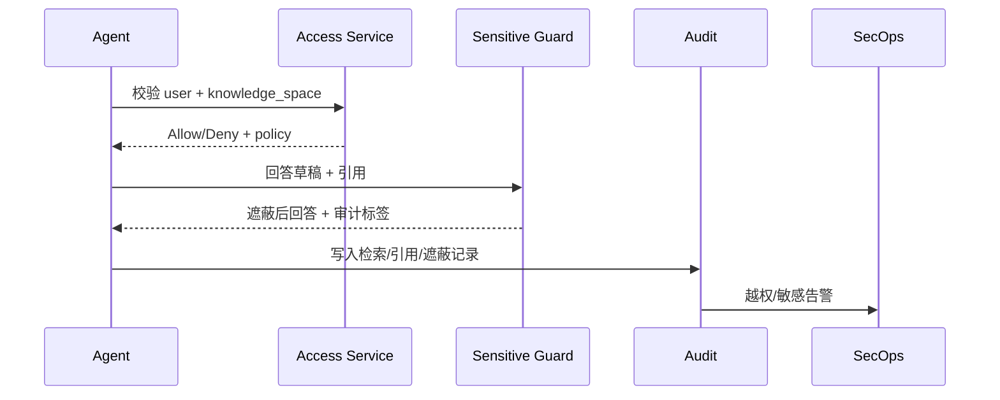

# Executive Summary

> 针对涉及敏感信息或跨租户访问的问答，系统必须在检索、生成与反馈阶段执行权限校验、敏感遮蔽，并写入完整审计链路。场景目标是实现越权拦截率 100%、敏感命中 ≥ 99%、审计日志可追溯。

# Scope & Guardrails

- **In Scope**：访问控制矩阵、知识空间授权校验、敏感字段检测/遮蔽、人工审批、审计日志（检索、引用、工具调用、回答）、越权与敏感告警。
- **Out of Scope**：IAM 用户管理、License 控制、插件部署流程。
- **Environment & Flags**：启用 `PX_QA_ACCESS_CHECK`, `PX_QA_SENSITIVE_MASK`, `PX_AUDIT_STREAM`; 需要 `iam-service`, `security-policy`, `audit-ledger` 处于活跃状态。

# Participants & Responsibilities

| Scope | Repository | Layer | 责任与交付物 | Owners |
|-------|------------|-------|--------------|--------|
| Access Evaluator | powerx-core | service | 根据租户/角色/知识空间执行访问校验，返回决策 | Security & Compliance Squad |
| Sensitive Data Guard | powerx-core | service | 识别并遮蔽敏感字段，触发人工审批或替代文案 | Data Security Squad |
| Audit Ledger | powerx-core | service | 记录检索请求、引用 chunk、工具调用、回答输出与反馈 | Platform Observability Squad |

# End-to-End Flow

1. **Stage 1 – Authorization Check**：在检索计划阶段校验 `user_id` 与目标知识空间的访问矩阵，拒绝越权请求。
2. **Stage 2 – Sensitive Inspection**：回答生成前执行敏感检测，对命中字段进行遮蔽或请求额外授权。
3. **Stage 3 – Audit Write**：将检索、引用、工具调用与遮蔽动作写入审计（含 trace ID、租户、知识空间、chunk ID）。
4. **Stage 4 – Alert & Escalation**：越权或敏感违规触发告警，必要时暂停回答并通知安全团队；提供审计查询接口用于复盘。

# Key Interactions & Contracts

- **APIs / Events**：`POST /security/access/check`, `POST /security/sensitive/detect`, `POST /security/sensitive/mask`, `POST /audit/logs`, `POST /alerts/security`。
- **Configs / Schemas**：`knowledge_access_matrix.yaml`, `sensitive_dictionary.yaml`, `audit_record_schema.json`, `security_runbook.md`。
- **Security / Compliance**：所有接口需双向 TLS，审计日志写入后不可篡改并具备租户隔离；敏感遮蔽需标记处理规则与责任人。

# Usecase Links

- `UC-KNOWLEDGE-QA-MASKING-001` — 正向：敏感字段模糊化/提示需授权（Service 层，powerx-core）。
- `UC-KNOWLEDGE-QA-AUTHZ-001` — 逆向：越权访问被拦截并产生审计告警（Service 层，powerx-core）。

# Acceptance Criteria

1. 所有检索与回答都必须经过访问校验，越权拦截率 100%，失败响应包含明确提示与审计 ID。
2. 敏感检测命中率 ≥ 99%，遮蔽策略可配置，人工审批 SLA ≤ 15 分钟。
3. 审计日志覆盖检索、引用、工具调用、遮蔽、反馈，且支持按会话/用户查询。

# Telemetry & Ops

- 指标：`security.access.check_count`, `security.access.denied`, `security.sensitive.hit_rate`, `security.audit.write_latency`, `security.alert.count`。
- 告警阈值：任何越权成功事件、敏感命中率 < 98%、审计写入失败、告警未在 5 分钟内确认。
- 观测来源：`Security & Compliance` 仪表盘、`reports/_state/qa-security.json`、SIEM 告警流。

# Open Issues & Follow-ups

| 风险/事项 | 影响范围 | 负责人 | ETA |
|-----------|----------|--------|-----|
| docmap 缺少 `SCN-KNOWLEDGE-QA-COMPLIANCE-001` | 文档导航 | Docs Steward Team | 2025-02-20 |
| 与 IAM 团队确认知识空间访问矩阵的同步频率 | 权限一致性 | Security & Compliance Squad | 2025-02-28 |

# Appendix

- 背景：`docs/meta/scenarios/powerx/agent-and-automation/knowledge-and-reasoning/intelligent-qa-and-reasoning/primary.md`（子场景 E）。
- 关联：`SCN-KNOWLEDGE-QA-REASON-001`, `SCN-KNOWLEDGE-QA-TOOL-001`。
