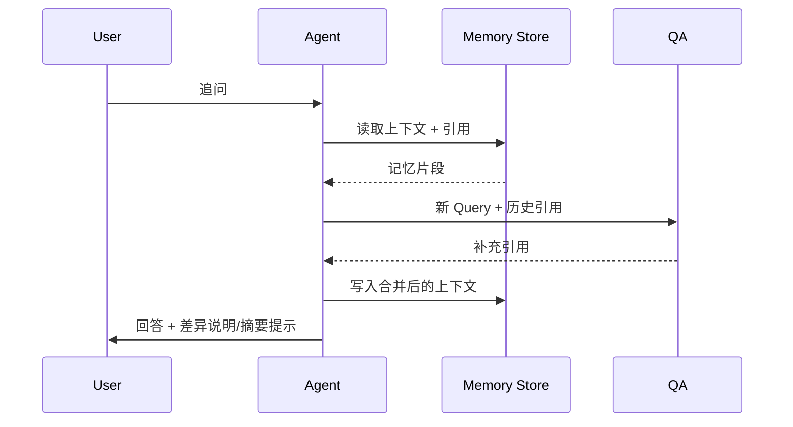

# Executive Summary

> 本场景负责保存多轮对话状态、引用链路与差异说明，确保用户追问时能够复用历史信息而不重复回答，并在上下文超长时触发摘要策略。

多轮记忆是实现企业级问答体验的关键。系统需在上下文准确率 ≥95% 的前提下，控制 token/存储成本，并为回答附带引用差异说明和提示。该能力还需与安全与反馈场景共享记忆及日志。

# Scope & Guardrails

- **In Scope**：对话状态持久化、引用缓存、差异标记、上下文摘要/截断策略、记忆写入审计。
- **Out of Scope**：首次问题的跨空间检索、复杂工具推理、UI 呈现、聊天标签管理。
- **Environment & Flags**：依赖 `PX_AGENT_MEMORY`, `PX_QA_CONTEXT_SUMMARY`，需要接入 Redis/Vector Store 作为记忆存储，并与 QA Orchestrator 共用租户隔离配置。

# Participants & Responsibilities

| Scope | Repository | Layer | 责任与交付物 | Owners |
|-------|------------|-------|--------------|--------|
| Dialogue Memory | powerx-core | application | 管理会话线程、上下文切片、引用缓存 | Agent Experience Squad |
| Context Summarizer | powerx-core | service | 触发摘要、差异检测、引用合并 | Knowledge Ops Squad |
| Audit & UX Bridge | powerx-core | service | 输出差异提示、写入审计、提供 UI 标签 | Security & Compliance Squad |

# End-to-End Flow

1. **Stage 1 – Memory Write**：问题与回答完成后写入记忆（包含引用 chunk ID、工具结果、评分）。
2. **Stage 2 – Follow-up Retrieval**：接收追问时，读取最新记忆并生成新的查询，标记需要重用或补充的引用。
3. **Stage 3 – Delta Composition**：整合新增结果与历史引用，生成差异说明与“已回答”提示。
4. **Stage 4 – Summarization / Truncation**：若对话超过阈值，执行摘要并提示用户；摘要后的上下文需再次写入记忆并记录审计。

# Key Interactions & Contracts

- **APIs / Events**：`POST /agent/memory/write`, `POST /agent/memory/query`, `POST /qa/context/diff`, `POST /agent/memory/summarize`。
- **Configs / Schemas**：`dialogue_memory_schema.json`, `context_summary_policies.yaml`, `citation_delta.md`。
- **Security / Compliance**：记忆与引用必须按租户、知识空间隔离；摘要输出需保留引用映射，防止丢失血缘。

# Usecase Links

- `UC-KNOWLEDGE-QA-CONTEXT-001` — 正向：追问后沿用历史引用并输出差异说明（Application 层，powerx-core）。
- `UC-KNOWLEDGE-QA-SUMMARY-001` — 逆向：上下文超长触发摘要并提示用户（Service 层，powerx-core）。

# Acceptance Criteria

1. 对话记忆命中率 ≥ 95%，重复回答率 < 2%，差异说明覆盖所有新增引用。
2. 当上下文超过配置阈值（默认 20 轮）时，自动触发摘要并提示，且引用仍可追溯。
3. 记忆写入/读取需在 150 ms 内完成，失败需降级到短期缓存并记录。

# Telemetry & Ops

- 指标：`agent.memory.hit_rate`, `qa.context.delta_rate`, `agent.summary.trigger_rate`, `agent.memory.latency_ms`。
- 告警阈值：记忆命中率 < 90%、摘要触发率 > 30%（提示策略调整）、重复回答率 > 5%。
- 观测来源：`Agent Dialogue` 仪表盘、`reports/_state/qa-context.json`、对话审计日志。

# Open Issues & Follow-ups

| 风险/事项 | 影响范围 | 负责人 | ETA |
|-----------|----------|--------|-----|
| docmap 未登记 `SCN-KNOWLEDGE-QA-CONTEXT-001` | 文档导航 | Docs Steward Team | 2025-02-20 |
| 需补充记忆存储容量 / TTL 的运维手册 | 运维、成本控制 | Platform Ops | 2025-02-28 |

# Appendix

- 背景：`docs/meta/scenarios/powerx/agent-and-automation/knowledge-and-reasoning/intelligent-qa-and-reasoning/primary.md`（子场景 B）。
- 相关用例：`SCN-KNOWLEDGE-QA-RETRIEVE-001`（检索阶段输入）。
