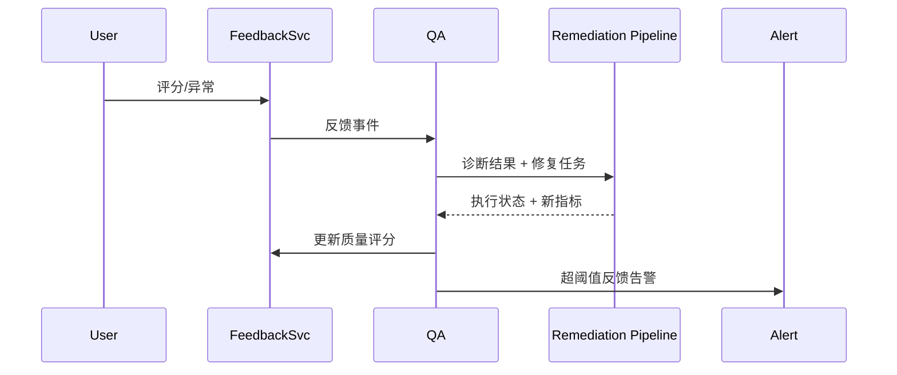

# Executive Summary

> 用户评分、异常标注与审计信号需要沉淀为可执行的修复任务，确保答案质量问题能在 24 小时内定位并回测效果。本场景定义反馈收集、引用回溯、再加工与升级告警的标准流程。

# Scope & Guardrails

- **In Scope**：反馈采集 API、评分模型、引用回溯、问题定位（chunk 过时/图谱缺漏/工具异常）、触发再检索/再切分/重排序训练、质量回归测试、告警升级。
- **Out of Scope**：知识空间初次构建、工具连接维护、用户界面控件、费用结算。
- **Environment & Flags**：启用 `PX_QA_FEEDBACK_LOOP`, `PX_QA_AUTOFIX`, `PX_QA_ALERT`. 需接入 `feedback-service`, `knowledge-space`、`tool-runtime`、`audit-ledger`。

# Participants & Responsibilities

| Scope | Repository | Layer | 责任与交付物 | Owners |
|-------|------------|-------|--------------|--------|
| Feedback Collector | powerx-core | service | 采集评分/标签、写入事件、关联会话上下文 | Agent Experience Squad |
| Root Cause Analyzer | powerx-core | service | 回溯引用与工具轨迹，定位问题源，生成修复计划 | Knowledge Ops Squad |
| Remediation Runner | powerx-core | data | 触发再切分/再检索/模型重训练并校验指标 | Data Platform Squad |
| Alerting | powerx-core | service | 监控反馈量级、触发高优告警与人工审核 | Security & Compliance Squad |

# End-to-End Flow

1. **Stage 1 – Feedback Capture**：终端用户或质检人员对回答进行评分/标注，事件写入 `feedback-service`。
2. **Stage 2 – Trace & Diagnose**：系统回溯引用 chunk、工具调用、知识空间版本，识别问题分类（过时、遗漏、敏感等）。
3. **Stage 3 – Remediation**：根据分类触发流水线（再检索、再切分、重排序训练或人工修复），记录执行状态。
4. **Stage 4 – Regression & Close Loop**：修复完成后自动回测相同问题，更新质量评分并关闭反馈或升级。

# Key Interactions & Contracts

- **APIs / Events**：`POST /qa/feedback`, `GET /qa/feedback/:id`, `POST /qa/feedback/diagnose`, `POST /qa/remediation/jobs`, `POST /alerts/emit`。
- **Configs / Schemas**：`feedback_event_schema.json`, `remediation_playbook.yaml`, `quality_scorecard.md`。
- **Security / Compliance**：反馈事件需脱敏并按租户隔离；所有修复任务要引用审计 ID，并可被监管回溯。

# Usecase Links

- `UC-KNOWLEDGE-QA-FEEDBACK-001` — 正向：反馈修复 24 小时闭环（Service 层，powerx-core）。
- `UC-KNOWLEDGE-QA-FEEDBACK-ALERT-001` — 逆向：短时间内 50 次负反馈触发高优告警（Data 层，powerx-core）。

# Acceptance Criteria

1. 反馈定位准确率 ≥ 90%，从提交到修复上线 ≤ 24 小时，并自动回测同类问题。
2. 反馈闭环率 ≥ 95%，质量评分提升 ≥ 30%，修复失败需自动回滚并保留审计记录。
3. 负反馈激增触发 P1 告警并自动升级至人工审核队列。

# Telemetry & Ops

- 指标：`qa.feedback.count`, `qa.feedback.loop_time`, `qa.feedback.fix_accuracy`, `qa.feedback.alert_rate`。
- 告警阈值：loop_time > 24h、fix_accuracy < 85%、alert_rate > 5/min。
- 观测来源：`QA Feedback` 仪表盘、`reports/_state/qa-feedback.json`、Alertmanager。

# Open Issues & Follow-ups

| 风险/事项 | 影响范围 | 负责人 | ETA |
|-----------|----------|--------|-----|
| docmap 需新增 `SCN-KNOWLEDGE-QA-FEEDBACK-001` | 文档导航 | Docs Steward Team | 2025-02-20 |
| Remediation pipeline 与知识空间再加工脚本尚未串联 | 自动化闭环 | Knowledge Ops Squad | 2025-03-05 |

# Appendix

- 背景：`docs/meta/scenarios/powerx/agent-and-automation/knowledge-and-reasoning/intelligent-qa-and-reasoning/primary.md`（子场景 D）。
- 依赖：`SCN-KNOWLEDGE-SPACE-001`, `SCN-KNOWLEDGE-QA-REASON-001`。
