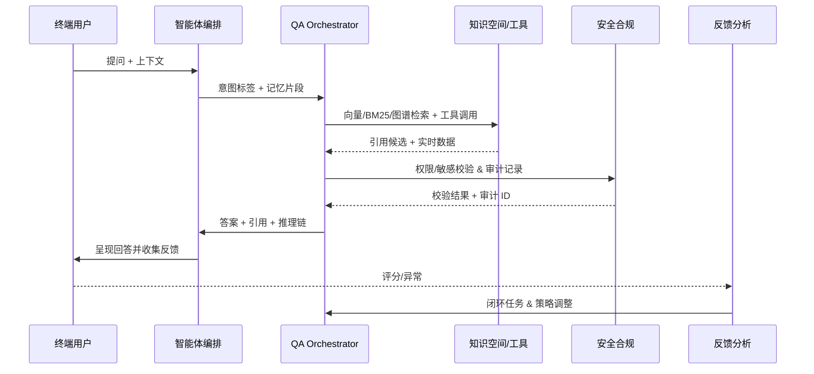

# Positioning & Goals

> 智能问答与推理场景聚焦“用户提问 → 多知识空间检索 → 工具推理 → 答案引用 → 安全与反馈闭环”的整条链路，目标是在企业级环境中输出可信、可追溯、可审计的回答。

PowerX 需要在现有知识空间与 Agent 编排能力之上，补齐跨空间检索、上下文记忆、复杂推理链、合规控制与反馈治理。场景成功的衡量标准包括：跨空间检索响应 ≤ 2 秒、引用覆盖 ≥ 95%、实时工具调用成功率 ≥ 99%、越权拦截率 100% 与负反馈 24 小时内闭环。本文定义主要角色（终端用户、智能体编排、QA Orchestrator、知识空间服务、安全合规、反馈分析）、关键依赖与验收指标，为子场景与 Usecase Seed 提供统一基线。

# Scope & Guardrails

- **In Scope**：QA Orchestrator、Agent 对话状态管理、跨知识空间检索策略、工具/插件协同、回答引用生成、敏感信息过滤、反馈闭环自动化。
- **Out of Scope**：知识源解析/切分（另见 `SCN-KNOWLEDGE-SPACE-001`）、模型微调与私有 LLM 训练、前端聊天 UI 细节、非业务类闲聊、插件 Marketplace 发布流。
- **Environment & Flags**：需启用 `PX_QA_ORCHESTRATOR`, `PX_AGENT_MEMORY`, `PX_SECURITY_AUDIT_LOG`。依赖 `knowledge-space`、`tool-runtime`、`feedback-service`、`audit-ledger` 等服务在同一租户内可用。

# Participants & Responsibilities

| Scope | Repository | Layer | 责任与交付物 | Owners |
|-------|------------|-------|--------------|--------|
| QA Orchestrator | powerx-core | service | 实现多策略检索、推理链路记录、引用血缘、反馈闭环触发 | Core Platform Squad |
| Agent Dialogue Orchestrator | powerx-core | application | 解析意图、维护对话记忆、路由工具调用、协调回答合成 | Agent Experience Squad |
| Security & Audit Mesh | powerx-core | service | 权限校验、敏感检测、审计日志写入与越权告警 | Security & Compliance Squad |
| Feedback Intelligence | powerx-core | data | 质量评分、反馈聚合、再训练/再检索触发脚本 | Knowledge Ops Squad |

# Core Capabilities

1. **多知识空间检索**：根据意图标签组合向量/BM25/图谱策略，动态选择知识空间并输出引用候选（对应 `SCN-KNOWLEDGE-QA-RETRIEVE-001`）。
2. **多轮上下文与记忆**：维护对话记忆栈、引用差异、摘要策略，避免重复回答并保持连续性（`SCN-KNOWLEDGE-QA-CONTEXT-001`）。
3. **工具协同推理**：构建推理计划，串联 SQL/REST/规则引擎，记录每一步链路用于审计与复盘（`SCN-KNOWLEDGE-QA-TOOL-001`）。
4. **安全合规与审计**：在检索与回答阶段执行权限校验、敏感检测、审计写入，并对越权/泄露触发告警（`SCN-KNOWLEDGE-QA-COMPLIANCE-001`）。
5. **反馈闭环与修复**：采集评分、诊断引用问题、触发再加工/重排、验证修复效果，形成数据驱动的优化循环（`SCN-KNOWLEDGE-QA-FEEDBACK-001`）。

# End-to-End Flow

1. **Stage 1 – Intent Intake & Routing**：终端用户通过聊天界面提问；智能体编排服务抽取意图、租户、上下文标签并记录对话状态。
2. **Stage 2 – Cross-space Retrieval**：QA Orchestrator 依据标签选择知识空间，组合向量/BM25/图谱查询并重排序，输出引用候选与置信度。
3. **Stage 3 – Reasoning & Tool Chaining**：当查询需要实时或结构化数据时，Agent 触发 SQL/REST 插件、规则引擎或小模型，构建推理链并记录每一步执行。
4. **Stage 4 – Answering, Compliance & Feedback**：答案生成前执行敏感屏蔽与权限校验，产出附带引用/推理链的回答并写入审计；之后接收评分或异常反馈，触发回溯和修复流程。

# Key Interactions & Contracts

- **APIs / Events**：`POST /qa/intents/analyze`, `POST /qa/retrieval/multi-space`, `POST /qa/answers/compose`, `POST /tools/sql/run`, `POST /audit/logs`, `POST /feedback/events`。
- **Configs / Schemas**：`docs/standards/knowledge/knowledge_space_schema.md`, `docs/standards/security/audit_event.md`, `docs/standards/agent/memory_record.md`。
- **Security / Compliance**：必须在检索与回答阶段校验 `tenant_id + knowledge_space_id` 访问矩阵；敏感字段由 `data_masking_policies` 表驱动；所有推理链节点写入 `audit.reasoning_steps`，便于合规复盘。

# Validation Workflow

1. **跨空间检索回归**：在沙箱租户 `demo-corp` 中执行 `scripts/dev/seed_intelligent_qa.mjs`，使用用例 A-1/A-2 验证跨空间召回、降级提示与审计字段。
2. **多轮上下文演练**：复现用例 B-1/B-2，观察记忆命中率、摘要触发、引用差异说明，并通过 `reports/_state/qa-context.json` 校验指标。
3. **工具协同与 failover**：执行用例 C-1/C-2，确认 SQL/规则调用成功率与回退策略，检查 `qa.failover.count` 与审计链路。
4. **反馈闭环与合规**：批量触发用例 D-1/D-2、E-1/E-2，确保反馈 SLA、越权拦截、敏感遮蔽、告警升级均按期生效，日志写入 `audit-ledger`、`qa-feedback` 仪表。

# Related Links

- `UC-KNOWLEDGE-QA-E2E-001` — 主流程：从提问到回答与引用回写（Application 层，powerx-core）。
- `UC-KNOWLEDGE-QA-GOV-001` — 安全合规与反馈治理：越权拦截、敏感遮蔽、24h 闭环（Service 层，powerx-core）。
- 子场景：`SCN-KNOWLEDGE-QA-RETRIEVE-001`、`SCN-KNOWLEDGE-QA-CONTEXT-001`、`SCN-KNOWLEDGE-QA-TOOL-001`、`SCN-KNOWLEDGE-QA-FEEDBACK-001`、`SCN-KNOWLEDGE-QA-COMPLIANCE-001`。
- 依赖场景：`SCN-KNOWLEDGE-SPACE-001`（知识空间构建）、`SCN-KNOWLEDGE-RAG-FEEDBACK-001`（RAG 反馈）。
- Meta 参考：`docs/meta/scenarios/powerx/agent-and-automation/knowledge-and-reasoning/intelligent-qa-and-reasoning/primary.md`。

# Acceptance Criteria

1. 基于意图标签可在 ≥2 个知识空间间动态选择检索策略，响应时间 ≤ 2 秒且引用覆盖 ≥ 95%。
2. 推理链必须包含知识片段、工具调用与规则判断的血缘记录，并在审计面板可回放。
3. 多轮上下文记忆命中率 ≥ 95%，越权访问拦截率 100%，负向反馈需在 24 小时内闭环并回测修复效果。

# Telemetry & Ops

- 指标：`qa.retrieval.latency_ms`, `qa.cross_space.hit_rate`, `qa.reasoning.tool_success_rate`, `qa.feedback.loop_time`, `qa.security.violations`。
- 告警阈值：检索 p95 > 2s、跨空间命中率 < 90%、工具成功率 < 98%、反馈 SLA > 24h、出现任何越权事件即触发 P1 告警。
- 观测来源：Grafana `QA Orchestrator` 与 `Agent Dialogue` 仪表盘、`reports/_state/workflows/SCN-KNOWLEDGE-QA-REASON-001.json`、Audit Lakehouse 查询。

# Architecture Diagram

# Open Issues & Follow-ups

| 风险/事项 | 影响范围 | 负责人 | ETA |
|-----------|----------|--------|-----|
| docmap 尚未登记 `SCN-KNOWLEDGE-QA-REASON-001` 及其子场景 | 文档导航、sidebar 构建 | Docs Steward Team | 2025-02-20 |
| Usecase Seed (`UC-KNOWLEDGE-QA-*`) 仍缺失 | 端到端验证脚本 | Knowledge Ops Squad | 2025-02-28 |

# Appendix

- 背景参考：`docs/meta/scenarios/powerx/agent-and-automation/knowledge-and-reasoning/intelligent-qa-and-reasoning/primary.md`
- 依赖场景：`SCN-KNOWLEDGE-SPACE-001`（知识空间构建）、`SCN-KNOWLEDGE-RAG-FEEDBACK-001`（RAG 反馈）。
- 相关任务：`specs/004-publish-hub-spec` 中的 QA 交付物、`docs/guides/publish/local-install.md`（用于内测环境验证）。
