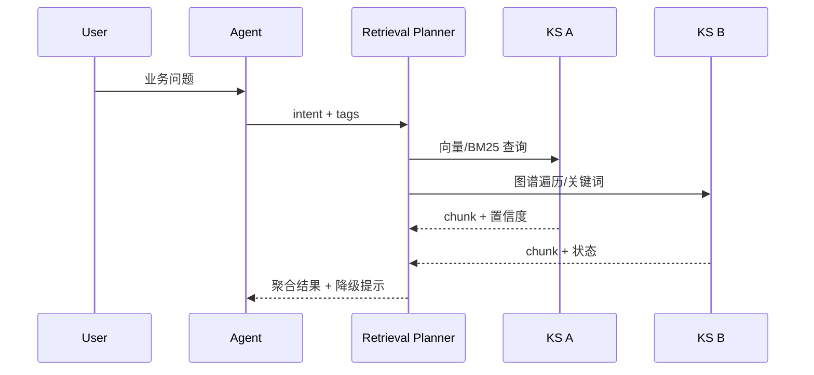

# Executive Summary

> 该子场景确保智能体收到问题后，能够在多个知识空间之间自动选择最优检索策略，并在 2 秒内返回带引用的候选答案，即便部分空间不可用也能降级输出。

能力核心是“意图理解 + 标签映射 + 多策略检索 + 重排序 + 引用聚合”。终端用户期望一次提问即可覆盖多个业务域信息，因此需要 QA Orchestrator 在跨空间召回、引用血缘、降级提示与性能指标之间取得平衡。

# Scope & Guardrails

- **In Scope**：领域标签提取、向量/BM25/图谱组合检索、跨空间召回权重、自适应重排序、引用聚合与降级提示。
- **Out of Scope**：知识空间入库流程、对话上下文记忆、工具/SQL 调用、回答呈现 UI。
- **Environment & Flags**：依赖 `PX_QA_MULTI_SPACE`, `PX_QA_DEGRADE_NOTICE`，需要至少两个知识空间在线并在租户内授权。

# Participants & Responsibilities

| Scope | Repository | Layer | 责任与交付物 | Owners |
|-------|------------|-------|--------------|--------|
| Intent & Tagging | powerx-core | service | 解析问题、抽取领域与上下文标签、写入评分 | Agent Experience Squad |
| Retrieval Planner | powerx-core | service | 根据标签路由知识空间、选择检索策略、聚合结果 | Knowledge Ops Squad |
| Observability | powerx-core | service | 记录响应时间、召回准确率、降级原因、审计追踪 | Platform Observability Squad |

# End-to-End Flow

1. **Stage 1 – Intent Parsing**：Agent 编排服务接收问题并输出 `intent`, `domain_tags`, `context_keywords`。
2. **Stage 2 – Retrieval Planning**：QA Orchestrator 根据标签映射出候选知识空间，生成包含向量/BM25/图谱的策略组合，处理不可用空间的降级路径。
3. **Stage 3 – Execution & Rerank**：并行调用各空间的检索接口，将片段合并、重排序并计算引用覆盖度。
4. **Stage 4 – Response Packaging**：返回前检查 SLA、写入审计与降级提示，将引用候选提供给回答生成阶段。

# Key Interactions & Contracts

- **APIs / Events**：`POST /qa/intents/tag`, `POST /qa/retrieval/multi-space`, `GET /knowledge-spaces/:id/status`, `POST /audit/events`。
- **Configs / Schemas**：`knowledge_space_routing.yaml`（标签→空间映射）、`retrieval_strategy.json`（BM25/向量/图谱权重）、`degrade_notice.md`（降级文案）。
- **Security / Compliance**：路由前调用 IAM 校验访问矩阵；降级时需写入 `audit.retrieval.degrade_reason` 并提示用户受影响的空间。

# Usecase Links

- `UC-KNOWLEDGE-QA-RETRIEVE-001` — 正向：跨空间检索并在 2 秒内返回引用（Service 层，powerx-core）。
- `UC-KNOWLEDGE-QA-DEGRADE-001` — 逆向：空间不可用时降级提示与审计记录（Service 层，powerx-core）。

# Acceptance Criteria

1. 任一问题都能在配置的知识空间集合内完成召回，响应时间 ≤ 2 秒，引用覆盖率 ≥ 95%。
2. 检索失败或空间不可用时需切换备份或提示降级，审计记录包含原因与影响范围。
3. 澄清提问触发率维持 < 10%，并提供统一文案与追踪指标。

# Telemetry & Ops

- 指标：`qa.retrieval.latency_ms`, `qa.cross_space.hit_rate`, `qa.degrade.count`, `qa.clarify.rate`。
- 告警阈值：p95 > 2s、命中率 < 90%、降级连续出现 3 次、澄清率 > 15%。
- 观测来源：`QA Retrieval` Grafana 看板、`reports/_state/qa-retrieval.json`、Audit Lakehouse。

# Open Issues & Follow-ups

| 风险/事项 | 影响范围 | 负责人 | ETA |
|-----------|----------|--------|-----|
| 需在 docmap 中挂载 `SCN-KNOWLEDGE-QA-RETRIEVE-001` | 场景导航 | Docs Steward Team | 2025-02-20 |
| `UC-KNOWLEDGE-QA-RETRIEVE-001`/`DEGRADE-001` 尚未落地 | 测试脚本 | Knowledge Ops Squad | 2025-02-28 |

# Appendix

- 背景：`docs/meta/scenarios/powerx/agent-and-automation/knowledge-and-reasoning/intelligent-qa-and-reasoning/primary.md`（子场景 A）。
- 依赖场景：`SCN-KNOWLEDGE-SPACE-001`（知识空间构建）。
