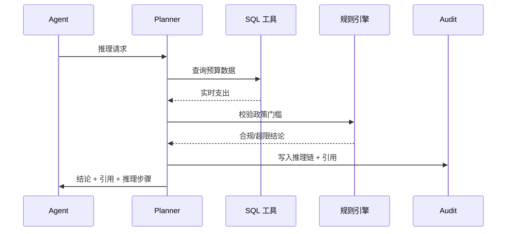

# Executive Summary

> 当问题需要实时数据或复杂运算时，QA Orchestrator 必须协调 SQL/BI/规则引擎等工具，与知识片段一起构建可追溯的推理链，并在工具失败时提供降级方案。

场景目标是在保证实时数据调用成功率 ≥ 99% 的同时，输出包含政策条款 + 数据来源 + 推理步骤的结论，且每一步都可回放。失败时需回退到缓存或人工审核。

# Scope & Guardrails

- **In Scope**：推理计划生成、工具选择策略、SQL/REST 调用、规则引擎执行、推理链记录、失败降级与人工升级。
- **Out of Scope**：工具自身的连接管理、数据仓库建模、反馈闭环（另见场景 D）。
- **Environment & Flags**：启用 `PX_QA_TOOLCHAIN`, `PX_TOOL_FAILOVER`, `PX_AUDIT_REASONING`；要求工具注册于 `tool-registry` 并具备健康检查。

# Participants & Responsibilities

| Scope | Repository | Layer | 责任与交付物 | Owners |
|-------|------------|-------|--------------|--------|
| Reasoning Planner | powerx-core | application | 生成推理步骤、确定所需工具、记录链路 | Agent Experience Squad |
| Tool Runtime | powerx-core | service | 执行 SQL/REST/规则，返回结构化结果与日志 | Tooling Squad |
| Audit & Safety | powerx-core | service | 记录推理链、处理失败降级、触发人工审核 | Security & Compliance Squad |

# End-to-End Flow

1. **Stage 1 – Plan Build**：根据问题类型与检索结果，形成含知识片段 + 工具操作的推理 DAG。
2. **Stage 2 – Tool Invocation**：顺序或并行执行工具操作，写入中间结果与耗时。
3. **Stage 3 – Chain Assembly**：聚合工具输出、知识引用与规则判断，生成结论与链路说明。
4. **Stage 4 – Failover / Escalation**：若工具失败，切换到缓存或提示用户；必要时升级到人工审核并写入告警。

# Key Interactions & Contracts

- **APIs / Events**：`POST /qa/reasoning/plan`, `POST /tools/sql/run`, `POST /tools/rule/execute`, `POST /qa/reasoning/failover`, `POST /audit/reasoning`。
- **Configs / Schemas**：`tool_registry.yaml`, `reasoning_plan_schema.json`, `failover_policy.md`。
- **Security / Compliance**：工具调用需携带租户/用户授权；推理链必须写入审计表 `audit.reasoning_steps`，并附带引用 chunk 与工具输出摘要。

# Usecase Links

- `UC-KNOWLEDGE-QA-TOOL-001` — 正向：SQL + 知识片段协同输出预算超标判断（Application 层，powerx-core）。
- `UC-KNOWLEDGE-QA-TOOL-FAILOVER-001` — 逆向：工具 500 时回退到缓存或提示用户（Service 层，powerx-core）。

# Acceptance Criteria

1. 推理链必须完整记录知识片段、工具输入输出与规则判断，且可按会话 ID 回放。
2. 实时工具调用成功率 ≥ 99%，失败自动触发 failover 并写入审计；重复失败时发出告警。
3. 当推理冲突或缺少可信数据时，系统需升级到人工审核并提供上下文。

# Telemetry & Ops

- 指标：`qa.tool.success_rate`, `qa.reasoning.chain_length`, `qa.failover.count`, `qa.audit.reasoning_latency`。
- 告警阈值：工具成功率 < 98%、failover 连续 3 次、推理链记录失败、人工审核率 > 5%（需排查策略）。
- 观测来源：`Tool Runtime` 仪表盘、`reports/_state/qa-toolchain.json`、Audit Lakehouse。

# Open Issues & Follow-ups

| 风险/事项 | 影响范围 | 负责人 | ETA |
|-----------|----------|--------|-----|
| docmap 待新增 `SCN-KNOWLEDGE-QA-TOOL-001` | 文档导航 | Docs Steward Team | 2025-02-20 |
| failover 策略需与 SRE 团队对齐（缓存有效期） | 可用性与成本 | Tooling Squad | 2025-02-28 |

# Appendix

- 背景：`docs/meta/scenarios/powerx/agent-and-automation/knowledge-and-reasoning/intelligent-qa-and-reasoning/primary.md`（子场景 C）。
- 关联场景：`SCN-KNOWLEDGE-QA-RETRIEVE-001`（输入）与 `SCN-KNOWLEDGE-QA-COMPLIANCE-001`（输出审计）。
