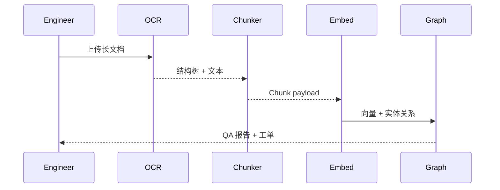

scn_id: SCN-KNOWLEDGE-LONGDOC-001
title: 长篇文档分层切分与入库
status: Draft
version: v0.1.0
owners:
  - name: Michael Hu
    role: Product Manager
    contact: matrix-x@artisan-cloud.com
domains: [knowledge]
layers: [data]
repos:
  - key: powerx-core
    scope: ingestion
    responsibility: OCR、结构解析、chunk 化与索引写入
related_usecases:
  - doc_id: SCN-KNOWLEDGE-SPACE-001
    layer: service
    domain: knowledge
last_reviewed_at: 2025-11-12

---

# Executive Summary

该子场景面向 300 页以上的 PDF/手册等长篇材料，聚焦“解析 → 分层切分 → 嵌入 → 图谱同步”的自动化处理。目标是将章节/小节/段落映射成多粒度 chunk（章节摘要 ≈800 tokens、段落片段 ≈300 tokens），实现高覆盖率与高质量索引，并为 RAG 提供结构化引用（页码、术语、跳转关系）。关键角色：知识工程师、OCR 服务、结构解析器、嵌入服务、图谱写入器、人工校验工单系统。

# Scope & Guardrails

- **In Scope**：OCR、目录解析、层级切分、滑动窗口 + 语义聚类、向量/关键词/图谱同步、失败节点回滚。
- **Out of Scope**：空间创建、表格/API 数据处理、Agent 消费端体验。
- **Environment & Flags**：需启用 `ocr.enabled`, `longdoc.chunking`, `graph.sync`，并具备 GPU/LLM 资源用于结构解析与摘要。

# Participants & Responsibilities

| Scope | Repository | Layer | 责任与交付物 | Owners |
|-------|------------|-------|--------------|--------|
| OCR & Layout Service | powerx-core | data | 提供版面/章节解析、图像识别 | Data Infra Team |
| Chunk Builder | powerx-core | data | 多粒度切分、滑动窗口、语义聚类 | Knowledge Platform Team |
| Embedding & Graph Writer | powerx-core | data | 向量化、关键词抽取、术语/实体写入图谱 | AI Infra Team |

# End-to-End Flow

1. **Stage 1 – Intake & Layout Detection**：上传 PDF → 触发 OCR（如需）与目录/页眉解析，生成结构树。
2. **Stage 2 – Hierarchical Chunking**：按章节→小节→段落切分，结合滑动窗口/语义聚类生成多粒度 chunk，附带 token 统计、页码、父子引用。
3. **Stage 3 – Representation Build**：对 chunk 计算嵌入、关键词、实体/关系三元组；失败 chunk 自动重试 3 次并进入人工队列。
4. **Stage 4 – Publish & QA**：向量写入、倒排索引、图谱更新、血缘记录，产出 QA 报告（chunk 覆盖率、平均 token、失败原因）。

# Key Interactions & Contracts

- **APIs / Events**：`POST /ingestion/longdoc`, `GET /ingestion/{job_id}`, Event `knowledge.chunk.failed`（附页码/原因）。
- **Configs / Schemas**：Chunk schema（chunk_id, source_doc, hierarchy_path, token_count, page_range, vector_id, entity_refs），QA report schema。
- **Security / Compliance**：在 OCR/解析过程中继承空间级脱敏策略；原始文档存储在加密桶，访问需审计。

# Usecase Links

- `SCN-KNOWLEDGE-SPACE-001` — 主链路。

# Acceptance Criteria

1. chunk 覆盖率 ≥95%，平均 chunk token 300±50（段落级）/800（摘要级）；嵌入成功率 100%。
2. 结构解析失败需自动生成人工校验任务，未完成节点阻断发布，审计记录原因。
3. 图谱实体准确率 ≥90%，引用路径可从 chunk 回溯到页码/原文。

# Telemetry & Ops

- 指标：OCR 成功率、chunk 覆盖率、嵌入吞吐、图谱实体质量评分、平均处理时长。
- 告警阈值：OCR 失败率 >2%、嵌入延迟 > 30s、chunk 覆盖率 < 95%。
- 观测来源：`longdoc-ingestion` dashboard、`reports/_state/ingestion-longdoc.json`。

# Open Issues & Follow-ups

| 风险/事项 | 影响范围 | 负责人 | ETA |
|-----------|----------|--------|-----|
| 数学公式/表格的 OCR 支持不足 | 特殊行业资料 | Data Infra Team | 2026-01-05 |

# Appendix

- 长文档样例：《财务合规白皮书.pdf》
- 参考脚本：`scripts/ingestion/longdoc-batch.mjs`
