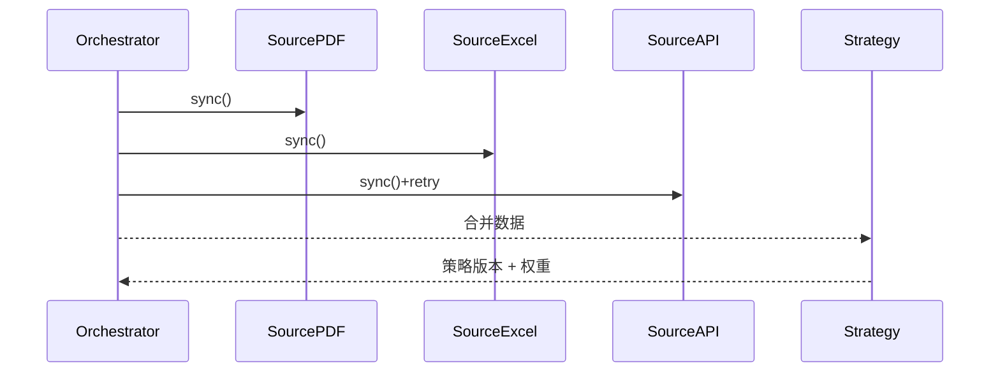

scn_id: SCN-KNOWLEDGE-MULTISRC-001
title: 多源知识融合与策略组合
status: Draft
version: v0.1.0
owners:
  - name: Michael Hu
    role: Product Manager
    contact: matrix-x@artisan-cloud.com
domains: [knowledge]
layers: [service, data]
repos:
  - key: powerx-core
    scope: fusion
    responsibility: 多源接入、策略权重、重排序与图谱联动
related_usecases:
  - doc_id: SCN-KNOWLEDGE-SPACE-001
    layer: service
    domain: knowledge
last_reviewed_at: 2025-11-12

---

# Executive Summary

该子场景将长文（政策 PDF）、结构化表格（费用 Excel）与实时 API（额度服务）融合，构建“条款 → 费用项 → 实时额度”的知识链路，并配置混合检索策略（BM25 + 向量 + 图谱约束）及上下文重排序（cross-encoder）。目标是在 1 小时内完成三类数据首轮同步，让检索准确率提升 ≥15%，同时具备 API 故障重试、冲突处理与策略回滚能力。

# Scope & Guardrails

- **In Scope**：多源任务流配置、同步调度、权重设置、冲突检测、策略版本管理、图谱链路构建。
- **Out of Scope**：单一源解析细节（长文/表格已在其他子场景覆盖）、Agent 前端使用体验。
- **Environment & Flags**：需启用 `fusion.pipeline`, `graph.constraint`, `reweighting.controls`；外部 API 需具备鉴权与限流策略。

# Participants & Responsibilities

| Scope | Repository | Layer | 责任与交付物 | Owners |
|-------|------------|-------|--------------|--------|
| Fusion Orchestrator | powerx-core | service | 配置多源任务、调度同步、写入策略版本 | Knowledge Platform Team |
| Strategy Engine | powerx-core | service | 管理混合检索权重、重排序模型、回滚 | AI Infra Team |
| Monitoring & Retry | powerx-core | service | API 失败重试、冲突检测、告警 | SRE Team |

# End-to-End Flow

1. **Stage 1 – Source Registration**：注册 PDF/Excel/API 数据源，定义同步频率、鉴权方式、权重初值。
2. **Stage 2 – Parallel Sync**：任务流并行抓取数据；对 API 设置超时与重试（三次），失败标记为“异常”。
3. **Stage 3 – Fusion & Strategy Build**：将 PDF chunk、Excel 实体、API 实时字段映射到统一图谱链，并生成混合检索配置（权重、过滤规则、重排序模型版本）。
4. **Stage 4 – Validation & Publish**：执行示例查询（如“供应商是否超限”），校验引用路径完整；将策略版本写入审计，并提供回滚按钮。

# Key Interactions & Contracts

- **APIs / Events**：`POST /fusion/pipelines`, `POST /fusion/pipelines/{id}/run`, `PATCH /fusion/weights`, Event `fusion.source.failed`、`fusion.strategy.published`。
- **Configs / Schemas**：Pipeline manifest（sources, schedulers, retries, weights）、策略版本记录（weight vector, reranker_id, graph_constraints）。
- **Security / Compliance**：外部 API 凭证加密存储、按租户限流；策略变更需审计与审批；图谱链路需校验敏感字段权限。

# Usecase Links

- `SCN-KNOWLEDGE-SPACE-001` — 主链路。

# Acceptance Criteria

1. 三类数据首轮同步 ≤ 1 小时，API 失败可自动重试 3 次并产生日志/告警。
2. 混合检索召回准确率提升 ≥15%，策略权重变更可回滚，回滚耗时 < 5 分钟。
3. 图谱查询可返回政策条款→费用项→实时额度的完整链路，引用可追溯。

# Telemetry & Ops

- 指标：多源同步成功率、策略发布次数、检索准确率提升、API 失败率。
- 告警阈值：API 失败率 >5%、策略发布失败、权重漂移超过 10% 未审计。
- 观测来源：`fusion-pipeline` dashboard、`reports/_state/fusion.json`。

# Open Issues & Follow-ups

| 风险/事项 | 影响范围 | 负责人 | ETA |
|-----------|----------|--------|-----|
| API 限流策略尚未与租户配额联动 | 外部源同步 | SRE Team | 2025-12-15 |

# Appendix

- 示例 API：`/api/realtime/expense-limit`
- 配置样例：`backend/config/fusion/policy-expense.yaml`
